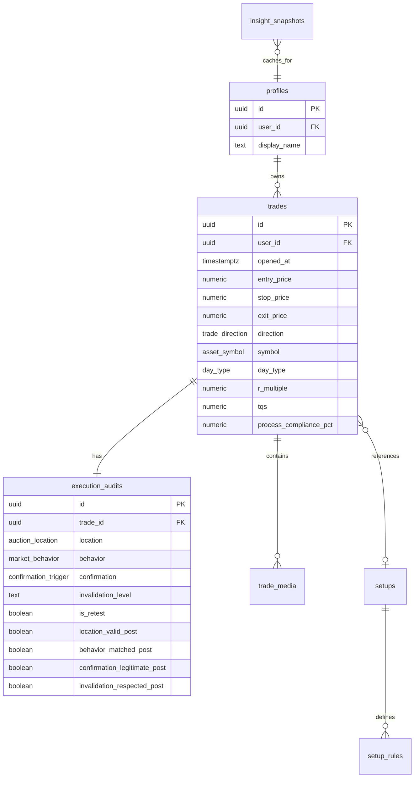
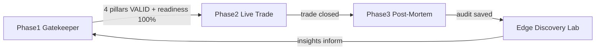

# 01 — Database Core Specification

## Module Header

| Field | Value |
|-------|-------|
| **Purpose** | Foundational relational schema enforcing upstream-cause trade qualification before any execution record may exist |
| **Angular Target Path** | `src/app/core/supabase/` |
| **Route** | N/A (backend layer) |
| **Supabase Tables** | All tables, views, RPCs defined below |
| **Key Metrics** | TQS, Process Compliance %, R-multiple, Win Rate by Location |

---

## Philosophy

Profit and Loss ($ and R-multiple) are **downstream outcomes**. Location, Behavior, Confirmation, and Invalidation are **upstream causes**. The database enforces this at insert time: a `trades` row cannot exist without a fully qualified `execution_audits` row containing all four pillar enum values.

**Core execution rule:** `is_retest` must be `true` on every qualified trade. Initial tests are for context only — never traded.

---

## Entity Relationship Diagram



---

## Application Flow



---

## Future Angular Source Map

| Docs Module | Future `src/app` Path |
|-------------|----------------------|
| Database Core | `core/supabase/` |
| Gatekeeper | `features/gatekeeper/` |
| Trade Details | `features/trade-details/` |
| Dashboard | `features/dashboard/` |
| Journal | `features/journal/` |
| Setups | `features/setups/` |
| Edge Lab | `features/edge-lab/` |
| Shared UI | `shared/components/` |

---

## Complete SQL Migration

Execute in Supabase SQL Editor in order.

```sql
-- ============================================================================
-- DQOS // AMT Lab — Core Schema Migration
-- Version: 1.0.0
-- Auth model: Single private user (RLS via auth.uid())
-- ============================================================================

-- ---------------------------------------------------------------------------
-- 1. EXTENSIONS
-- ---------------------------------------------------------------------------
CREATE EXTENSION IF NOT EXISTS "pgcrypto";

-- ---------------------------------------------------------------------------
-- 2. CUSTOM ENUMS
-- ---------------------------------------------------------------------------

CREATE TYPE asset_symbol AS ENUM (
  'ES', 'NQ', 'RTY', 'YM', 'CL', 'GC', 'SI', 'ZB'
);

CREATE TYPE trade_direction AS ENUM ('LONG', 'SHORT');

CREATE TYPE trade_status AS ENUM (
  'DRAFT', 'OPEN', 'CLOSED', 'CANCELLED'
);

CREATE TYPE day_type AS ENUM (
  'D_Day', 'P_Day', 'b_Day', 'Trend_Day', 'Double_Dist'
);

CREATE TYPE auction_location AS ENUM (
  'VAH', 'VAL', 'POC',
  'Weekly_VWAP', 'Monthly_VWAP',
  'Composite_VAH', 'Composite_VAL', 'Composite_POC',
  'Overnight_High', 'Overnight_Low',
  'Single_Print', 'Naked_POC'
);

CREATE TYPE market_behavior AS ENUM (
  'Rejection', 'Acceptance', 'Rotation', 'Exhaustion', 'Excess',
  'Failed_Auction', 'Value_Migration',
  'Responsive_Buying', 'Responsive_Selling'
);

CREATE TYPE confirmation_trigger AS ENUM (
  'Delta_Divergence', 'Volume_Absorption', 'Excess_Tail',
  'VWAP_Reclaim', 'Market_Structure_Break'
);

CREATE TYPE insight_tier AS ENUM (
  'HIGH_CONFIDENCE', 'SYSTEM_DRIFT', 'NEUTRAL'
);

-- ---------------------------------------------------------------------------
-- 3. UTILITY FUNCTIONS
-- ---------------------------------------------------------------------------

CREATE OR REPLACE FUNCTION public.set_updated_at()
RETURNS TRIGGER AS $$
BEGIN
  NEW.updated_at = NOW();
  RETURN NEW;
END;
$$ LANGUAGE plpgsql;

-- ---------------------------------------------------------------------------
-- 4. PROFILES
-- ---------------------------------------------------------------------------

CREATE TABLE public.profiles (
  id            UUID PRIMARY KEY DEFAULT gen_random_uuid(),
  user_id       UUID NOT NULL UNIQUE REFERENCES auth.users(id) ON DELETE CASCADE,
  display_name  TEXT,
  timezone      TEXT NOT NULL DEFAULT 'America/New_York',
  created_at    TIMESTAMPTZ NOT NULL DEFAULT NOW(),
  updated_at    TIMESTAMPTZ NOT NULL DEFAULT NOW()
);

CREATE TRIGGER profiles_set_updated_at
  BEFORE UPDATE ON public.profiles
  FOR EACH ROW EXECUTE FUNCTION public.set_updated_at();

-- ---------------------------------------------------------------------------
-- 5. SETUPS LIBRARY
-- ---------------------------------------------------------------------------

CREATE TABLE public.setups (
  id            UUID PRIMARY KEY DEFAULT gen_random_uuid(),
  user_id       UUID NOT NULL REFERENCES auth.users(id) ON DELETE CASCADE,
  name          TEXT NOT NULL,
  description   TEXT,
  is_active     BOOLEAN NOT NULL DEFAULT TRUE,
  created_at    TIMESTAMPTZ NOT NULL DEFAULT NOW(),
  updated_at    TIMESTAMPTZ NOT NULL DEFAULT NOW(),
  UNIQUE (user_id, name)
);

CREATE TABLE public.setup_rules (
  id            UUID PRIMARY KEY DEFAULT gen_random_uuid(),
  setup_id      UUID NOT NULL REFERENCES public.setups(id) ON DELETE CASCADE,
  rule_order    INTEGER NOT NULL DEFAULT 0,
  pillar        TEXT NOT NULL CHECK (pillar IN ('location', 'behavior', 'confirmation', 'invalidation')),
  rule_text     TEXT NOT NULL,
  created_at    TIMESTAMPTZ NOT NULL DEFAULT NOW()
);

CREATE INDEX idx_setup_rules_setup_id ON public.setup_rules(setup_id);

CREATE TRIGGER setups_set_updated_at
  BEFORE UPDATE ON public.setups
  FOR EACH ROW EXECUTE FUNCTION public.set_updated_at();

-- ---------------------------------------------------------------------------
-- 6. TRADES (baseline execution metrics — downstream outcomes)
-- ---------------------------------------------------------------------------

CREATE TABLE public.trades (
  id                      UUID PRIMARY KEY DEFAULT gen_random_uuid(),
  user_id                 UUID NOT NULL REFERENCES auth.users(id) ON DELETE CASCADE,
  setup_id                UUID REFERENCES public.setups(id) ON DELETE SET NULL,
  status                  trade_status NOT NULL DEFAULT 'DRAFT',
  symbol                  asset_symbol NOT NULL,
  direction               trade_direction NOT NULL,
  day_type                day_type NOT NULL,
  opened_at               TIMESTAMPTZ NOT NULL DEFAULT NOW(),
  closed_at               TIMESTAMPTZ,
  entry_price             NUMERIC(18, 6),
  stop_price              NUMERIC(18, 6),
  exit_price              NUMERIC(18, 6),
  size                    INTEGER CHECK (size IS NULL OR size > 0),
  commissions             NUMERIC(18, 6) DEFAULT 0,
  net_profit              NUMERIC(18, 6),
  r_multiple              NUMERIC(10, 4),
  tqs                     NUMERIC(5, 2) CHECK (tqs IS NULL OR (tqs >= 0 AND tqs <= 100)),
  process_compliance_pct  NUMERIC(5, 2) CHECK (process_compliance_pct IS NULL OR (process_compliance_pct >= 0 AND process_compliance_pct <= 100)),
  readiness_pct_at_entry  NUMERIC(5, 2) NOT NULL DEFAULT 0,
  notes                   TEXT,
  created_at              TIMESTAMPTZ NOT NULL DEFAULT NOW(),
  updated_at              TIMESTAMPTZ NOT NULL DEFAULT NOW(),
  CONSTRAINT trades_open_requires_prices CHECK (
    status != 'OPEN' OR (entry_price IS NOT NULL AND stop_price IS NOT NULL AND size IS NOT NULL)
  ),
  CONSTRAINT trades_closed_requires_exit CHECK (
    status != 'CLOSED' OR (exit_price IS NOT NULL AND closed_at IS NOT NULL)
  )
);

CREATE INDEX idx_trades_user_id ON public.trades(user_id);
CREATE INDEX idx_trades_symbol ON public.trades(symbol);
CREATE INDEX idx_trades_day_type ON public.trades(day_type);
CREATE INDEX idx_trades_opened_at ON public.trades(opened_at DESC);
CREATE INDEX idx_trades_status ON public.trades(status);

CREATE TRIGGER trades_set_updated_at
  BEFORE UPDATE ON public.trades
  FOR EACH ROW EXECUTE FUNCTION public.set_updated_at();

-- ---------------------------------------------------------------------------
-- 7. EXECUTION AUDITS (4 Pillars — upstream causes, 1:1 with trades)
-- ---------------------------------------------------------------------------

CREATE TABLE public.execution_audits (
  id                              UUID PRIMARY KEY DEFAULT gen_random_uuid(),
  trade_id                        UUID NOT NULL UNIQUE REFERENCES public.trades(id) ON DELETE CASCADE,
  location                        auction_location NOT NULL,
  behavior                        market_behavior NOT NULL,
  confirmation                    confirmation_trigger NOT NULL,
  invalidation_level              TEXT NOT NULL,
  invalidation_price              NUMERIC(18, 6) NOT NULL,
  is_retest                       BOOLEAN NOT NULL DEFAULT FALSE,
  location_thesis                 TEXT NOT NULL,
  behavior_thesis                 TEXT NOT NULL,
  confirmation_thesis             TEXT NOT NULL,
  invalidation_thesis             TEXT NOT NULL,
  location_valid_post             BOOLEAN,
  behavior_matched_post           BOOLEAN,
  confirmation_legitimate_post    BOOLEAN,
  invalidation_respected_post     BOOLEAN,
  execution_error                 BOOLEAN GENERATED ALWAYS AS (
    (location_valid_post = FALSE OR behavior_matched_post = FALSE
     OR confirmation_legitimate_post = FALSE OR invalidation_respected_post = FALSE)
    AND EXISTS (SELECT 1 FROM public.trades t WHERE t.id = trade_id AND t.r_multiple > 0)
  ) STORED,
  edge_failure                    BOOLEAN GENERATED ALWAYS AS (
    location_valid_post = TRUE AND behavior_matched_post = TRUE
    AND confirmation_legitimate_post = TRUE AND invalidation_respected_post = TRUE
    AND EXISTS (SELECT 1 FROM public.trades t WHERE t.id = trade_id AND t.r_multiple < 0)
  ) STORED,
  post_mortem_completed_at        TIMESTAMPTZ,
  created_at                      TIMESTAMPTZ NOT NULL DEFAULT NOW(),
  updated_at                      TIMESTAMPTZ NOT NULL DEFAULT NOW(),
  CONSTRAINT execution_audits_retest_required CHECK (is_retest = TRUE),
  CONSTRAINT execution_audits_invalidation_not_empty CHECK (char_length(trim(invalidation_level)) > 0)
);

CREATE INDEX idx_execution_audits_location ON public.execution_audits(location);
CREATE INDEX idx_execution_audits_behavior ON public.execution_audits(behavior);
CREATE INDEX idx_execution_audits_confirmation ON public.execution_audits(confirmation);

CREATE TRIGGER execution_audits_set_updated_at
  BEFORE UPDATE ON public.execution_audits
  FOR EACH ROW EXECUTE FUNCTION public.set_updated_at();

-- ---------------------------------------------------------------------------
-- 8. GATEKEEPER TRIGGER — block unqualified trade inserts
-- ---------------------------------------------------------------------------

CREATE OR REPLACE FUNCTION public.enforce_trade_qualification()
RETURNS TRIGGER AS $$
BEGIN
  IF NEW.status IN ('OPEN', 'CLOSED') AND NEW.readiness_pct_at_entry < 100 THEN
    RAISE EXCEPTION 'STRATEGY NOT FULLY QUALIFIED — trade cannot be % with readiness %', NEW.status, NEW.readiness_pct_at_entry;
  END IF;
  RETURN NEW;
END;
$$ LANGUAGE plpgsql;

CREATE TRIGGER trades_enforce_qualification
  BEFORE INSERT OR UPDATE ON public.trades
  FOR EACH ROW EXECUTE FUNCTION public.enforce_trade_qualification();

-- ---------------------------------------------------------------------------
-- 9. TRADE MEDIA
-- ---------------------------------------------------------------------------

CREATE TABLE public.trade_media (
  id            UUID PRIMARY KEY DEFAULT gen_random_uuid(),
  trade_id      UUID NOT NULL REFERENCES public.trades(id) ON DELETE CASCADE,
  user_id       UUID NOT NULL REFERENCES auth.users(id) ON DELETE CASCADE,
  storage_path  TEXT NOT NULL,
  file_name     TEXT NOT NULL,
  mime_type     TEXT NOT NULL DEFAULT 'image/png',
  caption       TEXT,
  captured_at   TIMESTAMPTZ NOT NULL DEFAULT NOW(),
  created_at    TIMESTAMPTZ NOT NULL DEFAULT NOW()
);

CREATE INDEX idx_trade_media_trade_id ON public.trade_media(trade_id);

-- ---------------------------------------------------------------------------
-- 10. INSIGHT SNAPSHOTS (Edge Lab cache)
-- ---------------------------------------------------------------------------

CREATE TABLE public.insight_snapshots (
  id              UUID PRIMARY KEY DEFAULT gen_random_uuid(),
  user_id         UUID NOT NULL REFERENCES auth.users(id) ON DELETE CASCADE,
  tier            insight_tier NOT NULL,
  headline        TEXT NOT NULL,
  body            TEXT NOT NULL,
  location        auction_location,
  day_type        day_type,
  behavior        market_behavior,
  direction       trade_direction,
  sample_size     INTEGER NOT NULL,
  expectancy_r    NUMERIC(10, 4) NOT NULL,
  win_rate_pct    NUMERIC(5, 2),
  generated_at    TIMESTAMPTZ NOT NULL DEFAULT NOW(),
  is_active       BOOLEAN NOT NULL DEFAULT TRUE
);

CREATE INDEX idx_insight_snapshots_user_active ON public.insight_snapshots(user_id, is_active);

-- ---------------------------------------------------------------------------
-- 11. ANALYTICS VIEWS
-- ---------------------------------------------------------------------------

CREATE OR REPLACE VIEW public.v_win_rate_by_location AS
SELECT
  t.user_id,
  ea.location,
  t.direction,
  COUNT(*) FILTER (WHERE t.status = 'CLOSED') AS total_closed,
  COUNT(*) FILTER (WHERE t.status = 'CLOSED' AND t.r_multiple > 0) AS wins,
  ROUND(
    100.0 * COUNT(*) FILTER (WHERE t.status = 'CLOSED' AND t.r_multiple > 0)
    / NULLIF(COUNT(*) FILTER (WHERE t.status = 'CLOSED'), 0),
    2
  ) AS win_rate_pct,
  ROUND(AVG(t.r_multiple) FILTER (WHERE t.status = 'CLOSED'), 4) AS avg_r
FROM public.trades t
JOIN public.execution_audits ea ON ea.trade_id = t.id
GROUP BY t.user_id, ea.location, t.direction;

CREATE OR REPLACE VIEW public.v_expectancy_matrix AS
SELECT
  t.user_id,
  ea.location,
  t.day_type,
  ea.behavior,
  t.direction,
  COUNT(*) FILTER (WHERE t.status = 'CLOSED') AS sample_size,
  ROUND(AVG(t.r_multiple) FILTER (WHERE t.status = 'CLOSED'), 4) AS expectancy_r,
  ROUND(
    100.0 * COUNT(*) FILTER (WHERE t.status = 'CLOSED' AND t.r_multiple > 0)
    / NULLIF(COUNT(*) FILTER (WHERE t.status = 'CLOSED'), 0),
    2
  ) AS win_rate_pct
FROM public.trades t
JOIN public.execution_audits ea ON ea.trade_id = t.id
GROUP BY t.user_id, ea.location, t.day_type, ea.behavior, t.direction
HAVING COUNT(*) FILTER (WHERE t.status = 'CLOSED') >= 1;

CREATE OR REPLACE VIEW public.v_process_compliance_summary AS
SELECT
  t.user_id,
  COUNT(*) FILTER (WHERE t.status = 'CLOSED') AS total_closed,
  ROUND(AVG(t.process_compliance_pct) FILTER (WHERE t.status = 'CLOSED'), 2) AS avg_process_compliance_pct,
  ROUND(AVG(t.tqs) FILTER (WHERE t.status = 'CLOSED'), 2) AS avg_tqs,
  COUNT(*) FILTER (WHERE ea.execution_error = TRUE) AS execution_error_count,
  COUNT(*) FILTER (WHERE ea.edge_failure = TRUE) AS edge_failure_count
FROM public.trades t
JOIN public.execution_audits ea ON ea.trade_id = t.id
GROUP BY t.user_id;

-- ---------------------------------------------------------------------------
-- 12. RPC: generate_insight_cards
-- ---------------------------------------------------------------------------

CREATE OR REPLACE FUNCTION public.generate_insight_cards(p_user_id UUID DEFAULT auth.uid())
RETURNS SETOF public.insight_snapshots
LANGUAGE plpgsql
SECURITY DEFINER
SET search_path = public
AS $$
DECLARE
  rec RECORD;
BEGIN
  UPDATE public.insight_snapshots SET is_active = FALSE WHERE user_id = p_user_id;

  FOR rec IN
    SELECT *
    FROM public.v_expectancy_matrix
    WHERE user_id = p_user_id AND sample_size >= 20
  LOOP
    IF rec.expectancy_r >= 0.5 THEN
      INSERT INTO public.insight_snapshots (
        user_id, tier, headline, body,
        location, day_type, behavior, direction,
        sample_size, expectancy_r, win_rate_pct
      ) VALUES (
        p_user_id,
        'HIGH_CONFIDENCE',
        format('%s @ %s on %s → +%sR expectancy', rec.direction, rec.location, rec.day_type, rec.expectancy_r),
        format('Cross-tab: %s behavior, n=%s, win rate %s%%', rec.behavior, rec.sample_size, rec.win_rate_pct),
        rec.location, rec.day_type, rec.behavior, rec.direction,
        rec.sample_size, rec.expectancy_r, rec.win_rate_pct
      );
    ELSIF rec.expectancy_r <= -0.5 THEN
      INSERT INTO public.insight_snapshots (
        user_id, tier, headline, body,
        location, day_type, behavior, direction,
        sample_size, expectancy_r, win_rate_pct
      ) VALUES (
        p_user_id,
        'SYSTEM_DRIFT',
        format('%s @ %s on %s → %sR expectancy (drift)', rec.direction, rec.location, rec.day_type, rec.expectancy_r),
        format('Negative edge detected: %s behavior, n=%s. Review playbook compliance.', rec.behavior, rec.sample_size),
        rec.location, rec.day_type, rec.behavior, rec.direction,
        rec.sample_size, rec.expectancy_r, rec.win_rate_pct
      );
    END IF;
  END LOOP;

  RETURN QUERY
  SELECT * FROM public.insight_snapshots
  WHERE user_id = p_user_id AND is_active = TRUE
  ORDER BY ABS(expectancy_r) DESC;
END;
$$;

-- ---------------------------------------------------------------------------
-- 13. ROW LEVEL SECURITY
-- ---------------------------------------------------------------------------

ALTER TABLE public.profiles ENABLE ROW LEVEL SECURITY;
ALTER TABLE public.setups ENABLE ROW LEVEL SECURITY;
ALTER TABLE public.setup_rules ENABLE ROW LEVEL SECURITY;
ALTER TABLE public.trades ENABLE ROW LEVEL SECURITY;
ALTER TABLE public.execution_audits ENABLE ROW LEVEL SECURITY;
ALTER TABLE public.trade_media ENABLE ROW LEVEL SECURITY;
ALTER TABLE public.insight_snapshots ENABLE ROW LEVEL SECURITY;

CREATE POLICY profiles_self ON public.profiles FOR ALL USING (auth.uid() = user_id);
CREATE POLICY setups_self ON public.setups FOR ALL USING (auth.uid() = user_id);
CREATE POLICY setup_rules_self ON public.setup_rules FOR ALL
  USING (EXISTS (SELECT 1 FROM public.setups s WHERE s.id = setup_id AND s.user_id = auth.uid()));
CREATE POLICY trades_self ON public.trades FOR ALL USING (auth.uid() = user_id);
CREATE POLICY execution_audits_self ON public.execution_audits FOR ALL
  USING (EXISTS (SELECT 1 FROM public.trades t WHERE t.id = trade_id AND t.user_id = auth.uid()));
CREATE POLICY trade_media_self ON public.trade_media FOR ALL USING (auth.uid() = user_id);
CREATE POLICY insight_snapshots_self ON public.insight_snapshots FOR ALL USING (auth.uid() = user_id);

-- ---------------------------------------------------------------------------
-- 14. STORAGE BUCKET (run in Supabase Dashboard or via API)
-- ---------------------------------------------------------------------------
-- Bucket name: trade-screenshots
-- Public: false
-- RLS: authenticated user can CRUD own folder {user_id}/{trade_id}/*
```

---

## Enum-to-UI Mapping

| PostgreSQL Enum | PrimeNG Control | Gatekeeper Step |
|-----------------|-----------------|-----------------|
| `auction_location` | `p-selectbutton` | Step 1 — Location |
| `market_behavior` | `p-selectbutton` | Step 2 — Behavior |
| `confirmation_trigger` | `p-selectbutton` | Step 3 — Confirmation |
| `invalidation_level` + price | `p-inputnumber` + `p-textarea` | Step 4 — Invalidation |
| `trade_direction` | `p-select` | Execution Block |
| `asset_symbol` | `p-select` | Execution Block |
| `day_type` | `p-select` | Execution Block |
| `is_retest` | `p-checkbox` | Step 1 (gate) |

---

## TypeScript Interfaces (Angular)

```typescript
export type AssetSymbol = 'ES' | 'NQ' | 'RTY' | 'YM' | 'CL' | 'GC' | 'SI' | 'ZB';
export type TradeDirection = 'LONG' | 'SHORT';
export type TradeStatus = 'DRAFT' | 'OPEN' | 'CLOSED' | 'CANCELLED';
export type DayType = 'D_Day' | 'P_Day' | 'b_Day' | 'Trend_Day' | 'Double_Dist';
export type AuctionLocation = 'VAH' | 'VAL' | 'POC' | 'Weekly_VWAP' | 'Monthly_VWAP'
  | 'Composite_VAH' | 'Composite_VAL' | 'Composite_POC'
  | 'Overnight_High' | 'Overnight_Low' | 'Single_Print' | 'Naked_POC';
export type MarketBehavior = 'Rejection' | 'Acceptance' | 'Rotation' | 'Exhaustion' | 'Excess'
  | 'Failed_Auction' | 'Value_Migration' | 'Responsive_Buying' | 'Responsive_Selling';
export type ConfirmationTrigger = 'Delta_Divergence' | 'Volume_Absorption' | 'Excess_Tail'
  | 'VWAP_Reclaim' | 'Market_Structure_Break';

export interface Trade {
  id: string;
  user_id: string;
  setup_id: string | null;
  status: TradeStatus;
  symbol: AssetSymbol;
  direction: TradeDirection;
  day_type: DayType;
  opened_at: string;
  closed_at: string | null;
  entry_price: number | null;
  stop_price: number | null;
  exit_price: number | null;
  size: number | null;
  commissions: number;
  net_profit: number | null;
  r_multiple: number | null;
  tqs: number | null;
  process_compliance_pct: number | null;
  readiness_pct_at_entry: number;
}

export interface ExecutionAudit {
  id: string;
  trade_id: string;
  location: AuctionLocation;
  behavior: MarketBehavior;
  confirmation: ConfirmationTrigger;
  invalidation_level: string;
  invalidation_price: number;
  is_retest: boolean;
  location_thesis: string;
  behavior_thesis: string;
  confirmation_thesis: string;
  invalidation_thesis: string;
  location_valid_post: boolean | null;
  behavior_matched_post: boolean | null;
  confirmation_legitimate_post: boolean | null;
  invalidation_respected_post: boolean | null;
  post_mortem_completed_at: string | null;
}
```

---

## Appendix A — Global Design Tokens

| Token | Value | Usage |
|-------|-------|-------|
| `--dqos-bg-base` | `#0D0E12` | Page background |
| `--dqos-bg-panel` | `#161920` | Elevated panels, cards |
| `--dqos-border` | `#262B37` | Dividers, input borders |
| `--dqos-accent-qualified` | `#10b981` | 100% readiness, high confidence |
| `--dqos-accent-warning` | `#f59e0b` | <100% readiness, system drift |
| `--dqos-font-ui` | Inter | Labels, headings |
| `--dqos-font-mono` | JetBrains Mono | Prices, R-multiples, stats |

Mapped in [`src/app/core/theme/dqos-preset.ts`](../src/app/core/theme/dqos-preset.ts).

---

## Appendix B — PrimeNG & Angular Version Pin

| Package | Version | Notes |
|---------|---------|-------|
| `@angular/core` | 22.x | Project scaffold |
| `primeng` | 21.1.9 | Latest stable; install with `--legacy-peer-deps` |
| `@primeuix/themes` | 2.x | Token-based theming via `DqosDarkPreset` |
| `primeicons` | latest | Icon set |
| `chart.js` | latest | Backend for `p-chart` |

If `ng build` fails due to peer dependency conflicts, align Angular to v21 LTS.

---

## Appendix C — Transactional Insert Pattern (Gatekeeper Submit)

```typescript
// Pseudocode — see execution_block.md for full implementation
async submitQualifiedTrade(payload: GatekeeperSubmitPayload): Promise<void> {
  const { data: trade, error: tradeError } = await supabase.from('trades').insert({
    user_id: auth.uid(),
    status: 'OPEN',
    readiness_pct_at_entry: 100,
    ...payload.trade,
  }).select('id').single();

  if (tradeError) throw tradeError;

  const { error: auditError } = await supabase.from('execution_audits').insert({
    trade_id: trade.id,
    is_retest: true,
    ...payload.audit,
  });

  if (auditError) {
    await supabase.from('trades').delete().eq('id', trade.id);
    throw auditError;
  }
}
```
