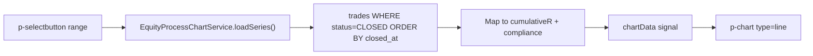

# 02b — Dashboard Equity vs Process Chart

## Module Header

| Field | Value |
|-------|-------|
| **Purpose** | Visualize divergence between downstream equity (cumulative R) and upstream process quality over time |
| **Angular Target Path** | `src/app/features/dashboard/components/equity-process-chart/` |
| **Route** | `/dashboard` (middle section of `DashboardPageComponent`) |
| **Supabase Tables / Views** | `trades`, `execution_audits` |
| **Key Metrics** | Cumulative R-multiple (downstream), Rolling avg Process Compliance % (upstream) |

---

## Philosophy

Equity curve and process score must share a timeline but remain semantically distinct:

- **Left Y-axis (downstream):** Cumulative R-multiple — the compounding outcome of closed trades ordered by `closed_at`.
- **Right Y-axis (upstream):** Process Compliance % per trade — the cause-side discipline score stored on each `trades` row at close.

When equity rises while process compliance falls, the chart surfaces *execution error* risk (profitable trades with broken process). When both rise together, the trader is in *edge alignment*.

---

## PrimeNG Component Table

| Component | Import Path | Role |
|-----------|-------------|------|
| `p-chart` | `primeng/chart` | Chart.js wrapper; dual-axis line chart |
| `p-card` | `primeng/card` | Chart panel container |
| `p-selectbutton` | `primeng/selectbutton` | Range toggle: 30D / 90D / YTD / ALL |
| `p-skeleton` | `primeng/skeleton` | Chart area placeholder |
| `p-tooltip` | `primeng/tooltip` | Legend item explanations |

---

## Chart Specification

| Series | Axis | Color Token | Line Style | Data Point |
|--------|------|-------------|------------|------------|
| Cumulative R | Left (`y`) | `#10b981` (`--dqos-accent-qualified`) | Solid, 2px | Running sum of `r_multiple` |
| Process Compliance % | Right (`y1`) | `#6366f1` (indigo accent) | Dashed, 2px | `process_compliance_pct` per trade |
| X-axis labels | — | `#9ca3af` | — | `closed_at` formatted `MMM d` |

Chart type: `'line'`. Interaction: `mode: 'index'`, `intersect: false`. Animation disabled for performance on large datasets.

---

## Data Layer

### Supabase query

```typescript
// equity-process-chart.service.ts
import { Injectable, inject } from '@angular/core';
import { SupabaseClient } from '@supabase/supabase-js';
import { SUPABASE_CLIENT } from '../../../core/supabase/supabase-client.token';

export type ChartRange = '30D' | '90D' | 'YTD' | 'ALL';

export interface EquityProcessPoint {
  closedAt: string;
  rMultiple: number;
  cumulativeR: number;
  processCompliancePct: number | null;
  symbol: string;
  tradeId: string;
}

@Injectable({ providedIn: 'root' })
export class EquityProcessChartService {
  private readonly supabase = inject(SUPABASE_CLIENT);

  async loadSeries(range: ChartRange = 'ALL'): Promise<EquityProcessPoint[]> {
    let query = this.supabase
      .from('trades')
      .select('id, closed_at, r_multiple, process_compliance_pct, symbol')
      .eq('status', 'CLOSED')
      .not('closed_at', 'is', null)
      .not('r_multiple', 'is', null)
      .order('closed_at', { ascending: true });

    const since = this.rangeToIso(range);
    if (since) {
      query = query.gte('closed_at', since);
    }

    const { data, error } = await query;
    if (error) throw error;

    let cumulative = 0;
    return (data ?? []).map(row => {
      cumulative += Number(row.r_multiple);
      return {
        tradeId: row.id,
        closedAt: row.closed_at as string,
        rMultiple: Number(row.r_multiple),
        cumulativeR: Math.round(cumulative * 10000) / 10000,
        processCompliancePct: row.process_compliance_pct != null
          ? Number(row.process_compliance_pct)
          : null,
        symbol: row.symbol as string,
      };
    });
  }

  private rangeToIso(range: ChartRange): string | null {
    const now = new Date();
    switch (range) {
      case '30D':
        return new Date(now.getTime() - 30 * 86400000).toISOString();
      case '90D':
        return new Date(now.getTime() - 90 * 86400000).toISOString();
      case 'YTD':
        return new Date(now.getFullYear(), 0, 1).toISOString();
      case 'ALL':
      default:
        return null;
    }
  }
}
```

---

## Chart.js Configuration

```typescript
// equity-process-chart.component.ts
import { Component, OnInit, signal, computed, effect } from '@angular/core';
import { CommonModule } from '@angular/common';
import { ChartModule } from 'primeng/chart';
import { CardModule } from 'primeng/card';
import { SelectButtonModule } from 'primeng/selectbutton';
import { SkeletonModule } from 'primeng/skeleton';
import { FormsModule } from '@angular/forms';
import { ChartData, ChartOptions } from 'chart.js';
import {
  ChartRange,
  EquityProcessChartService,
  EquityProcessPoint,
} from '../../services/equity-process-chart.service';

@Component({
  selector: 'app-equity-process-chart',
  standalone: true,
  imports: [CommonModule, FormsModule, ChartModule, CardModule, SelectButtonModule, SkeletonModule],
  templateUrl: './equity-process-chart.component.html',
  styleUrl: './equity-process-chart.component.scss',
})
export class EquityProcessChartComponent implements OnInit {
  readonly loading = signal(true);
  readonly points = signal<EquityProcessPoint[]>([]);
  readonly selectedRange = signal<ChartRange>('ALL');

  readonly rangeOptions: { label: string; value: ChartRange }[] = [
    { label: '30D', value: '30D' },
    { label: '90D', value: '90D' },
    { label: 'YTD', value: 'YTD' },
    { label: 'ALL', value: 'ALL' },
  ];

  chartData = signal<ChartData<'line'>>({ labels: [], datasets: [] });
  chartOptions: ChartOptions<'line'> = this.buildOptions();

  constructor(private readonly chartService: EquityProcessChartService) {
    effect(() => {
      void this.reload(this.selectedRange());
    });
  }

  ngOnInit(): void {
    void this.reload('ALL');
  }

  private async reload(range: ChartRange): Promise<void> {
    this.loading.set(true);
    try {
      const data = await this.chartService.loadSeries(range);
      this.points.set(data);
      this.chartData.set(this.toChartData(data));
    } finally {
      this.loading.set(false);
    }
  }

  private toChartData(points: EquityProcessPoint[]): ChartData<'line'> {
    const labels = points.map(p =>
      new Date(p.closedAt).toLocaleDateString('en-US', { month: 'short', day: 'numeric' }),
    );

    return {
      labels,
      datasets: [
        {
          label: 'Cumulative R',
          data: points.map(p => p.cumulativeR),
          yAxisID: 'y',
          borderColor: '#10b981',
          backgroundColor: 'rgba(16, 185, 129, 0.08)',
          fill: true,
          tension: 0.2,
          pointRadius: points.length > 60 ? 0 : 3,
          pointHoverRadius: 5,
          borderWidth: 2,
        },
        {
          label: 'Process Compliance %',
          data: points.map(p => p.processCompliancePct ?? 0),
          yAxisID: 'y1',
          borderColor: '#6366f1',
          backgroundColor: 'transparent',
          borderDash: [6, 4],
          tension: 0.2,
          pointRadius: points.length > 60 ? 0 : 3,
          pointHoverRadius: 5,
          borderWidth: 2,
        },
      ],
    };
  }

  private buildOptions(): ChartOptions<'line'> {
    return {
      responsive: true,
      maintainAspectRatio: false,
      animation: false,
      interaction: { mode: 'index', intersect: false },
      plugins: {
        legend: {
          position: 'top',
          align: 'end',
          labels: {
            color: '#9ca3af',
            boxWidth: 12,
            font: { family: 'Inter', size: 11 },
          },
        },
        tooltip: {
          backgroundColor: '#161920',
          borderColor: '#262B37',
          borderWidth: 1,
          titleFont: { family: 'Inter' },
          bodyFont: { family: 'JetBrains Mono', size: 12 },
          callbacks: {
            afterBody: (items) => {
              const idx = items[0]?.dataIndex;
              if (idx == null) return [];
              const pt = this.points()[idx];
              if (!pt) return [];
              return [`Trade: ${pt.symbol}`, `R: ${pt.rMultiple >= 0 ? '+' : ''}${pt.rMultiple}R`];
            },
          },
        },
      },
      scales: {
        x: {
          grid: { color: '#262B37' },
          ticks: { color: '#6b7280', maxRotation: 0, autoSkip: true, maxTicksLimit: 12 },
        },
        y: {
          type: 'linear',
          position: 'left',
          title: {
            display: true,
            text: 'Cumulative R',
            color: '#10b981',
            font: { size: 11 },
          },
          grid: { color: '#262B37' },
          ticks: {
            color: '#10b981',
            font: { family: 'JetBrains Mono', size: 10 },
            callback: (v) => `${v}R`,
          },
        },
        y1: {
          type: 'linear',
          position: 'right',
          min: 0,
          max: 100,
          title: {
            display: true,
            text: 'Process %',
            color: '#6366f1',
            font: { size: 11 },
          },
          grid: { drawOnChartArea: false },
          ticks: {
            color: '#6366f1',
            font: { family: 'JetBrains Mono', size: 10 },
            callback: (v) => `${v}%`,
          },
        },
      },
    };
  }
}
```

---

## HTML Template

```html
<!-- equity-process-chart.component.html -->
<p-card styleClass="equity-process-chart">
  <ng-template pTemplate="header">
    <div class="equity-process-chart__header">
      <div>
        <h2 class="equity-process-chart__title">Equity vs Process</h2>
        <p class="equity-process-chart__subtitle">
          Downstream cumulative R · Upstream compliance per close
        </p>
      </div>
      <p-selectbutton
        [options]="rangeOptions"
        [(ngModel)]="selectedRange"
        optionLabel="label"
        optionValue="value"
        styleClass="equity-process-chart__range"
      />
    </div>
  </ng-template>

  @if (loading()) {
    <p-skeleton width="100%" height="320px" />
  } @else if (points().length === 0) {
    <div class="equity-process-chart__empty">
      No closed trades in selected range.
    </div>
  } @else {
    <div class="equity-process-chart__canvas">
      <p-chart type="line" [data]="chartData()" [options]="chartOptions" />
    </div>
  }
</p-card>
```

---

## SCSS

```scss
// equity-process-chart.component.scss
.equity-process-chart {
  margin-block-end: 1.5rem;
  background: var(--dqos-bg-panel, #161920);
  border: 1px solid var(--dqos-border, #262B37);

  &__header {
    display: flex;
    align-items: flex-start;
    justify-content: space-between;
    gap: 1rem;
    padding: 1rem 1.25rem 0;
    flex-wrap: wrap;
  }

  &__title {
    margin: 0;
    font-size: 1rem;
    font-weight: 600;
    color: var(--p-text-color, #e5e7eb);
  }

  &__subtitle {
    margin: 0.25rem 0 0;
    font-size: 0.75rem;
    color: var(--p-text-muted-color, #6b7280);
  }

  &__canvas {
    height: 320px;
    padding: 0.5rem 1rem 1rem;
  }

  &__empty {
    height: 320px;
    display: flex;
    align-items: center;
    justify-content: center;
    color: var(--p-text-muted-color, #6b7280);
    font-size: 0.875rem;
  }
}
```

---

## Chart.js Provider Setup

Register Chart.js scales and elements once in `app.config.ts`:

```typescript
import { Chart, registerables } from 'chart.js';
Chart.register(...registerables);
```

Ensure `chart.js` is installed: `npm install chart.js --legacy-peer-deps`.

---

## Data Binding Flow



---

## Acceptance Criteria

1. Dual Y-axes render with left = R-multiple, right = 0–100% compliance; no axis label overlap at `768px` width.
2. Cumulative R at trade *n* equals sum of `r_multiple` for trades `1..n` ordered by `closed_at ASC`.
3. Range toggle re-fetches and re-renders without full page reload; skeleton shows during fetch.
4. Tooltip displays trade symbol, single-trade R, cumulative R, and compliance % for hovered index.
5. Empty state shown when zero closed trades match the selected range.
6. Point markers hidden when series length exceeds 60 trades (performance guard).
