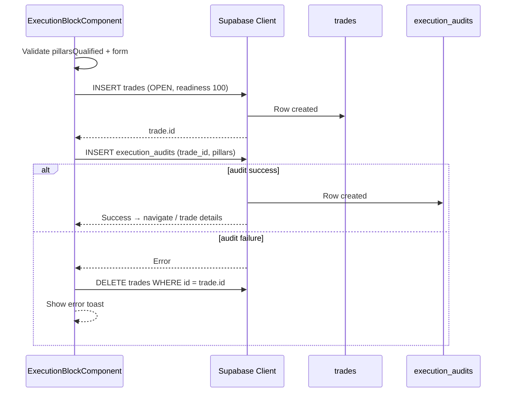

# Execution Block — Component Specification

## Module Header

| Field | Value |
|-------|-------|
| **Purpose** | Downstream trade execution panel — entry, stop, size, direction, symbol, day type — locked until four pillars are fully qualified; submits `trades` + `execution_audits` transactionally |
| **Angular Target Path** | `src/app/features/gatekeeper/execution-block/` |
| **Route** | `/gatekeeper` (embedded in Gatekeeper page sidebar below Readiness Meter) |
| **Supabase Tables** | `trades` (insert `status: OPEN`), `execution_audits` (1:1 insert via `trade_id`) |
| **Key Metrics** | `risk_per_contract`, `total_risk`, `r_target`, `readiness_pct_at_entry` (must be 100), point value by symbol |

---

## Overview

The **ExecutionBlockComponent** captures downstream execution parameters only after upstream qualification is complete. While `pillarsQualified === false`, the entire block renders in a **locked** state: inputs disabled, submit inert, overlay visible with lock messaging.

On submit, the component:

1. Validates execution form + confirms `pillarsQualified` and `readinessPct === 100`.
2. Computes risk metrics for display confirmation.
3. Inserts **`trades`** row with `status: 'OPEN'` and **`readiness_pct_at_entry: 100`**.
4. Inserts **`execution_audits`** row linked by `trade_id`.
5. On audit insert failure, **deletes** the orphaned trade (compensating transaction).

The database trigger `trades_enforce_qualification` provides a second line of defense: any `OPEN` trade with `readiness_pct_at_entry < 100` raises an exception.



---

## File Structure

```
src/app/features/gatekeeper/execution-block/
├── execution-block.component.ts
├── execution-block.component.html
├── execution-block.component.scss
├── execution-block.types.ts
├── execution-block.constants.ts      # point values, tick sizes
├── execution-risk.utils.ts           # risk math pure functions
└── gatekeeper-submit.service.ts      # Supabase transactional insert
```

---

## PrimeNG Component Table

| Module | Component | Field / action | Import Path |
|--------|-----------|----------------|-------------|
| `InputNumberModule` | `p-inputnumber` | `entry_price`, `stop_price`, `size`, optional `target_price` | `primeng/inputnumber` |
| `SelectModule` | `p-select` | `direction`, `symbol`, `day_type` | `primeng/select` |
| `ButtonModule` | `p-button` | Submit "Execute Trade" | `primeng/button` |
| `MessageModule` | `p-message` | Lock banner, validation errors | `primeng/message` |
| `DividerModule` | `p-divider` | Separates risk summary from inputs | `primeng/divider` |
| `BlockUIModule` | `p-blockui` | Optional full-panel lock overlay | `primeng/blockui` |
| `ToastModule` | `p-toast` | Success / error feedback (page level) | `primeng/toast` |
| `ConfirmDialogModule` | `p-confirmdialog` | Pre-submit risk confirmation | `primeng/confirmdialog` |
| `TagModule` | `p-tag` | Display computed R-target badge | `primeng/tag` |

---

## TypeScript Interfaces

### `execution-block.types.ts`

```typescript
import type {
  AssetSymbol,
  DayType,
  TradeDirection,
} from '../../../core/supabase/database.types';
import type { GatekeeperFormValue } from '../gatekeeper-form.types';

export interface ExecutionFormValue {
  symbol: AssetSymbol;
  direction: TradeDirection;
  day_type: DayType;
  entry_price: number;
  stop_price: number;
  size: number;
  /** Optional profit target for R-target calculation. */
  target_price: number | null;
  setup_id: string | null;
  notes: string | null;
}

export interface ExecutionRiskMetrics {
  /** Absolute price distance entry → stop (points). */
  stopDistancePts: number;
  /** Dollar risk for one contract. */
  risk_per_contract: number;
  /** risk_per_contract × size. */
  total_risk: number;
  /** Reward distance / stop distance when target_price set; else null. */
  r_target: number | null;
}

export interface GatekeeperSubmitPayload {
  trade: {
    symbol: AssetSymbol;
    direction: TradeDirection;
    day_type: DayType;
    entry_price: number;
    stop_price: number;
    size: number;
    setup_id: string | null;
    notes: string | null;
    status: 'OPEN';
    readiness_pct_at_entry: 100;
  };
  audit: ReturnType<typeof mapFormToExecutionAudit>;
}

export interface GatekeeperSubmitResult {
  tradeId: string;
  auditId: string;
}
```

### `execution-block.constants.ts`

```typescript
import type { AssetSymbol } from '../../../core/supabase/database.types';

/** Dollar value per one index/commodity point (1.0 price unit). */
export const POINT_VALUE_USD: Record<AssetSymbol, number> = {
  ES: 50,
  NQ: 20,
  RTY: 50,
  YM: 5,
  CL: 1000,
  GC: 100,
  SI: 5000,
  ZB: 1000,
};

export const TICK_SIZE: Record<AssetSymbol, number> = {
  ES: 0.25,
  NQ: 0.25,
  RTY: 0.1,
  YM: 1,
  CL: 0.01,
  GC: 0.1,
  SI: 0.005,
  ZB: 0.03125,
};
```

---

## Risk Math

### Pure functions — `execution-risk.utils.ts`

```typescript
import { POINT_VALUE_USD, TICK_SIZE } from './execution-block.constants';
import type { AssetSymbol } from '../../../core/supabase/database.types';
import type { ExecutionFormValue, ExecutionRiskMetrics } from './execution-block.types';

export function computeStopDistancePts(
  entry: number,
  stop: number,
  direction: 'LONG' | 'SHORT'
): number {
  const raw = direction === 'LONG' ? entry - stop : stop - entry;
  return Math.max(0, raw);
}

export function computeRiskMetrics(
  form: Pick<ExecutionFormValue, 'symbol' | 'direction' | 'entry_price' | 'stop_price' | 'size' | 'target_price'>
): ExecutionRiskMetrics {
  const stopDistancePts = computeStopDistancePts(
    form.entry_price,
    form.stop_price,
    form.direction
  );

  const pointValue = POINT_VALUE_USD[form.symbol];
  const risk_per_contract = stopDistancePts * pointValue;

  const total_risk = risk_per_contract * form.size;

  let r_target: number | null = null;
  if (form.target_price != null && stopDistancePts > 0) {
    const rewardPts =
      form.direction === 'LONG'
        ? form.target_price - form.entry_price
        : form.entry_price - form.target_price;
    if (rewardPts > 0) {
      r_target = roundTo(rewardPts / stopDistancePts, 2);
    }
  }

  return {
    stopDistancePts: roundTo(stopDistancePts, 4),
    risk_per_contract: roundTo(risk_per_contract, 2),
    total_risk: roundTo(total_risk, 2),
    r_target,
  };
}

function roundTo(value: number, decimals: number): number {
  const factor = 10 ** decimals;
  return Math.round(value * factor) / factor;
}

/** Validates stop is on correct side of entry. */
export function isStopPlacementValid(form: ExecutionFormValue): boolean {
  if (form.direction === 'LONG') {
    return form.stop_price < form.entry_price;
  }
  return form.stop_price > form.entry_price;
}
```

### Risk display formulas

| Metric | Formula | Example (ES LONG, entry 5200, stop 5195, size 2) |
|--------|---------|-----------------------------------------------------|
| `stopDistancePts` | `\|entry − stop\|` in trade direction | 5.0 pts |
| `risk_per_contract` | `stopDistancePts × POINT_VALUE_USD[symbol]` | 5 × $50 = **$250** |
| `total_risk` | `risk_per_contract × size` | $250 × 2 = **$500** |
| `r_target` | `rewardPts / stopDistancePts` (if target set) | Target 5210 → 10/5 = **2.0R** |

All currency values render with `JetBrains Mono` and `$` prefix in the risk summary panel.

---

## Lock Logic

### Inputs

| Input | Type | Description |
|-------|------|-------------|
| `pillarsQualified` | `boolean` | From ReadinessMeter / wizard; must be `true` to unlock |
| `readinessPct` | `number` | Must be `100` at submit (defense in depth) |
| `auditDraft` | `GatekeeperFormValue \| null` | Mapped execution_audits payload from wizard |

### Lock state computed signals

```typescript
protected readonly isLocked = computed(() => !this.pillarsQualified());

protected readonly lockReason = computed(() => {
  if (this.pillarsQualified()) return null;
  return 'Complete all four pillars and confirm retest to unlock execution.';
});

protected readonly canSubmit = computed(() =>
  this.pillarsQualified() &&
  this.readinessPct() === 100 &&
  this.executionForm.valid &&
  this.auditDraft() !== null &&
  !this.submitting()
);
```

### Lock behavior matrix

| State | Inputs | Submit button | Overlay |
|-------|--------|---------------|---------|
| `pillarsQualified === false` | `[disabled]="true"` | Disabled, label "Locked" | Visible with lock icon + `lockReason` |
| `pillarsQualified === true` | Enabled | Enabled when form valid | Hidden |
| Submitting | Disabled | Loading spinner | Optional semi-transparent overlay |

### Direction-aware stop validation

| Direction | Rule | Error message |
|-----------|------|---------------|
| `LONG` | `stop_price < entry_price` | "Stop must be below entry for LONG" |
| `SHORT` | `stop_price > entry_price` | "Stop must be above entry for SHORT" |

---

## Execution Form

```typescript
export function createExecutionForm(fb: FormBuilder) {
  return fb.group({
    symbol: fb.control<AssetSymbol>('ES', Validators.required),
    direction: fb.control<TradeDirection>('LONG', Validators.required),
    day_type: fb.control<DayType>('D_Day', Validators.required),
    entry_price: fb.control<number | null>(null, [Validators.required, Validators.min(0.000001)]),
    stop_price: fb.control<number | null>(null, [Validators.required, Validators.min(0.000001)]),
    size: fb.control<number | null>(null, [Validators.required, Validators.min(1), Validators.pattern(/^\d+$/)]),
    target_price: fb.control<number | null>(null),
    setup_id: fb.control<string | null>(null),
    notes: fb.control<string | null>(null, Validators.maxLength(2000)),
  }, { validators: [stopPlacementValidator] });
}
```

### Enum select options

```typescript
export const DIRECTION_OPTIONS: SelectItem<TradeDirection>[] = [
  { label: 'Long', value: 'LONG' },
  { label: 'Short', value: 'SHORT' },
];

export const SYMBOL_OPTIONS: SelectItem<AssetSymbol>[] = [
  { label: 'ES', value: 'ES' },
  { label: 'NQ', value: 'NQ' },
  { label: 'RTY', value: 'RTY' },
  { label: 'YM', value: 'YM' },
  { label: 'CL', value: 'CL' },
  { label: 'GC', value: 'GC' },
  { label: 'SI', value: 'SI' },
  { label: 'ZB', value: 'ZB' },
];

export const DAY_TYPE_OPTIONS: SelectItem<DayType>[] = [
  { label: 'D-Day', value: 'D_Day' },
  { label: 'P-Day', value: 'P_Day' },
  { label: 'b-Day', value: 'b_Day' },
  { label: 'Trend Day', value: 'Trend_Day' },
  { label: 'Double Distribution', value: 'Double_Dist' },
];
```

---

## HTML Template Blueprint

```html
<section
  class="execution-block"
  [class.execution-block--locked]="isLocked()"
  [class.execution-block--ready]="!isLocked()"
  aria-labelledby="execution-block-title"
>
  <header class="execution-block__header">
    <h2 id="execution-block-title" class="execution-block__title">Execution</h2>
    @if (riskMetrics(); as risk) {
      @if (risk.r_target !== null) {
        <p-tag
          class="execution-block__r-tag"
          [value]="risk.r_target + 'R target'"
          severity="info"
        />
      }
    }
  </header>

  @if (isLocked()) {
    <p-message
      class="execution-block__lock-banner"
      severity="warn"
      icon="pi pi-lock"
      [text]="lockReason()!"
    />
  }

  <div class="execution-block__body" [class.execution-block__body--disabled]="isLocked()">
    @if (isLocked()) {
      <div class="execution-block__overlay" aria-hidden="true">
        <i class="pi pi-lock execution-block__overlay-icon"></i>
        <span class="execution-block__overlay-text">Execution Locked</span>
      </div>
    }

    <form class="execution-block__form" [formGroup]="executionForm" (ngSubmit)="onSubmit()">
      <div class="execution-block__row execution-block__row--triple">
        <div class="execution-block__field">
          <label for="symbol">Symbol</label>
          <p-select
            inputId="symbol"
            formControlName="symbol"
            [options]="symbolOptions"
            optionLabel="label"
            optionValue="value"
            [disabled]="isLocked()"
          />
        </div>

        <div class="execution-block__field">
          <label for="direction">Direction</label>
          <p-select
            inputId="direction"
            formControlName="direction"
            [options]="directionOptions"
            optionLabel="label"
            optionValue="value"
            [disabled]="isLocked()"
          />
        </div>

        <div class="execution-block__field">
          <label for="day_type">Day Type</label>
          <p-select
            inputId="day_type"
            formControlName="day_type"
            [options]="dayTypeOptions"
            optionLabel="label"
            optionValue="value"
            [disabled]="isLocked()"
          />
        </div>
      </div>

      <div class="execution-block__row execution-block__row--triple">
        <div class="execution-block__field">
          <label for="entry_price">Entry</label>
          <p-inputnumber
            inputId="entry_price"
            formControlName="entry_price"
            mode="decimal"
            [minFractionDigits]="2"
            [maxFractionDigits]="6"
            [disabled]="isLocked()"
          />
        </div>

        <div class="execution-block__field">
          <label for="stop_price">Stop</label>
          <p-inputnumber
            inputId="stop_price"
            formControlName="stop_price"
            mode="decimal"
            [minFractionDigits]="2"
            [maxFractionDigits]="6"
            [disabled]="isLocked()"
          />
        </div>

        <div class="execution-block__field">
          <label for="size">Size (contracts)</label>
          <p-inputnumber
            inputId="size"
            formControlName="size"
            [showButtons]="true"
            [min]="1"
            [step]="1"
            [disabled]="isLocked()"
          />
        </div>
      </div>

      <div class="execution-block__row">
        <div class="execution-block__field execution-block__field--optional">
          <label for="target_price">Target (optional, for R calc)</label>
          <p-inputnumber
            inputId="target_price"
            formControlName="target_price"
            mode="decimal"
            [minFractionDigits]="2"
            [maxFractionDigits]="6"
            [disabled]="isLocked()"
          />
        </div>
      </div>

      <p-divider class="execution-block__divider" />

      @if (riskMetrics(); as risk) {
        <dl class="execution-block__risk-summary">
          <div class="execution-block__risk-row">
            <dt>Stop distance</dt>
            <dd>{{ risk.stopDistancePts }} pts</dd>
          </div>
          <div class="execution-block__risk-row">
            <dt>Risk / contract</dt>
            <dd>{{ risk.risk_per_contract | currency:'USD':'symbol':'1.2-2' }}</dd>
          </div>
          <div class="execution-block__risk-row execution-block__risk-row--emphasis">
            <dt>Total risk</dt>
            <dd>{{ risk.total_risk | currency:'USD':'symbol':'1.2-2' }}</dd>
          </div>
          @if (risk.r_target !== null) {
            <div class="execution-block__risk-row">
              <dt>R target</dt>
              <dd>{{ risk.r_target }}R</dd>
            </div>
          }
        </dl>
      }

      @if (executionForm.errors?.['stopPlacement'] && executionForm.touched) {
        <p-message severity="error" [text]="stopPlacementError()" />
      }

      <footer class="execution-block__footer">
        <p-button
          type="submit"
          label="Execute Trade"
          icon="pi pi-bolt"
          severity="success"
          [disabled]="!canSubmit()"
          [loading]="submitting()"
        />
      </footer>
    </form>
  </div>
</section>

<p-confirmDialog />
<p-toast position="top-right" />
```

---

## SCSS — BEM Namespace `.execution-block`

```scss
.execution-block {
  --ex-bg: var(--dqos-bg-panel, #161920);
  --ex-bg-input: var(--dqos-bg-base, #0D0E12);
  --ex-border: var(--dqos-border, #262B37);
  --ex-text: var(--p-text-color, #e5e7eb);
  --ex-muted: var(--p-text-muted-color, #9ca3af);
  --ex-qualified: var(--dqos-accent-qualified, #10b981);
  --ex-warning: var(--dqos-accent-warning, #f59e0b);
  --ex-font-ui: var(--dqos-font-ui, 'Inter', system-ui, sans-serif);
  --ex-font-mono: var(--dqos-font-mono, 'JetBrains Mono', monospace);

  background: var(--ex-bg);
  border: 1px solid var(--ex-border);
  border-radius: 0.75rem;
  padding: 1.25rem 1.5rem;
  font-family: var(--ex-font-ui);
  position: relative;

  &--locked {
    border-color: color-mix(in srgb, var(--ex-warning) 30%, var(--ex-border));
  }

  &--ready {
    border-color: color-mix(in srgb, var(--ex-qualified) 25%, var(--ex-border));
  }

  &__header {
    display: flex;
    align-items: center;
    justify-content: space-between;
    margin-bottom: 1rem;
  }

  &__title {
    margin: 0;
    font-size: 0.875rem;
    font-weight: 600;
    letter-spacing: 0.04em;
    text-transform: uppercase;
    color: var(--ex-muted);
  }

  &__lock-banner {
    margin-bottom: 1rem;
  }

  &__body {
    position: relative;

    &--disabled {
      .execution-block__form {
        opacity: 0.45;
        pointer-events: none;
        user-select: none;
      }
    }
  }

  &__overlay {
    position: absolute;
    inset: 0;
    z-index: 2;
    display: flex;
    flex-direction: column;
    align-items: center;
    justify-content: center;
    gap: 0.5rem;
    background: color-mix(in srgb, var(--ex-bg-input) 75%, transparent);
    border-radius: 0.5rem;
    pointer-events: none;
  }

  &__overlay-icon {
    font-size: 2rem;
    color: var(--ex-warning);
  }

  &__overlay-text {
    font-size: 0.875rem;
    font-weight: 600;
    color: var(--ex-warning);
    letter-spacing: 0.03em;
  }

  &__form {
    display: flex;
    flex-direction: column;
    gap: 1rem;
  }

  &__row {
    display: grid;
    gap: 0.75rem;

    &--triple {
      grid-template-columns: repeat(3, 1fr);

      @media (max-width: 640px) {
        grid-template-columns: 1fr;
      }
    }
  }

  &__field {
    display: flex;
    flex-direction: column;
    gap: 0.375rem;

    label {
      font-size: 0.75rem;
      font-weight: 600;
      text-transform: uppercase;
      letter-spacing: 0.04em;
      color: var(--ex-muted);
    }

    :host ::ng-deep input,
    :host ::ng-deep .p-select-label {
      font-family: var(--ex-font-mono);
      font-variant-numeric: tabular-nums;
    }
  }

  &__divider {
    margin: 0.25rem 0;
  }

  &__risk-summary {
    margin: 0;
    padding: 0.875rem 1rem;
    background: var(--ex-bg-input);
    border: 1px solid var(--ex-border);
    border-radius: 0.5rem;
    display: flex;
    flex-direction: column;
    gap: 0.5rem;
  }

  &__risk-row {
    display: flex;
    justify-content: space-between;
    align-items: baseline;
    font-size: 0.875rem;

    dt {
      margin: 0;
      color: var(--ex-muted);
      font-weight: 500;
    }

    dd {
      margin: 0;
      font-family: var(--ex-font-mono);
      font-variant-numeric: tabular-nums;
      font-weight: 600;
    }

    &--emphasis dd {
      color: var(--ex-warning);
      font-size: 1rem;
    }
  }

  &__footer {
    padding-top: 0.5rem;

    :host ::ng-deep .p-button {
      width: 100%;
    }
  }
}
```

---

## Submit Pipeline

### Service — `gatekeeper-submit.service.ts`

```typescript
import { Injectable, inject } from '@angular/core';
import { SupabaseService } from '../../../core/supabase/supabase.service';
import type { GatekeeperSubmitPayload, GatekeeperSubmitResult } from './execution-block.types';

@Injectable({ providedIn: 'root' })
export class GatekeeperSubmitService {
  private readonly supabase = inject(SupabaseService);

  async submitQualifiedTrade(payload: GatekeeperSubmitPayload): Promise<GatekeeperSubmitResult> {
    if (payload.trade.readiness_pct_at_entry !== 100) {
      throw new Error('STRATEGY NOT FULLY QUALIFIED — readiness must be 100%');
    }

    if (payload.audit.is_retest !== true) {
      throw new Error('Retest required — initial tests are not traded');
    }

    const client = this.supabase.client;
    const { data: { user } } = await client.auth.getUser();
    if (!user) throw new Error('Not authenticated');

    const { data: trade, error: tradeError } = await client
      .from('trades')
      .insert({
        user_id: user.id,
        status: 'OPEN',
        readiness_pct_at_entry: 100,
        symbol: payload.trade.symbol,
        direction: payload.trade.direction,
        day_type: payload.trade.day_type,
        entry_price: payload.trade.entry_price,
        stop_price: payload.trade.stop_price,
        size: payload.trade.size,
        setup_id: payload.trade.setup_id,
        notes: payload.trade.notes,
      })
      .select('id')
      .single();

    if (tradeError || !trade) {
      throw new Error(tradeError?.message ?? 'Trade insert failed');
    }

    const { data: audit, error: auditError } = await client
      .from('execution_audits')
      .insert({
        trade_id: trade.id,
        location: payload.audit.location,
        behavior: payload.audit.behavior,
        confirmation: payload.audit.confirmation,
        invalidation_level: payload.audit.invalidation_level,
        invalidation_price: payload.audit.invalidation_price,
        is_retest: true,
        location_thesis: payload.audit.location_thesis,
        behavior_thesis: payload.audit.behavior_thesis,
        confirmation_thesis: payload.audit.confirmation_thesis,
        invalidation_thesis: payload.audit.invalidation_thesis,
      })
      .select('id')
      .single();

    if (auditError || !audit) {
      await client.from('trades').delete().eq('id', trade.id);
      throw new Error(auditError?.message ?? 'Audit insert failed — trade rolled back');
    }

    return { tradeId: trade.id, auditId: audit.id };
  }
}
```

### Component submit handler

```typescript
protected readonly submitting = signal(false);

constructor() {
  // Recompute risk on any execution field change
  this.executionForm.valueChanges.subscribe(() => {
    const value = this.executionForm.getRawValue() as ExecutionFormValue;
    if (this.executionForm.valid && isStopPlacementValid(value)) {
      this.riskMetrics.set(computeRiskMetrics(value));
    }
  });
}

protected async onSubmit(): Promise<void> {
  if (!this.canSubmit()) return;

  const exec = this.executionForm.getRawValue() as ExecutionFormValue;
  const audit = this.auditDraft();
  if (!audit) return;

  const risk = computeRiskMetrics(exec);

  this.confirmationService.confirm({
    header: 'Confirm Execution',
    message: `Total risk ${this.currency.format(risk.total_risk)} at ${risk.r_target ?? '—'}R. Proceed?`,
    accept: async () => {
      this.submitting.set(true);
      try {
        const payload: GatekeeperSubmitPayload = {
          trade: {
            symbol: exec.symbol,
            direction: exec.direction,
            day_type: exec.day_type,
            entry_price: exec.entry_price,
            stop_price: exec.stop_price,
            size: exec.size,
            setup_id: exec.setup_id,
            notes: exec.notes,
            status: 'OPEN',
            readiness_pct_at_entry: 100,
          },
          audit: mapFormToExecutionAudit(audit),
        };

        const result = await this.submitService.submitQualifiedTrade(payload);

        this.messageService.add({
          severity: 'success',
          summary: 'Trade opened',
          detail: `Trade ${result.tradeId} recorded with full qualification.`,
        });

        await this.router.navigate(['/trade-details', result.tradeId]);
      } catch (err) {
        const message = err instanceof Error ? err.message : 'Submit failed';
        this.messageService.add({ severity: 'error', summary: 'Execution blocked', detail: message });
      } finally {
        this.submitting.set(false);
      }
    },
  });
}
```

---

## Supabase Column Mapping (Submit)

### `trades` insert

| Form / computed field | DB column | Value |
|----------------------|-----------|-------|
| Auth user | `user_id` | `auth.uid()` |
| — | `status` | `'OPEN'` |
| — | `readiness_pct_at_entry` | **`100`** (required) |
| `symbol` | `symbol` | `asset_symbol` enum |
| `direction` | `direction` | `trade_direction` enum |
| `day_type` | `day_type` | `day_type` enum |
| `entry_price` | `entry_price` | `NUMERIC(18,6)` |
| `stop_price` | `stop_price` | `NUMERIC(18,6)` |
| `size` | `size` | `INTEGER > 0` |
| `setup_id` | `setup_id` | UUID or null |
| `notes` | `notes` | TEXT or null |
| — | `opened_at` | DEFAULT `NOW()` |

**Not set at entry:** `exit_price`, `closed_at`, `r_multiple`, `tqs`, `process_compliance_pct`, `net_profit` (populated at close / post-mortem).

### `execution_audits` insert

See [`four_pillars_form.md`](./four_pillars_form.md) mapping table. All thesis fields and enums originate from wizard `auditDraft`; execution block does not mutate pillar values.

---

## Database Constraints (Failure Messages)

| Constraint | Trigger condition | User-facing message |
|------------|-------------------|---------------------|
| `trades_enforce_qualification` | `status IN ('OPEN','CLOSED')` AND `readiness_pct_at_entry < 100` | "STRATEGY NOT FULLY QUALIFIED — DO NOT TRADE" |
| `execution_audits_retest_required` | `is_retest != TRUE` | "Retest required — initial tests are not traded" |
| `execution_audits_invalidation_not_empty` | empty `invalidation_level` | "Invalidation level required" |
| `trades_open_requires_prices` | `OPEN` without entry/stop/size | "Entry, stop, and size required" |
| RLS `trades_self` | wrong user | "Not authorized" |

---

## Component Inputs / Outputs

```typescript
@Component({ /* ... */ })
export class ExecutionBlockComponent {
  readonly pillarsQualified = input.required<boolean>();
  readonly readinessPct = input.required<number>();
  readonly auditDraft = input.required<GatekeeperFormValue | null>();

  readonly tradeSubmitted = output<GatekeeperSubmitResult>();
}
```

Parent binds:

```html
<app-execution-block
  [pillarsQualified]="pillarsQualified()"
  [readinessPct]="readinessPct()"
  [auditDraft]="qualifiedFormValue()"
  (tradeSubmitted)="onTradeSubmitted($event)"
/>
```

---

## Testing Checklist

| Scenario | Expected |
|----------|----------|
| `pillarsQualified = false` | Overlay visible, submit disabled |
| `pillarsQualified = true`, invalid stop side | Form error, submit disabled |
| Valid form, readiness 100 | Submit enabled |
| Successful submit | `trades.status = OPEN`, `readiness_pct_at_entry = 100`, audit row exists |
| Audit insert fails | Trade row deleted, error toast |
| DB trigger with readiness 99 | Exception surfaced in toast |
| ES 5pt stop, 2 contracts | `risk_per_contract = 250`, `total_risk = 500` |
| Target yielding 2:1 | `r_target = 2.0` |

---

## Future Enhancements (Out of Scope v1)

- Postgres RPC `submit_qualified_trade` for true single-transaction atomicity (Supabase JS lacks multi-statement transactions without RPC).
- Account equity input to warn when `total_risk` exceeds daily loss limit.
- Auto-populate `entry_price` from live quote feed.

---

## Cross-References

- Pillar form & audit mapping: [`four_pillars_form.md`](./four_pillars_form.md)
- Readiness meter & 100% rule: [`readiness_meter.md`](./readiness_meter.md)
- Schema, enums, trigger: [`docs/01_DATABASE_CORE.md`](../01_DATABASE_CORE.md)
- Design tokens: [`src/app/core/theme/dqos-preset.ts`](../../src/app/core/theme/dqos-preset.ts)
