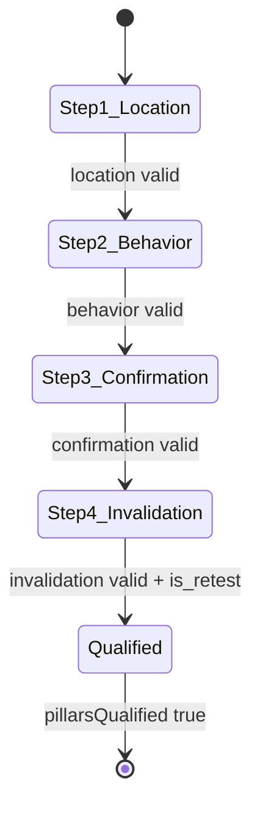

# Four Pillars Form — Gatekeeper Wizard Specification

## Module Header

| Field | Value |
|-------|-------|
| **Purpose** | Four-step reactive form wizard capturing upstream trade qualification (Location, Behavior, Confirmation, Invalidation) plus mandatory retest gate before execution |
| **Angular Target Path** | `src/app/features/gatekeeper/` |
| **Route** | `/gatekeeper` |
| **Supabase Tables** | `execution_audits` (insert on submit), `trades` (companion insert via Execution Block), `setups` / `setup_rules` (optional pre-fill source) |
| **Key Metrics** | Pillar validity per step, `is_retest` compliance, readiness % (25% × valid steps), process compliance baseline |

---

## Overview

The **GatekeeperWizardComponent** is the upstream-cause data entry surface on the Gatekeeper page. It implements a **4-step reactive form** using PrimeNG **p-stepper**, one step per pillar. Each step collects:

1. An **enum selection** via `p-selectbutton` (except Invalidation level, which is free text + price).
2. A **thesis** narrative via `p-textarea` (maps to `*_thesis` columns in `execution_audits`).

Step 1 additionally hosts the **`is_retest` checkbox** (`p-checkbox`). This field is a hard gate: **`is_retest` must be `true`** before the Location step can be considered valid and before any trade may be inserted. The database enforces this via `execution_audits_retest_required CHECK (is_retest = TRUE)`.

**Execution unlock rule:** All four step form groups must be **VALID** **and** `is_retest === true` → parent sets `pillarsQualified = true` → `ExecutionBlockComponent` unlocks.



---

## File Structure

```
src/app/features/gatekeeper/
├── gatekeeper-page.component.ts
├── gatekeeper-page.component.html
├── gatekeeper-page.component.scss
├── gatekeeper-wizard.component.ts
├── gatekeeper-wizard.component.html
├── gatekeeper-wizard.component.scss
├── gatekeeper-form.types.ts
├── gatekeeper-form.factory.ts          # FormBuilder factory + validators
├── gatekeeper-pillar-options.ts        # Enum → SelectButton option arrays
├── gatekeeper.routes.ts
└── services/
    └── gatekeeper-state.service.ts     # optional: shared pillarsQualified signal
```

---

## PrimeNG Imports

| Module | Component | Step | Import Path |
|--------|-----------|------|-------------|
| `StepperModule` | `p-stepper`, `p-step-list`, `p-step`, `p-step-panels`, `p-step-panel` | Wizard shell | `primeng/stepper` |
| `SelectButtonModule` | `p-selectbutton` | Steps 1–3 enums | `primeng/selectbutton` |
| `TextareaModule` | `p-textarea` | All steps (thesis) | `primeng/textarea` |
| `CheckboxModule` | `p-checkbox` | Step 1 (`is_retest`) | `primeng/checkbox` |
| `InputNumberModule` | `p-inputnumber` | Step 4 (`invalidation_price`) | `primeng/inputnumber` |
| `InputTextModule` | `p-inputtext` | Step 4 (`invalidation_level`) | `primeng/inputtext` |
| `ButtonModule` | `p-button` | Next / Back navigation | `primeng/button` |
| `MessageModule` | `p-message` | Inline validation hints | `primeng/message` |
| `FloatLabelModule` | `p-floatlabel` | Thesis fields | `primeng/floatlabel` |

---

## Form Structure

### Root form group

```typescript
interface GatekeeperFormValue {
  is_retest: boolean;
  location: LocationStepValue;
  behavior: BehaviorStepValue;
  confirmation: ConfirmationStepValue;
  invalidation: InvalidationStepValue;
}

interface LocationStepValue {
  location: AuctionLocation | null;
  location_thesis: string;
}

interface BehaviorStepValue {
  behavior: MarketBehavior | null;
  behavior_thesis: string;
}

interface ConfirmationStepValue {
  confirmation: ConfirmationTrigger | null;
  confirmation_thesis: string;
}

interface InvalidationStepValue {
  invalidation_level: string;
  invalidation_price: number | null;
  invalidation_thesis: string;
}
```

### `gatekeeper-form.factory.ts`

```typescript
import { FormBuilder, Validators, ValidatorFn, AbstractControl, ValidationErrors } from '@angular/forms';
import type { GatekeeperFormValue } from './gatekeeper-form.types';

const THESIS_MIN_LENGTH = 20;
const THESIS_MAX_LENGTH = 2000;

export function thesisValidators(): ValidatorFn[] {
  return [
    Validators.required,
    Validators.minLength(THESIS_MIN_LENGTH),
    Validators.maxLength(THESIS_MAX_LENGTH),
    Validators.pattern(/\S/), // reject whitespace-only
  ];
}

/** Location step invalid unless retest confirmed. */
export function retestGateValidator(): ValidatorFn {
  return (control: AbstractControl): ValidationErrors | null => {
    const root = control.root;
    if (!root) return null;
    const isRetest = root.get('is_retest')?.value;
    if (isRetest !== true) {
      return { retestRequired: true };
    }
    return null;
  };
}

export function createGatekeeperForm(fb: FormBuilder) {
  return fb.group({
    is_retest: fb.nonNullable.control(false, {
      validators: [Validators.requiredTrue],
    }),
    location: fb.group({
      location: fb.control<AuctionLocation | null>(null, [Validators.required, retestGateValidator()]),
      location_thesis: fb.nonNullable.control('', thesisValidators()),
    }),
    behavior: fb.group({
      behavior: fb.control<MarketBehavior | null>(null, Validators.required),
      behavior_thesis: fb.nonNullable.control('', thesisValidators()),
    }),
    confirmation: fb.group({
      confirmation: fb.control<ConfirmationTrigger | null>(null, Validators.required),
      confirmation_thesis: fb.nonNullable.control('', thesisValidators()),
    }),
    invalidation: fb.group({
      invalidation_level: fb.nonNullable.control('', [
        Validators.required,
        Validators.minLength(3),
        Validators.maxLength(120),
        Validators.pattern(/\S/),
      ]),
      invalidation_price: fb.control<number | null>(null, [
        Validators.required,
        Validators.min(0.000001),
      ]),
      invalidation_thesis: fb.nonNullable.control('', thesisValidators()),
    }),
  });
}
```

**Cross-field behavior:** When `is_retest` toggles to `false`, re-run validation on `location.location` so Location step immediately fails and readiness drops by 25%.

```typescript
// gatekeeper-wizard.component.ts (excerpt)
this.form.get('is_retest')!.valueChanges.subscribe(() => {
  this.form.get('location.location')?.updateValueAndValidity({ emitEvent: true });
});
```

---

## Validation Rules

| Field | Control | Validators | Error messages |
|-------|---------|------------|----------------|
| `is_retest` | Root | `requiredTrue` | "Initial tests are for context only — retest required to trade" |
| `location.location` | Step 1 | `required`, `retestGateValidator` | "Select auction location" / "Confirm retest before qualifying location" |
| `location.location_thesis` | Step 1 | thesis set | "Minimum 20 characters describing location context" |
| `behavior.behavior` | Step 2 | `required` | "Select observed market behavior" |
| `behavior.behavior_thesis` | Step 2 | thesis set | "Describe behavior at location" |
| `confirmation.confirmation` | Step 3 | `required` | "Select confirmation trigger" |
| `confirmation.confirmation_thesis` | Step 3 | thesis set | "Describe confirmation evidence" |
| `invalidation.invalidation_level` | Step 4 | required, min 3, max 120 | "Define invalidation level (e.g. VAL, swing low)" |
| `invalidation.invalidation_price` | Step 4 | required, min > 0 | "Enter invalidation price" |
| `invalidation.invalidation_thesis` | Step 4 | thesis set | "Explain invalidation logic" |

### Step validity (for readiness meter)

| Step | `FormGroup` | `valid === true` when |
|------|-------------|------------------------|
| 1 — Location | `form.get('location')` | Group valid **and** `is_retest === true` |
| 2 — Behavior | `form.get('behavior')` | Group valid |
| 3 — Confirmation | `form.get('confirmation')` | Group valid |
| 4 — Invalidation | `form.get('invalidation')` | Group valid |

### Navigation guards

- **Next** button on step N disabled until step N group is valid.
- **Back** always enabled.
- User may click step headers in `p-stepper` only for **completed** steps or the **first invalid** step (prevent skipping ahead).

---

## Enum Option Arrays

### `gatekeeper-pillar-options.ts`

```typescript
import type { SelectItem } from 'primeng/api';
import type {
  AuctionLocation,
  ConfirmationTrigger,
  MarketBehavior,
} from '../../core/supabase/database.types';

export const AUCTION_LOCATION_OPTIONS: SelectItem<AuctionLocation>[] = [
  { label: 'VAH', value: 'VAH' },
  { label: 'VAL', value: 'VAL' },
  { label: 'POC', value: 'POC' },
  { label: 'Weekly VWAP', value: 'Weekly_VWAP' },
  { label: 'Monthly VWAP', value: 'Monthly_VWAP' },
  { label: 'Composite VAH', value: 'Composite_VAH' },
  { label: 'Composite VAL', value: 'Composite_VAL' },
  { label: 'Composite POC', value: 'Composite_POC' },
  { label: 'Overnight High', value: 'Overnight_High' },
  { label: 'Overnight Low', value: 'Overnight_Low' },
  { label: 'Single Print', value: 'Single_Print' },
  { label: 'Naked POC', value: 'Naked_POC' },
];

export const MARKET_BEHAVIOR_OPTIONS: SelectItem<MarketBehavior>[] = [
  { label: 'Rejection', value: 'Rejection' },
  { label: 'Acceptance', value: 'Acceptance' },
  { label: 'Rotation', value: 'Rotation' },
  { label: 'Exhaustion', value: 'Exhaustion' },
  { label: 'Excess', value: 'Excess' },
  { label: 'Failed Auction', value: 'Failed_Auction' },
  { label: 'Value Migration', value: 'Value_Migration' },
  { label: 'Responsive Buying', value: 'Responsive_Buying' },
  { label: 'Responsive Selling', value: 'Responsive_Selling' },
];

export const CONFIRMATION_TRIGGER_OPTIONS: SelectItem<ConfirmationTrigger>[] = [
  { label: 'Delta Divergence', value: 'Delta_Divergence' },
  { label: 'Volume Absorption', value: 'Volume_Absorption' },
  { label: 'Excess Tail', value: 'Excess_Tail' },
  { label: 'VWAP Reclaim', value: 'VWAP_Reclaim' },
  { label: 'Market Structure Break', value: 'Market_Structure_Break' },
];
```

---

## Supabase Field Mapping

### Form → `execution_audits` insert payload

| Form path | DB column | PostgreSQL type | Notes |
|-----------|-----------|-----------------|-------|
| `location.location` | `location` | `auction_location` | NOT NULL enum |
| `location.location_thesis` | `location_thesis` | `TEXT` | NOT NULL |
| `behavior.behavior` | `behavior` | `market_behavior` | NOT NULL enum |
| `behavior.behavior_thesis` | `behavior_thesis` | `TEXT` | NOT NULL |
| `confirmation.confirmation` | `confirmation` | `confirmation_trigger` | NOT NULL enum |
| `confirmation.confirmation_thesis` | `confirmation_thesis` | `TEXT` | NOT NULL |
| `invalidation.invalidation_level` | `invalidation_level` | `TEXT` | NOT NULL; `trim()` before insert |
| `invalidation.invalidation_price` | `invalidation_price` | `NUMERIC(18,6)` | NOT NULL |
| `invalidation.invalidation_thesis` | `invalidation_thesis` | `TEXT` | NOT NULL |
| `is_retest` | `is_retest` | `BOOLEAN` | MUST be `true`; DB CHECK rejects `false` |
| — | `trade_id` | `UUID` | Set after `trades` insert (Execution Block) |
| — | `location_valid_post` | `BOOLEAN` | `NULL` until post-mortem |
| — | `behavior_matched_post` | `BOOLEAN` | `NULL` until post-mortem |
| — | `confirmation_legitimate_post` | `BOOLEAN` | `NULL` until post-mortem |
| — | `invalidation_respected_post` | `BOOLEAN` | `NULL` until post-mortem |

### Mapping helper

```typescript
export function mapFormToExecutionAudit(
  form: GatekeeperFormValue
): Omit<ExecutionAudit, 'id' | 'trade_id' | 'location_valid_post' | 'behavior_matched_post' | 'confirmation_legitimate_post' | 'invalidation_respected_post' | 'post_mortem_completed_at'> {
  return {
    location: form.location.location!,
    location_thesis: form.location.location_thesis.trim(),
    behavior: form.behavior.behavior!,
    behavior_thesis: form.behavior.behavior_thesis.trim(),
    confirmation: form.confirmation.confirmation!,
    confirmation_thesis: form.confirmation.confirmation_thesis.trim(),
    invalidation_level: form.invalidation.invalidation_level.trim(),
    invalidation_price: form.invalidation.invalidation_price!,
    invalidation_thesis: form.invalidation.invalidation_thesis.trim(),
    is_retest: true,
  };
}
```

---

## HTML Template Blueprint

```html
<form class="gatekeeper-form" [formGroup]="form" novalidate>
  <p-stepper [(value)]="activeStep" [linear]="true" class="gatekeeper-form__stepper">
    <p-step-list class="gatekeeper-form__step-list">
      <p-step [value]="1">Location</p-step>
      <p-step [value]="2">Behavior</p-step>
      <p-step [value]="3">Confirmation</p-step>
      <p-step [value]="4">Invalidation</p-step>
    </p-step-list>

    <p-step-panels class="gatekeeper-form__panels">
      <!-- STEP 1 — LOCATION -->
      <p-step-panel [value]="1">
        <ng-template #content let-activateCallback="activateCallback">
          <section class="gatekeeper-form__step" formGroupName="location">
            <div class="gatekeeper-form__retest gatekeeper-form__retest--highlight">
              <p-checkbox
                inputId="is_retest"
                formControlName="is_retest"
                [binary]="true"
                label="This is a RETEST (not initial test)"
              />
              @if (form.get('is_retest')?.invalid && form.get('is_retest')?.touched) {
                <p-message severity="error" text="Retest confirmation required to trade" />
              }
            </div>

            <label class="gatekeeper-form__label">Auction Location</label>
            <p-selectbutton
              class="gatekeeper-form__selectbutton"
              formControlName="location"
              [options]="locationOptions"
              optionLabel="label"
              optionValue="value"
              ariaLabel="Auction location"
            />

            <p-floatlabel class="gatekeeper-form__float">
              <p-textarea
                inputId="location_thesis"
                formControlName="location_thesis"
                rows="4"
                autoResize
                class="gatekeeper-form__textarea"
              />
              <label for="location_thesis">Location thesis (why here?)</label>
            </p-floatlabel>

            <footer class="gatekeeper-form__nav">
              <p-button
                label="Next: Behavior"
                icon="pi pi-arrow-right"
                iconPos="right"
                [disabled]="!isStepValid(1)"
                (onClick)="activateCallback(2)"
              />
            </footer>
          </section>
        </ng-template>
      </p-step-panel>

      <!-- STEP 2 — BEHAVIOR -->
      <p-step-panel [value]="2">
        <ng-template #content let-activateCallback="activateCallback">
          <section class="gatekeeper-form__step" formGroupName="behavior">
            <label class="gatekeeper-form__label">Market Behavior</label>
            <p-selectbutton
              class="gatekeeper-form__selectbutton"
              formControlName="behavior"
              [options]="behaviorOptions"
              optionLabel="label"
              optionValue="value"
            />

            <p-floatlabel class="gatekeeper-form__float">
              <p-textarea
                inputId="behavior_thesis"
                formControlName="behavior_thesis"
                rows="4"
                autoResize
                class="gatekeeper-form__textarea"
              />
              <label for="behavior_thesis">Behavior thesis (what is price doing?)</label>
            </p-floatlabel>

            <footer class="gatekeeper-form__nav">
              <p-button label="Back" severity="secondary" (onClick)="activateCallback(1)" />
              <p-button
                label="Next: Confirmation"
                icon="pi pi-arrow-right"
                iconPos="right"
                [disabled]="!isStepValid(2)"
                (onClick)="activateCallback(3)"
              />
            </footer>
          </section>
        </ng-template>
      </p-step-panel>

      <!-- STEP 3 — CONFIRMATION -->
      <p-step-panel [value]="3">
        <ng-template #content let-activateCallback="activateCallback">
          <section class="gatekeeper-form__step" formGroupName="confirmation">
            <label class="gatekeeper-form__label">Confirmation Trigger</label>
            <p-selectbutton
              class="gatekeeper-form__selectbutton"
              formControlName="confirmation"
              [options]="confirmationOptions"
              optionLabel="label"
              optionValue="value"
            />

            <p-floatlabel class="gatekeeper-form__float">
              <p-textarea
                inputId="confirmation_thesis"
                formControlName="confirmation_thesis"
                rows="4"
                autoResize
                class="gatekeeper-form__textarea"
              />
              <label for="confirmation_thesis">Confirmation thesis (evidence of entry trigger)</label>
            </p-floatlabel>

            <footer class="gatekeeper-form__nav">
              <p-button label="Back" severity="secondary" (onClick)="activateCallback(2)" />
              <p-button
                label="Next: Invalidation"
                icon="pi pi-arrow-right"
                iconPos="right"
                [disabled]="!isStepValid(3)"
                (onClick)="activateCallback(4)"
              />
            </footer>
          </section>
        </ng-template>
      </p-step-panel>

      <!-- STEP 4 — INVALIDATION -->
      <p-step-panel [value]="4">
        <ng-template #content let-activateCallback="activateCallback">
          <section class="gatekeeper-form__step" formGroupName="invalidation">
            <label class="gatekeeper-form__label">Invalidation Level</label>
            <input
              pInputText
              class="gatekeeper-form__input"
              formControlName="invalidation_level"
              placeholder="e.g. Below VAL, under overnight low"
            />

            <label class="gatekeeper-form__label">Invalidation Price</label>
            <p-inputnumber
              class="gatekeeper-form__inputnumber"
              formControlName="invalidation_price"
              mode="decimal"
              [minFractionDigits]="2"
              [maxFractionDigits]="6"
              [min]="0"
            />

            <p-floatlabel class="gatekeeper-form__float">
              <p-textarea
                inputId="invalidation_thesis"
                formControlName="invalidation_thesis"
                rows="4"
                autoResize
                class="gatekeeper-form__textarea"
              />
              <label for="invalidation_thesis">Invalidation thesis (what proves you wrong?)</label>
            </p-floatlabel>

            <footer class="gatekeeper-form__nav">
              <p-button label="Back" severity="secondary" (onClick)="activateCallback(3)" />
              <p-button
                label="Qualification Complete"
                icon="pi pi-check"
                severity="success"
                [disabled]="!isStepValid(4)"
                (onClick)="onQualificationComplete()"
              />
            </footer>
          </section>
        </ng-template>
      </p-step-panel>
    </p-step-panels>
  </p-stepper>
</form>
```

**Note:** `is_retest` checkbox binds to root `formControlName="is_retest"` — move checkbox outside `formGroupName="location"` in actual template (wrap both in form; use `[formGroup]="form"` on outer element and nest location group without duplicating retest inside location group). Correct structure:

```html
<form [formGroup]="form">
  <p-checkbox formControlName="is_retest" ... />
  <div formGroupName="location">...</div>
</form>
```

---

## SCSS — BEM Namespace `.gatekeeper-form`

```scss
.gatekeeper-form {
  --gk-bg: var(--dqos-bg-panel, #161920);
  --gk-bg-input: var(--dqos-bg-base, #0D0E12);
  --gk-border: var(--dqos-border, #262B37);
  --gk-text: var(--p-text-color, #e5e7eb);
  --gk-muted: var(--p-text-muted-color, #9ca3af);
  --gk-qualified: var(--dqos-accent-qualified, #10b981);
  --gk-warning: var(--dqos-accent-warning, #f59e0b);
  --gk-font-ui: var(--dqos-font-ui, 'Inter', system-ui, sans-serif);
  --gk-font-mono: var(--dqos-font-mono, 'JetBrains Mono', monospace);

  background: var(--gk-bg);
  border: 1px solid var(--gk-border);
  border-radius: 0.75rem;
  padding: 1.5rem;

  &__stepper {
    :host ::ng-deep .p-stepper-header {
      font-family: var(--gk-font-ui);
    }
  }

  &__step {
    display: flex;
    flex-direction: column;
    gap: 1.25rem;
    padding-top: 1rem;
  }

  &__retest {
    padding: 0.875rem 1rem;
    background: var(--gk-bg-input);
    border: 1px solid var(--gk-border);
    border-radius: 0.5rem;

    &--highlight {
      border-color: color-mix(in srgb, var(--gk-warning) 40%, var(--gk-border));
    }
  }

  &__label {
    font-size: 0.8125rem;
    font-weight: 600;
    text-transform: uppercase;
    letter-spacing: 0.04em;
    color: var(--gk-muted);
  }

  &__selectbutton {
    :host ::ng-deep .p-togglebutton {
      font-family: var(--gk-font-ui);
      font-size: 0.8125rem;
    }

    :host ::ng-deep .p-togglebutton-checked {
      border-color: var(--gk-qualified);
    }
  }

  &__float {
    width: 100%;
  }

  &__textarea {
    width: 100%;
    font-family: var(--gk-font-ui);
    font-size: 0.9375rem;
  }

  &__input,
  &__inputnumber {
    width: 100%;
    max-width: 24rem;
  }

  &__inputnumber {
    :host ::ng-deep input {
      font-family: var(--gk-font-mono);
      font-variant-numeric: tabular-nums;
    }
  }

  &__nav {
    display: flex;
    justify-content: space-between;
    gap: 0.75rem;
    margin-top: 0.5rem;
    padding-top: 1rem;
    border-top: 1px solid var(--gk-border);
  }
}
```

---

## Component Logic (Wizard)

```typescript
@Component({
  selector: 'app-gatekeeper-wizard',
  standalone: true,
  imports: [
    ReactiveFormsModule,
    StepperModule,
    SelectButtonModule,
    TextareaModule,
    CheckboxModule,
    ButtonModule,
    MessageModule,
  ],
  templateUrl: './gatekeeper-wizard.component.html',
  styleUrl: './gatekeeper-wizard.component.scss',
})
export class GatekeeperWizardComponent {
  private readonly fb = inject(FormBuilder);

  protected readonly form = createGatekeeperForm(this.fb);
  protected activeStep = 1;

  protected readonly locationOptions = AUCTION_LOCATION_OPTIONS;
  protected readonly behaviorOptions = MARKET_BEHAVIOR_OPTIONS;
  protected readonly confirmationOptions = CONFIRMATION_TRIGGER_OPTIONS;

  /** Emits full form value when step 4 completes. */
  readonly qualified = output<GatekeeperFormValue>();

  protected isStepValid(step: number): boolean {
    switch (step) {
      case 1:
        return this.form.get('location')!.valid && this.form.get('is_retest')!.value === true;
      case 2:
        return this.form.get('behavior')!.valid;
      case 3:
        return this.form.get('confirmation')!.valid;
      case 4:
        return this.form.get('invalidation')!.valid;
      default:
        return false;
    }
  }

  protected onQualificationComplete(): void {
    if (!this.isStepValid(4)) {
      this.form.markAllAsTouched();
      return;
    }
    this.qualified.emit(this.form.getRawValue() as GatekeeperFormValue);
  }

  /** Exposed to parent for ReadinessMeter + ExecutionBlock */
  getPillarStepStates(): PillarStepState[] {
    return [
      { key: 'location', label: 'Location', valid: this.isStepValid(1) },
      { key: 'behavior', label: 'Behavior', valid: this.isStepValid(2) },
      { key: 'confirmation', label: 'Confirmation', valid: this.isStepValid(3) },
      { key: 'invalidation', label: 'Invalidation', valid: this.isStepValid(4) },
    ];
  }
}
```

---

## Gatekeeper Page Layout

```html
<!-- gatekeeper-page.component.html -->
<div class="gatekeeper-page">
  <header class="gatekeeper-page__header">
    <h1>Gatekeeper</h1>
    <p class="gatekeeper-page__subtitle">Qualify upstream cause before execution</p>
  </header>

  <div class="gatekeeper-page__grid">
    <app-gatekeeper-wizard
      class="gatekeeper-page__wizard"
      (qualified)="onQualified($event)"
    />

    <aside class="gatekeeper-page__sidebar">
      <app-readiness-meter
        [pillarSteps]="pillarStepStates()"
        (readinessChange)="onReadinessChange($event)"
      />

      <app-execution-block
        [pillarsQualified]="pillarsQualified()"
        [auditDraft]="auditDraft()"
        [readinessPct]="readinessPct()"
      />
    </aside>
  </div>
</div>
```

---

## Route Configuration

```typescript
// gatekeeper.routes.ts
import { Routes } from '@angular/router';

export const GATEKEEPER_ROUTES: Routes = [
  {
    path: '',
    loadComponent: () =>
      import('./gatekeeper-page.component').then((m) => m.GatekeeperPageComponent),
    title: 'Gatekeeper — DQOS',
  },
];

// app.routes.ts
{ path: 'gatekeeper', loadChildren: () => import('./features/gatekeeper/gatekeeper.routes').then(m => m.GATEKEEPER_ROUTES) }
```

---

## Error Handling

| Failure | UI response |
|---------|-------------|
| Thesis too short | Inline `p-message` under textarea on blur |
| `is_retest` unchecked | Highlight retest panel amber; Location step invalid |
| User skips to execution while locked | Execution block shows lock overlay (see `execution_block.md`) |
| DB rejects `is_retest false` | Toast: "Retest required — initial tests are not traded" |

---

## Cross-References

- Readiness display: [`readiness_meter.md`](./readiness_meter.md)
- Trade submit: [`execution_block.md`](./execution_block.md)
- Schema & constraints: [`docs/01_DATABASE_CORE.md`](../01_DATABASE_CORE.md)
