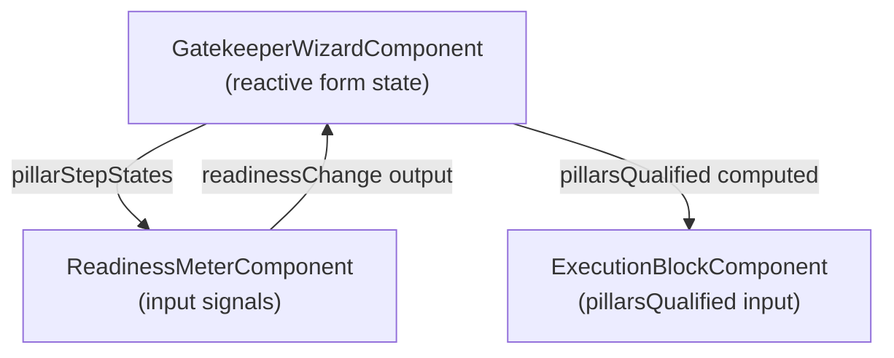

# Readiness Meter — Component Specification

## Module Header

| Field | Value |
|-------|-------|
| **Purpose** | Real-time visual gate displaying upstream pillar qualification progress (0–100%) and blocking trade execution until all four pillars plus retest confirmation are satisfied |
| **Angular Target Path** | `src/app/shared/components/readiness-meter/` |
| **Route** | `/gatekeeper` (embedded in Gatekeeper page shell; not a standalone route) |
| **Supabase Tables** | `trades.readiness_pct_at_entry` (persisted on submit at 100), `execution_audits` (source pillar values validated by parent wizard) |
| **Key Metrics** | Readiness %, pillar completion count (0–4), `pillarsQualified` boolean, TQS input for downstream analytics |

---

## Overview

The **ReadinessMeterComponent** is a presentational, signal-driven widget that consumes pillar validation state from the parent `GatekeeperWizardComponent` and renders:

1. A circular **p-knob** (primary) or linear **p-progressbar** (compact layout) showing cumulative readiness.
2. A **p-message** banner that switches between amber warning and emerald success based on the computed percentage.

**Formula:** Each of the four pillar steps contributes **25%** when its step group is **VALID**. Partial credit is allowed per step; there is no fractional credit within a single step.

| Pillar Step | Weight | Valid When |
|-------------|--------|------------|
| Location | 25% | `location` enum selected **and** `location_thesis` passes min-length validator **and** `is_retest === true` |
| Behavior | 25% | `behavior` enum selected **and** `behavior_thesis` passes min-length validator |
| Confirmation | 25% | `confirmation` enum selected **and** `confirmation_thesis` passes min-length validator |
| Invalidation | 25% | `invalidation_level` non-empty **and** `invalidation_price > 0` **and** `invalidation_thesis` passes min-length validator |

**Critical rule:** `readiness_pct_at_entry` written to `trades` on submit **must be exactly `100`**. The database trigger `trades_enforce_qualification` rejects any `OPEN` or `CLOSED` trade with `readiness_pct_at_entry < 100`. The meter is the UI enforcement layer; the DB is the hard stop.



---

## PrimeNG Component Table

| PrimeNG Module | Component Selector | Role | Import Path |
|----------------|-------------------|------|-------------|
| `KnobModule` | `p-knob` | Primary circular readiness indicator (0–100) | `primeng/knob` |
| `ProgressBarModule` | `p-progressbar` | Optional compact linear variant | `primeng/progressbar` |
| `MessageModule` | `p-message` | Amber / emerald qualification banner | `primeng/message` |
| `TooltipModule` | `p-tooltip` | Hover detail on each pillar segment | `primeng/tooltip` |
| `DividerModule` | `p-divider` | Separates knob from pillar checklist | `primeng/divider` |

**Layout decision:** Default to `p-knob` on viewports ≥768px; swap to `p-progressbar` below 768px via `@if (compact())` signal. Both bind to the same `readinessPct` computed signal.

---

## File Structure

```
src/app/shared/components/readiness-meter/
├── readiness-meter.component.ts
├── readiness-meter.component.html
├── readiness-meter.component.scss
├── readiness-meter.types.ts
└── index.ts                          # barrel: export component + types
```

---

## TypeScript Interfaces

### `readiness-meter.types.ts`

```typescript
import type {
  AuctionLocation,
  ConfirmationTrigger,
  MarketBehavior,
} from '../../../core/supabase/database.types';

/** Single pillar step validation snapshot passed from wizard. */
export interface PillarStepState {
  /** Step key matching form group name. */
  key: 'location' | 'behavior' | 'confirmation' | 'invalidation';
  /** Human label for UI checklist. */
  label: string;
  /** True when all validators for this step pass (including is_retest on location). */
  valid: boolean;
  /** Optional enum value for tooltip display. */
  value?: AuctionLocation | MarketBehavior | ConfirmationTrigger | string | null;
}

/** Emitted when readiness crosses thresholds. */
export interface ReadinessChangeEvent {
  readinessPct: number;
  pillarsQualified: boolean;
  completedSteps: number;
}

/** Knob color mode derived from readiness. */
export type ReadinessVisualState = 'warning' | 'qualified' | 'neutral';
```

### `readiness-meter.component.ts`

```typescript
import {
  ChangeDetectionStrategy,
  Component,
  computed,
  input,
  output,
  effect,
} from '@angular/core';
import { KnobModule } from 'primeng/knob';
import { ProgressBarModule } from 'primeng/progressbar';
import { MessageModule } from 'primeng/message';
import { TooltipModule } from 'primeng/tooltip';
import { DividerModule } from 'primeng/divider';
import type { PillarStepState, ReadinessChangeEvent, ReadinessVisualState } from './readiness-meter.types';

@Component({
  selector: 'app-readiness-meter',
  standalone: true,
  imports: [KnobModule, ProgressBarModule, MessageModule, TooltipModule, DividerModule],
  templateUrl: './readiness-meter.component.html',
  styleUrl: './readiness-meter.component.scss',
  changeDetection: ChangeDetectionStrategy.OnPush,
})
export class ReadinessMeterComponent {
  /** Ordered pillar states from parent wizard (4 items expected). */
  readonly pillarSteps = input.required<PillarStepState[]>();

  /** Force linear progress bar instead of knob. */
  readonly compact = input<boolean>(false);

  /** Show per-pillar checklist beneath meter. */
  readonly showChecklist = input<boolean>(true);

  /** Emits whenever readinessPct or pillarsQualified changes. */
  readonly readinessChange = output<ReadinessChangeEvent>();

  /** Count of valid steps (0–4). */
  protected readonly completedSteps = computed(() =>
    this.pillarSteps().filter((s) => s.valid).length
  );

  /** 25% per valid pillar; integer steps only. */
  protected readonly readinessPct = computed(() =>
    this.completedSteps() * 25
  );

  /** True only when readiness === 100 (all 4 valid). */
  protected readonly pillarsQualified = computed(() =>
    this.readinessPct() === 100
  );

  protected readonly visualState = computed<ReadinessVisualState>(() => {
    const pct = this.readinessPct();
    if (pct === 100) return 'qualified';
    if (pct > 0) return 'warning';
    return 'neutral';
  });

  protected readonly bannerSeverity = computed<'warn' | 'success' | 'info'>(() => {
    switch (this.visualState()) {
      case 'qualified':
        return 'success';
      case 'warning':
        return 'warn';
      default:
        return 'info';
    }
  });

  protected readonly bannerText = computed(() => {
    if (this.pillarsQualified()) {
      return 'STRATEGY FULLY QUALIFIED — EXECUTION UNLOCKED';
    }
    return 'STRATEGY NOT FULLY QUALIFIED — DO NOT TRADE';
  });

  protected readonly knobColor = computed(() => {
    return this.pillarsQualified()
      ? 'var(--dqos-accent-qualified, #10b981)'
      : 'var(--dqos-accent-warning, #f59e0b)';
  });

  constructor() {
    effect(() => {
      this.readinessChange.emit({
        readinessPct: this.readinessPct(),
        pillarsQualified: this.pillarsQualified(),
        completedSteps: this.completedSteps(),
      });
    });
  }
}
```

---

## HTML Template Blueprint

```html
<section
  class="readiness-meter"
  [class.readiness-meter--qualified]="pillarsQualified()"
  [class.readiness-meter--warning]="visualState() === 'warning'"
  [class.readiness-meter--neutral]="visualState() === 'neutral'"
  aria-live="polite"
  aria-label="Strategy readiness meter"
>
  <header class="readiness-meter__header">
    <h2 class="readiness-meter__title">Readiness</h2>
    <span class="readiness-meter__pct" [attr.aria-valuenow]="readinessPct()">
      {{ readinessPct() }}%
    </span>
  </header>

  <div class="readiness-meter__visual">
    @if (compact()) {
      <p-progressbar
        class="readiness-meter__bar"
        [value]="readinessPct()"
        [showValue]="true"
        unit="%"
        [color]="knobColor()"
      />
    } @else {
      <p-knob
        class="readiness-meter__knob"
        [ngModel]="readinessPct()"
        [readonly]="true"
        [min]="0"
        [max]="100"
        valueTemplate="{value}%"
        [strokeWidth]="8"
        [size]="140"
        [valueColor]="knobColor()"
        ariaLabel="Readiness percentage"
      />
    }
  </div>

  <p-message
    class="readiness-meter__banner"
    [severity]="bannerSeverity()"
    [text]="bannerText()"
    [closable]="false"
    icon="pi pi-shield"
  />

  @if (showChecklist()) {
    <p-divider class="readiness-meter__divider" />

    <ul class="readiness-meter__checklist" role="list">
      @for (step of pillarSteps(); track step.key) {
        <li
          class="readiness-meter__checklist-item"
          [class.readiness-meter__checklist-item--valid]="step.valid"
          [pTooltip]="step.valid ? 'Step qualified' : 'Complete this pillar to add 25%'"
          tooltipPosition="right"
        >
          <span
            class="readiness-meter__checklist-icon"
            [attr.aria-label]="step.valid ? step.label + ' complete' : step.label + ' incomplete'"
          >
            @if (step.valid) {
              <i class="pi pi-check-circle" aria-hidden="true"></i>
            } @else {
              <i class="pi pi-circle" aria-hidden="true"></i>
            }
          </span>
          <span class="readiness-meter__checklist-label">{{ step.label }}</span>
          <span class="readiness-meter__checklist-weight">25%</span>
        </li>
      }
    </ul>
  }
</section>
```

**Note:** `FormsModule` is required only for `p-knob` `[ngModel]` readonly binding. Prefer `FormsModule` import in the standalone component imports array.

---

## SCSS — BEM Namespace `.readiness-meter`

```scss
.readiness-meter {
  --readiness-bg: var(--dqos-bg-panel, #161920);
  --readiness-border: var(--dqos-border, #262B37);
  --readiness-text: var(--p-text-color, #e5e7eb);
  --readiness-muted: var(--p-text-muted-color, #9ca3af);
  --readiness-qualified: var(--dqos-accent-qualified, #10b981);
  --readiness-warning: var(--dqos-accent-warning, #f59e0b);
  --readiness-font-ui: var(--dqos-font-ui, 'Inter', system-ui, sans-serif);
  --readiness-font-mono: var(--dqos-font-mono, 'JetBrains Mono', monospace);

  background: var(--readiness-bg);
  border: 1px solid var(--readiness-border);
  border-radius: 0.75rem;
  padding: 1.25rem 1.5rem;
  font-family: var(--readiness-font-ui);
  color: var(--readiness-text);

  &--qualified {
    border-color: color-mix(in srgb, var(--readiness-qualified) 40%, var(--readiness-border));
    box-shadow: 0 0 0 1px color-mix(in srgb, var(--readiness-qualified) 15%, transparent);
  }

  &--warning {
    border-color: color-mix(in srgb, var(--readiness-warning) 35%, var(--readiness-border));
  }

  &__header {
    display: flex;
    align-items: baseline;
    justify-content: space-between;
    margin-bottom: 1rem;
  }

  &__title {
    margin: 0;
    font-size: 0.875rem;
    font-weight: 600;
    letter-spacing: 0.04em;
    text-transform: uppercase;
    color: var(--readiness-muted);
  }

  &__pct {
    font-family: var(--readiness-font-mono);
    font-size: 1.5rem;
    font-weight: 700;
    font-variant-numeric: tabular-nums;
  }

  &--qualified &__pct {
    color: var(--readiness-qualified);
  }

  &--warning &__pct {
    color: var(--readiness-warning);
  }

  &__visual {
    display: flex;
    justify-content: center;
    margin-bottom: 1rem;
  }

  &__knob {
    :host ::ng-deep .p-knob-text {
      font-family: var(--readiness-font-mono);
      font-weight: 700;
    }
  }

  &__bar {
    width: 100%;
  }

  &__banner {
    margin-top: 0.5rem;

    :host ::ng-deep .p-message-text {
      font-size: 0.8125rem;
      font-weight: 600;
      letter-spacing: 0.02em;
    }
  }

  &--qualified &__banner {
    :host ::ng-deep .p-message {
      background: color-mix(in srgb, var(--readiness-qualified) 12%, var(--readiness-bg));
      border-color: color-mix(in srgb, var(--readiness-qualified) 35%, transparent);
      color: var(--readiness-qualified);
    }
  }

  &--warning &__banner {
    :host ::ng-deep .p-message {
      background: color-mix(in srgb, var(--readiness-warning) 12%, var(--readiness-bg));
      border-color: color-mix(in srgb, var(--readiness-warning) 35%, transparent);
      color: var(--readiness-warning);
    }
  }

  &__divider {
    margin: 1rem 0;
  }

  &__checklist {
    list-style: none;
    margin: 0;
    padding: 0;
    display: flex;
    flex-direction: column;
    gap: 0.5rem;
  }

  &__checklist-item {
    display: grid;
    grid-template-columns: 1.5rem 1fr auto;
    align-items: center;
    gap: 0.5rem;
    padding: 0.375rem 0.5rem;
    border-radius: 0.375rem;
    color: var(--readiness-muted);

    &--valid {
      color: var(--readiness-text);

      .readiness-meter__checklist-icon {
        color: var(--readiness-qualified);
      }
    }
  }

  &__checklist-icon {
    display: flex;
    align-items: center;
    justify-content: center;
  }

  &__checklist-label {
    font-size: 0.875rem;
  }

  &__checklist-weight {
    font-family: var(--readiness-font-mono);
    font-size: 0.75rem;
    font-variant-numeric: tabular-nums;
    opacity: 0.7;
  }
}
```

---

## State Handling Rules

### Input contract

| Input | Type | Required | Description |
|-------|------|----------|-------------|
| `pillarSteps` | `PillarStepState[]` | Yes | Exactly 4 items in pillar order; parent recomputes `valid` on every `valueChanges` |
| `compact` | `boolean` | No | Default `false`; parent may bind to `(window:resize)` or layout service |
| `showChecklist` | `boolean` | No | Default `true`; set `false` in collapsed sidebar mode |

### Output contract

| Output | Payload | Consumer action |
|--------|---------|-----------------|
| `readinessChange` | `ReadinessChangeEvent` | Parent stores `pillarsQualified` and passes to `ExecutionBlockComponent` |

### Visual state matrix

| `readinessPct` | CSS modifier | Banner severity | Banner copy | Knob / bar color |
|----------------|--------------|-----------------|-------------|------------------|
| `0` | `--neutral` | `info` | STRATEGY NOT FULLY QUALIFIED — DO NOT TRADE | `#262B37` (muted track) |
| `25`, `50`, `75` | `--warning` | `warn` | STRATEGY NOT FULLY QUALIFIED — DO NOT TRADE | `#f59e0b` (amber) |
| `100` | `--qualified` | `success` | STRATEGY FULLY QUALIFIED — EXECUTION UNLOCKED | `#10b981` (emerald) |

### Parent integration (Gatekeeper page)

```typescript
// gatekeeper-page.component.ts (excerpt)
protected readonly pillarStepStates = computed<PillarStepState[]>(() => [
  {
    key: 'location',
    label: 'Location',
    valid: this.locationGroup.valid && this.form.get('is_retest')?.value === true,
    value: this.locationGroup.get('location')?.value,
  },
  {
    key: 'behavior',
    label: 'Behavior',
    valid: this.behaviorGroup.valid,
    value: this.behaviorGroup.get('behavior')?.value,
  },
  {
    key: 'confirmation',
    label: 'Confirmation',
    valid: this.confirmationGroup.valid,
    value: this.confirmationGroup.get('confirmation')?.value,
  },
  {
    key: 'invalidation',
    label: 'Invalidation',
    valid: this.invalidationGroup.valid,
    value: this.invalidationGroup.get('invalidation_level')?.value,
  },
]);

protected pillarsQualified = signal(false);

protected onReadinessChange(event: ReadinessChangeEvent): void {
  this.pillarsQualified.set(event.pillarsQualified);
}
```

### Accessibility

- Container uses `aria-live="polite"` so screen readers announce banner changes when steps complete.
- Percentage displayed in both knob and header with `aria-valuenow`.
- Checklist items expose completion via `aria-label` on icon span.
- Color is never the sole indicator: banner text and checklist icons reinforce state.

### Performance

- `ChangeDetectionStrategy.OnPush` with signal inputs; no manual `markForCheck`.
- Parent should pass new `pillarSteps` array only when validity changes (computed in parent), not on every keystroke unless thesis validators run (acceptable for thesis fields with debounced validation optional).

### Database alignment

On successful trade submit (see `execution_block.md`):

```typescript
readiness_pct_at_entry: 100  // MUST match meter at submit time
```

If UI and DB diverge (e.g. race condition), Supabase returns:

```
STRATEGY NOT FULLY QUALIFIED — trade cannot be OPEN with readiness <value>
```

The meter must never display 100% unless all four `valid` flags are true **and** `is_retest === true`.

---

## Testing Checklist

| Scenario | Expected |
|----------|----------|
| 0 valid steps | 0%, amber/warn banner, execution locked |
| 1 valid step | 25%, warn banner |
| 3 valid steps | 75%, warn banner |
| 4 valid steps | 100%, emerald/success banner, `pillarsQualified === true` |
| Location valid but `is_retest === false` | Location step `valid: false`, max 75% |
| `readinessChange` emission | Fires on each validity transition with correct payload |

---

## Cross-References

- Database schema & enums: [`docs/01_DATABASE_CORE.md`](../01_DATABASE_CORE.md)
- Four pillars form (validity source): [`four_pillars_form.md`](./four_pillars_form.md)
- Execution unlock consumer: [`execution_block.md`](./execution_block.md)
- Theme tokens: [`src/app/core/theme/dqos-preset.ts`](../../src/app/core/theme/dqos-preset.ts)
