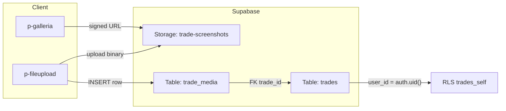

# 04 — Trade Details: Media Gallery

## Module Header

| Field | Value |
|-------|-------|
| **Purpose** | Attach, browse, and caption trade screenshots on the Trade Details page — dual persistence in Supabase Storage (`trade-screenshots`) and `public.trade_media` |
| **Angular Target Path** | `src/app/features/trade-details/components/trade-media-gallery/` |
| **Route** | `/trades/:id` (media section — embedded tab or panel) |
| **Supabase Tables** | `trade_media`, `trades` (ownership verify) |
| **Supabase Storage** | Bucket `trade-screenshots`, path `{user_id}/{trade_id}/{filename}` |
| **Key Metrics** | Media count per trade, upload success rate |
| **Parent Module** | [01 — Database Core](../01_DATABASE_CORE.md) |

---

## Philosophy

Screenshots are **evidence artifacts** tied to a closed or open trade — they do not affect TQS, readiness, or expectancy calculations. Storage objects and `trade_media` rows are written atomically: if the DB insert fails after upload, the client deletes the orphaned storage object.

---

## Storage & RLS Architecture



### Bucket configuration

| Setting | Value |
|---------|-------|
| Bucket name | `trade-screenshots` |
| Public | `false` |
| Allowed MIME | `image/png`, `image/jpeg`, `image/webp` |
| Max file size | 5 MB (client + bucket policy) |
| Path pattern | `{user_id}/{trade_id}/{uuid}.{ext}` |

### Storage RLS policies (Supabase Dashboard → Storage → Policies)

```sql
-- SELECT: user reads own folder
CREATE POLICY "trade_screenshots_select_own"
ON storage.objects FOR SELECT
TO authenticated
USING (
  bucket_id = 'trade-screenshots'
  AND (storage.foldername(name))[1] = auth.uid()::text
);

-- INSERT: user writes own folder
CREATE POLICY "trade_screenshots_insert_own"
ON storage.objects FOR INSERT
TO authenticated
WITH CHECK (
  bucket_id = 'trade-screenshots'
  AND (storage.foldername(name))[1] = auth.uid()::text
);

-- DELETE: user removes own objects
CREATE POLICY "trade_screenshots_delete_own"
ON storage.objects FOR DELETE
TO authenticated
USING (
  bucket_id = 'trade-screenshots'
  AND (storage.foldername(name))[1] = auth.uid()::text
);
```

**Table RLS:** `trade_media_self` — `auth.uid() = user_id` ([01 — Database Core](../01_DATABASE_CORE.md)).

---

## PrimeNG Component Table

| UI Element | PrimeNG Component | Module Import | Binding / Notes |
|------------|-------------------|---------------|-----------------|
| Section shell | `p-panel` | `PanelModule` | `header="Trade Screenshots"` |
| Upload zone | `p-fileupload` | `FileUploadModule` | `mode="advanced"`, `customUpload=true`, `accept="image/*"` |
| Upload trigger | `p-button` | `ButtonModule` | `chooseLabel="Add Screenshot"` |
| Gallery | `p-galleria` | `GalleriaModule` | Full-width; `numVisible=5`, thumbnails |
| Caption edit | `p-textarea` | `TextareaModule` | Below active slide |
| Save caption | `p-button` | `ButtonModule` | PATCH `trade_media.caption` |
| Delete media | `p-button` | `ButtonModule` | `icon="pi pi-trash"`, removes storage + row |
| Empty state | `p-message` | `MessageModule` | `severity="info"` — no screenshots yet |
| Upload progress | `p-progressbar` | `ProgressBarModule` | Per-file upload indicator |
| Toast | `p-toast` | `ToastModule` | Success / error feedback |
| Timestamp | native + `DatePipe` | `@angular/common` | `captured_at` display |

---

## TypeScript Interfaces

```typescript
// src/app/features/trade-details/models/trade-media.model.ts

export type TradeMediaMime = 'image/png' | 'image/jpeg' | 'image/webp';

export interface TradeMedia {
  id: string;
  trade_id: string;
  user_id: string;
  storage_path: string;
  file_name: string;
  mime_type: TradeMediaMime;
  caption: string | null;
  captured_at: string;
  created_at: string;
}

/** View model with resolved signed URL for Galleria. */
export interface TradeMediaItem extends TradeMedia {
  url: string;
  thumbnail_url: string;
}

export interface UploadTradeMediaResult {
  media: TradeMedia;
  url: string;
}
```

---

## Service Implementation

### trade-media.service.ts

```typescript
import { Injectable, inject } from '@angular/core';
import { SupabaseClient } from '@supabase/supabase-js';
import type { TradeMedia, TradeMediaItem, UploadTradeMediaResult } from '../models/trade-media.model';

const BUCKET = 'trade-screenshots';
const SIGNED_URL_TTL_SEC = 3600;

@Injectable({ providedIn: 'root' })
export class TradeMediaService {
  private readonly supabase = inject(SupabaseClient);

  private buildStoragePath(userId: string, tradeId: string, fileName: string): string {
    const ext = fileName.split('.').pop()?.toLowerCase() ?? 'png';
    const objectId = crypto.randomUUID();
    return `${userId}/${tradeId}/${objectId}.${ext}`;
  }

  async listForTrade(tradeId: string): Promise<TradeMediaItem[]> {
    const { data, error } = await this.supabase
      .from('trade_media')
      .select('id, trade_id, user_id, storage_path, file_name, mime_type, caption, captured_at, created_at')
      .eq('trade_id', tradeId)
      .order('captured_at', { ascending: false });

    if (error) throw error;

    const items: TradeMediaItem[] = [];
    for (const row of data ?? []) {
      const url = await this.createSignedUrl(row.storage_path);
      items.push({ ...row, url, thumbnail_url: url });
    }
    return items;
  }

  async upload(
    tradeId: string,
    file: File,
    caption?: string
  ): Promise<UploadTradeMediaResult> {
    const { data: { user } } = await this.supabase.auth.getUser();
    if (!user) throw new Error('Not authenticated');

    const { data: trade, error: tradeError } = await this.supabase
      .from('trades')
      .select('id')
      .eq('id', tradeId)
      .eq('user_id', user.id)
      .maybeSingle();

    if (tradeError) throw tradeError;
    if (!trade) throw new Error('Trade not found or access denied');

    const storagePath = this.buildStoragePath(user.id, tradeId, file.name);

    const { error: uploadError } = await this.supabase.storage
      .from(BUCKET)
      .upload(storagePath, file, {
        contentType: file.type,
        upsert: false,
      });

    if (uploadError) throw uploadError;

    const { data: media, error: insertError } = await this.supabase
      .from('trade_media')
      .insert({
        trade_id: tradeId,
        user_id: user.id,
        storage_path: storagePath,
        file_name: file.name,
        mime_type: file.type as TradeMedia['mime_type'],
        caption: caption?.trim() || null,
        captured_at: new Date().toISOString(),
      })
      .select()
      .single();

    if (insertError) {
      await this.supabase.storage.from(BUCKET).remove([storagePath]);
      throw insertError;
    }

    const url = await this.createSignedUrl(storagePath);
    return { media, url };
  }

  async updateCaption(mediaId: string, caption: string): Promise<void> {
    const { error } = await this.supabase
      .from('trade_media')
      .update({ caption: caption.trim() || null })
      .eq('id', mediaId);
    if (error) throw error;
  }

  async remove(media: TradeMedia): Promise<void> {
    const { error: storageError } = await this.supabase.storage
      .from(BUCKET)
      .remove([media.storage_path]);
    if (storageError) throw storageError;

    const { error: dbError } = await this.supabase
      .from('trade_media')
      .delete()
      .eq('id', media.id);
    if (dbError) throw dbError;
  }

  private async createSignedUrl(storagePath: string): Promise<string> {
    const { data, error } = await this.supabase.storage
      .from(BUCKET)
      .createSignedUrl(storagePath, SIGNED_URL_TTL_SEC);
    if (error) throw error;
    return data.signedUrl;
  }
}
```

---

## Component Implementation

### trade-media-gallery.component.ts

```typescript
import { Component, Input, OnInit, inject, signal } from '@angular/core';
import { DatePipe } from '@angular/common';
import { FormsModule } from '@angular/forms';
import { PanelModule } from 'primeng/panel';
import { FileUploadModule, type FileUploadHandlerEvent } from 'primeng/fileupload';
import { GalleriaModule } from 'primeng/galleria';
import { ButtonModule } from 'primeng/button';
import { TextareaModule } from 'primeng/textarea';
import { MessageModule } from 'primeng/message';
import { ProgressBarModule } from 'primeng/progressbar';
import { ToastModule } from 'primeng/toast';
import { MessageService } from 'primeng/api';
import { TradeMediaService } from '../../services/trade-media.service';
import type { TradeMediaItem } from '../../models/trade-media.model';

const MAX_FILE_BYTES = 5 * 1024 * 1024;
const ACCEPTED_TYPES = ['image/png', 'image/jpeg', 'image/webp'];

@Component({
  selector: 'app-trade-media-gallery',
  standalone: true,
  imports: [
    DatePipe,
    FormsModule,
    PanelModule,
    FileUploadModule,
    GalleriaModule,
    ButtonModule,
    TextareaModule,
    MessageModule,
    ProgressBarModule,
    ToastModule,
  ],
  providers: [MessageService],
  templateUrl: './trade-media-gallery.component.html',
  styleUrl: './trade-media-gallery.component.scss',
})
export class TradeMediaGalleryComponent implements OnInit {
  @Input({ required: true }) tradeId!: string;

  private readonly mediaService = inject(TradeMediaService);
  private readonly messageService = inject(MessageService);

  readonly items = signal<TradeMediaItem[]>([]);
  readonly activeIndex = signal(0);
  readonly loading = signal(true);
  readonly uploading = signal(false);
  readonly uploadProgress = signal(0);
  readonly captionDraft = signal('');

  readonly galleriaResponsiveOptions = [
    { breakpoint: '1024px', numVisible: 4 },
    { breakpoint: '768px', numVisible: 3 },
    { breakpoint: '560px', numVisible: 2 },
  ];

  ngOnInit(): void {
    this.refresh();
  }

  async refresh(): Promise<void> {
    this.loading.set(true);
    try {
      const list = await this.mediaService.listForTrade(this.tradeId);
      this.items.set(list);
      this.syncCaptionDraft();
    } catch (err) {
      this.messageService.add({
        severity: 'error',
        summary: 'Gallery load failed',
        detail: err instanceof Error ? err.message : 'Unknown error',
      });
    } finally {
      this.loading.set(false);
    }
  }

  async onCustomUpload(event: FileUploadHandlerEvent): Promise<void> {
    const file = event.files[0];
    if (!file) return;

    if (!ACCEPTED_TYPES.includes(file.type)) {
      this.messageService.add({ severity: 'warn', summary: 'Invalid file type', detail: 'PNG, JPEG, or WebP only' });
      return;
    }
    if (file.size > MAX_FILE_BYTES) {
      this.messageService.add({ severity: 'warn', summary: 'File too large', detail: 'Maximum 5 MB' });
      return;
    }

    this.uploading.set(true);
    this.uploadProgress.set(30);
    try {
      const result = await this.mediaService.upload(this.tradeId, file);
      this.uploadProgress.set(100);
      const item: TradeMediaItem = {
        ...result.media,
        url: result.url,
        thumbnail_url: result.url,
      };
      this.items.update((list) => [item, ...list]);
      this.activeIndex.set(0);
      this.syncCaptionDraft();
      this.messageService.add({ severity: 'success', summary: 'Screenshot uploaded' });
    } catch (err) {
      this.messageService.add({
        severity: 'error',
        summary: 'Upload failed',
        detail: err instanceof Error ? err.message : 'Storage or database error',
      });
    } finally {
      this.uploading.set(false);
      this.uploadProgress.set(0);
    }
  }

  onActiveIndexChange(index: number): void {
    this.activeIndex.set(index);
    this.syncCaptionDraft();
  }

  syncCaptionDraft(): void {
    const item = this.items()[this.activeIndex()];
    this.captionDraft.set(item?.caption ?? '');
  }

  async saveCaption(): Promise<void> {
    const item = this.items()[this.activeIndex()];
    if (!item) return;
    try {
      await this.mediaService.updateCaption(item.id, this.captionDraft());
      this.items.update((list) =>
        list.map((m) =>
          m.id === item.id ? { ...m, caption: this.captionDraft().trim() || null } : m
        )
      );
      this.messageService.add({ severity: 'success', summary: 'Caption saved' });
    } catch (err) {
      this.messageService.add({ severity: 'error', summary: 'Caption save failed', detail: String(err) });
    }
  }

  async deleteActive(): Promise<void> {
    const item = this.items()[this.activeIndex()];
    if (!item) return;
    try {
      await this.mediaService.remove(item);
      this.items.update((list) => list.filter((m) => m.id !== item.id));
      this.activeIndex.set(0);
      this.syncCaptionDraft();
      this.messageService.add({ severity: 'success', summary: 'Screenshot removed' });
    } catch (err) {
      this.messageService.add({ severity: 'error', summary: 'Delete failed', detail: String(err) });
    }
  }

  activeItem(): TradeMediaItem | undefined {
    return this.items()[this.activeIndex()];
  }
}
```

### trade-media-gallery.component.html

```html
<p-toast position="top-right" />

<p-panel header="Trade Screenshots" class="trade-media-gallery">
  <p-fileUpload
    mode="advanced"
    name="screenshots"
    accept="image/png,image/jpeg,image/webp"
    [customUpload]="true"
    [multiple]="false"
    [auto]="true"
    [disabled]="uploading()"
    (uploadHandler)="onCustomUpload($event)"
    chooseLabel="Add Screenshot"
    uploadLabel="Upload"
    cancelLabel="Cancel"
    class="trade-media-gallery__upload"
  >
    <ng-template pTemplate="empty">
      <p class="trade-media-gallery__upload-hint">
        Drag a chart screenshot here or click Add Screenshot. PNG, JPEG, WebP · max 5 MB.
      </p>
    </ng-template>
  </p-fileUpload>

  @if (uploading()) {
    <p-progressBar [value]="uploadProgress()" class="trade-media-gallery__progress" />
  }

  @if (loading()) {
    <p class="trade-media-gallery__loading">Loading gallery…</p>
  } @else if (items().length === 0) {
    <p-message
      severity="info"
      text="No screenshots attached. Upload entry, confirmation, and exit charts for post-mortem review."
    />
  } @else {
    <p-galleria
      [value]="items()"
      [activeIndex]="activeIndex()"
      (activeIndexChange)="onActiveIndexChange($event)"
      [numVisible]="5"
      [responsiveOptions]="galleriaResponsiveOptions"
      [circular]="true"
      [showThumbnails]="true"
      [showIndicators]="true"
      [containerStyle]="{ 'max-width': '100%' }"
      class="trade-media-gallery__galleria"
    >
      <ng-template pTemplate="item" let-item>
        
      </ng-template>
      <ng-template pTemplate="thumbnail" let-item>
        
      </ng-template>
      <ng-template pTemplate="caption" let-item>
        <div class="trade-media-gallery__caption-bar">
          <span class="trade-media-gallery__filename">{{ item.file_name }}</span>
          <span class="trade-media-gallery__timestamp">
            {{ item.captured_at | date: 'MMM d, y HH:mm' }}
          </span>
        </div>
      </ng-template>
    </p-galleria>

    <div class="trade-media-gallery__caption-edit">
      <label for="media-caption">Caption</label>
      <textarea
        pTextarea
        id="media-caption"
        rows="2"
        class="trade-media-gallery__caption-input"
        [ngModel]="captionDraft()"
        (ngModelChange)="captionDraft.set($event)"
        placeholder="e.g. 5m confirmation at VAH retest"
      ></textarea>
      <div class="trade-media-gallery__caption-actions">
        <p-button label="Save Caption" icon="pi pi-save" size="small" (onClick)="saveCaption()" />
        <p-button
          label="Delete"
          icon="pi pi-trash"
          size="small"
          severity="danger"
          [outlined]="true"
          (onClick)="deleteActive()"
        />
      </div>
    </div>
  }
</p-panel>
```

### trade-media-gallery.component.scss

```scss
.trade-media-gallery {
  background: var(--dqos-bg-panel);
  border: 1px solid var(--dqos-border);

  &__upload {
    margin-bottom: 1rem;

    ::ng-deep .p-fileupload-content {
      background: var(--dqos-bg-base);
      border: 1px dashed var(--dqos-border);
      border-radius: 0.5rem;
      min-height: 6rem;
    }
  }

  &__upload-hint {
    margin: 0;
    padding: 1.5rem;
    text-align: center;
    font-size: 0.875rem;
    color: #94a3b8;
  }

  &__progress {
    margin-bottom: 1rem;
  }

  &__loading {
    text-align: center;
    color: #94a3b8;
    padding: 2rem 0;
  }

  &__galleria {
    ::ng-deep .p-galleria-item-wrapper {
      background: #0a0b0f;
    }
  }

  &__slide-image {
    width: 100%;
    max-height: 28rem;
    object-fit: contain;
    display: block;
  }

  &__thumb {
    width: 4rem;
    height: 3rem;
    object-fit: cover;
    display: block;
    border-radius: 0.25rem;
  }

  &__caption-bar {
    display: flex;
    justify-content: space-between;
    align-items: center;
    gap: 1rem;
    padding: 0.5rem 0;
  }

  &__filename {
    font-family: var(--dqos-font-mono);
    font-size: 0.8125rem;
    color: #e2e8f0;
  }

  &__timestamp {
    font-family: var(--dqos-font-mono);
    font-size: 0.75rem;
    color: #64748b;
  }

  &__caption-edit {
    margin-top: 1rem;
    display: flex;
    flex-direction: column;
    gap: 0.375rem;

    label {
      font-size: 0.8125rem;
      color: #94a3b8;
    }
  }

  &__caption-input {
    width: 100%;
  }

  &__caption-actions {
    display: flex;
    gap: 0.5rem;
    margin-top: 0.25rem;
  }
}
```

---

## Parent Page Integration

```html
<!-- trade-details.component.html (excerpt) -->
<app-trade-media-gallery [tradeId]="tradeId" />
```

```typescript
// trade-details.component.ts (excerpt)
readonly tradeId = inject(ActivatedRoute).snapshot.paramMap.get('id')!;
```

Route: `{ path: 'trades/:id', loadComponent: () => import('...') }`.

---

## `trade_media` Column Mapping

| DB Column | Source on Upload | UI Display |
|-----------|------------------|------------|
| `id` | `gen_random_uuid()` | Internal key |
| `trade_id` | Parent route `:id` | — |
| `user_id` | `auth.uid()` | — |
| `storage_path` | `{user_id}/{trade_id}/{uuid}.{ext}` | — |
| `file_name` | `File.name` | Caption bar |
| `mime_type` | `File.type` | Validation only |
| `caption` | Optional textarea | Editable |
| `captured_at` | `new Date().toISOString()` | Formatted timestamp |
| `created_at` | DB default `NOW()` | — |

---

## Error Handling

| Scenario | Behavior |
|----------|----------|
| Trade not owned by user | Block upload; toast "Trade not found" |
| Storage upload succeeds, DB fails | Rollback: `storage.remove([path])` |
| DB delete succeeds, storage fails | Toast error; user retries delete |
| Signed URL expired | Re-fetch on `refresh()` or tab focus |
| Wrong MIME / oversize | Client-side reject before upload |

---

## Testing Checklist

- [ ] Upload writes to `trade-screenshots/{user_id}/{trade_id}/` and inserts `trade_media` row
- [ ] RLS blocks cross-user path access
- [ ] Galleria renders signed URLs for all items
- [ ] Caption PATCH persists
- [ ] Delete removes both storage object and DB row
- [ ] DB insert failure triggers storage rollback
- [ ] Empty trade shows info message
- [ ] 5 MB and MIME validation enforced client-side
