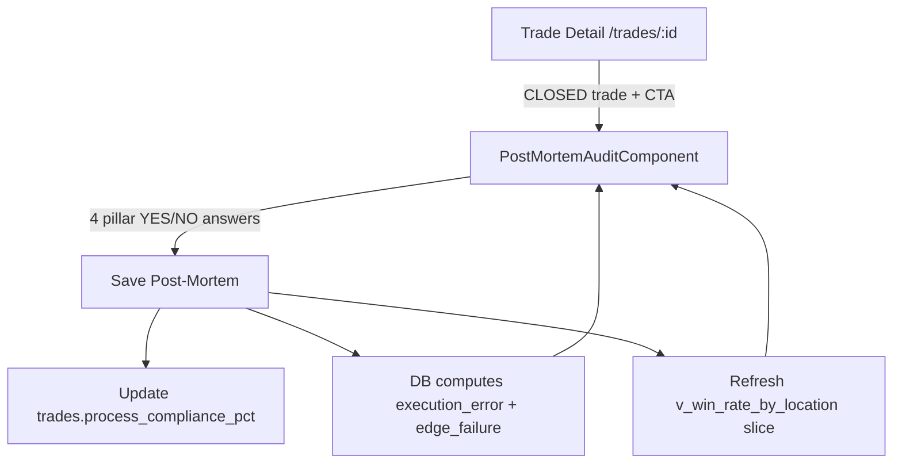

# 04 — Post-Mortem Audit Specification

## Module Header

| Field | Value |
|-------|-------|
| **Purpose** | Phase 3 upstream-cause review: after a trade closes, the trader re-evaluates the four execution pillars against what actually happened and records boolean post-mortem verdicts |
| **Angular Target Path** | `src/app/features/trade-details/` |
| **Primary Component** | `PostMortemAuditComponent` |
| **Route** | `/trades/:id/post-mortem` |
| **Route Guard** | `tradeClosedGuard` — trade `status` must be `CLOSED`; redirect to trade detail if `OPEN` or `DRAFT` |
| **Supabase Tables** | `trades`, `execution_audits` |
| **Supabase Views** | `v_win_rate_by_location` (read-only analytics sync after save) |
| **Key Metrics** | Process Compliance %, Execution Error, Edge Failure, Win Rate by Location |

---

## Philosophy

Post-mortem is **not** a P&L review. The trader answers four upstream questions about whether the original thesis held after the fact. Downstream outcomes (`r_multiple`, win/loss) are displayed for context only.

The database derives two diagnostic flags from the intersection of post-mortem verdicts and trade outcome:

| Flag | Meaning |
|------|---------|
| **Execution Error** | Process broke but trade still won — luck, not skill |
| **Edge Failure** | Process held but trade still lost — market/edge issue, not discipline |

These are **stored generated columns** on `execution_audits`. The UI must never write them directly; they appear after save when Supabase returns the updated row.

Reference: [`docs/01_DATABASE_CORE.md`](../01_DATABASE_CORE.md) — `execution_audits` generated column definitions.

---

## Application Flow



---

## Route Configuration

```typescript
// src/app/features/trade-details/trade-details.routes.ts
import { Routes } from '@angular/router';
import { tradeClosedGuard } from './guards/trade-closed.guard';

export const TRADE_DETAILS_ROUTES: Routes = [
  {
    path: 'trades/:id',
    loadComponent: () =>
      import('./trade-detail/trade-detail.component').then((m) => m.TradeDetailComponent),
  },
  {
    path: 'trades/:id/post-mortem',
    canActivate: [tradeClosedGuard],
    loadComponent: () =>
      import('./post-mortem-audit/post-mortem-audit.component').then(
        (m) => m.PostMortemAuditComponent,
      ),
  },
];
```

---

## PrimeNG Component Table

| UI Region | PrimeNG Component | Purpose | Key Props |
|-----------|-------------------|---------|-----------|
| Page shell | `p-card` | Wraps entire post-mortem form | `[styleClass]="'post-mortem__shell'"` |
| Trade context header | `p-tag` | Direction badge | `severity="success"` LONG / `severity="danger"` SHORT |
| Trade context header | `p-tag` | R-multiple outcome | Green if `r_multiple > 0`, red if `< 0` |
| Pillar review | `p-accordion` | Four expandable panels (one per pillar) | `[multiple]="true"`, `[activeIndex]="[0,1,2,3]"` default all open |
| Pillar panel header | Accordion header template | Shows pillar name + current YES/NO chip | Custom `#header` template |
| Pillar verdict | `p-selectbutton` | YES / NO toggle per pillar | `[options]="yesNoOptions"`, `[allowEmpty]="false"`, `optionLabel="label"`, `optionValue="value"` |
| Pre-trade thesis (read-only) | `p-message` | Displays original thesis text from audit row | `severity="secondary"` |
| Pre-trade enum (read-only) | `p-tag` | Location / behavior / confirmation enum value | `severity="info"` |
| Invalidation context | `p-inputnumber` (disabled) | Shows `invalidation_price` | `[disabled]="true"` |
| Derived flags (post-save) | `p-message` | Execution Error / Edge Failure banners | `severity="warn"` / `severity="info"` |
| Process compliance preview | `p-progressbar` | Live preview of compliance % before save | `[value]="compliancePreview"` |
| Analytics sidebar | `p-panel` | Win rate for this location + direction | `[toggleable]="true"` |
| Actions | `p-button` | Save | `label="Save Post-Mortem"`, `[disabled]="!formValid"` |
| Actions | `p-button` | Cancel | `severity="secondary"`, `routerLink` back to trade detail |
| Toast feedback | `p-toast` | Success / error on save | Via `MessageService` |

---

## Database Contract

### Writable Columns (POST on save)

| Column | Type | UI Control | Required on Save |
|--------|------|------------|------------------|
| `location_valid_post` | `boolean` | Panel 1 `p-selectbutton` | Yes |
| `behavior_matched_post` | `boolean` | Panel 2 `p-selectbutton` | Yes |
| `confirmation_legitimate_post` | `boolean` | Panel 3 `p-selectbutton` | Yes |
| `invalidation_respected_post` | `boolean` | Panel 4 `p-selectbutton` | Yes |
| `post_mortem_completed_at` | `timestamptz` | Set to `new Date().toISOString()` on first save | Yes |

### Read-Only Context (loaded with trade)

| Column | Display |
|--------|---------|
| `location` | Panel 1 header tag |
| `location_thesis` | Panel 1 read-only message |
| `behavior` / `behavior_thesis` | Panel 2 |
| `confirmation` / `confirmation_thesis` | Panel 3 |
| `invalidation_level` / `invalidation_price` / `invalidation_thesis` | Panel 4 |

### Generated Columns (read after save — never written by client)

```sql
execution_error BOOLEAN GENERATED ALWAYS AS (
  (location_valid_post = FALSE OR behavior_matched_post = FALSE
   OR confirmation_legitimate_post = FALSE OR invalidation_respected_post = FALSE)
  AND EXISTS (SELECT 1 FROM public.trades t WHERE t.id = trade_id AND t.r_multiple > 0)
) STORED,

edge_failure BOOLEAN GENERATED ALWAYS AS (
  location_valid_post = TRUE AND behavior_matched_post = TRUE
  AND confirmation_legitimate_post = TRUE AND invalidation_respected_post = TRUE
  AND EXISTS (SELECT 1 FROM public.trades t WHERE t.id = trade_id AND t.r_multiple < 0)
) STORED
```

### Process Compliance Calculation

On save, compute and persist to `trades.process_compliance_pct` using `computeProcessCompliancePct()` exported from `post-mortem.model.ts` (see TypeScript Interfaces section).

| YES count | `process_compliance_pct` |
|-----------|--------------------------|
| 4 | 100.00 |
| 3 | 75.00 |
| 2 | 50.00 |
| 1 | 25.00 |
| 0 | 0.00 |

### Derived Flag Display Logic (client preview mirrors DB)

Use `previewExecutionError()` and `previewEdgeFailure()` from `post-mortem.model.ts` for live preview before save; after save, trust DB-returned values.

| Scenario | `execution_error` | `edge_failure` |
|----------|-------------------|----------------|
| 4× YES, R = +1.5 | false | false |
| 2× NO, R = +0.8 | **true** | false |
| 4× YES, R = −1.0 | false | **true** |
| 1× NO, R = −0.5 | false | false |

---

## Analytics Sync — `v_win_rate_by_location`

After a successful post-mortem save, re-query the analytics view for the trade's location and direction. This slice updates automatically because the view aggregates all closed trades — no manual cache invalidation required.

```typescript
async syncLocationAnalytics(
  userId: string,
  location: AuctionLocation,
  direction: TradeDirection,
): Promise<WinRateByLocationRow | null> {
  const { data, error } = await this.supabase
    .from('v_win_rate_by_location')
    .select('*')
    .eq('user_id', userId)
    .eq('location', location)
    .eq('direction', direction)
    .maybeSingle();

  if (error) throw error;
  return data;
}
```

Display in the analytics sidebar panel:

| Field | Label |
|-------|-------|
| `total_closed` | Closed trades at this location |
| `wins` | Winning trades |
| `win_rate_pct` | Win rate % |
| `avg_r` | Average R-multiple |

---

## TypeScript Interfaces

```typescript
// src/app/features/trade-details/models/post-mortem.model.ts
import {
  AuctionLocation,
  ConfirmationTrigger,
  ExecutionAudit,
  MarketBehavior,
  Trade,
  TradeDirection,
} from '../../../core/supabase/database.types';

export interface YesNoOption {
  label: 'YES' | 'NO';
  value: boolean;
}

export const YES_NO_OPTIONS: YesNoOption[] = [
  { label: 'YES', value: true },
  { label: 'NO', value: false },
];

export interface PostMortemFormValue {
  location_valid_post: boolean | null;
  behavior_matched_post: boolean | null;
  confirmation_legitimate_post: boolean | null;
  invalidation_respected_post: boolean | null;
}

export interface PostMortemAuditRow extends ExecutionAudit {
  execution_error: boolean;
  edge_failure: boolean;
}

export interface PostMortemPageState {
  trade: Trade;
  audit: PostMortemAuditRow;
  form: PostMortemFormValue;
  compliancePreview: number;
  locationAnalytics: WinRateByLocationRow | null;
  saving: boolean;
  loaded: boolean;
}

export interface WinRateByLocationRow {
  user_id: string;
  location: AuctionLocation;
  direction: TradeDirection;
  total_closed: number;
  wins: number;
  win_rate_pct: number | null;
  avg_r: number | null;
}

export interface PillarConfig {
  key: keyof PostMortemFormValue;
  accordionIndex: number;
  title: string;
  question: string;
  enumField: keyof Pick<ExecutionAudit, 'location' | 'behavior' | 'confirmation'>;
  thesisField: keyof Pick<
    ExecutionAudit,
    'location_thesis' | 'behavior_thesis' | 'confirmation_thesis' | 'invalidation_thesis'
  >;
}

export function computeProcessCompliancePct(form: PostMortemFormValue): number {
  const pillars = [
    form.location_valid_post,
    form.behavior_matched_post,
    form.confirmation_legitimate_post,
    form.invalidation_respected_post,
  ];
  const yesCount = pillars.filter((v) => v === true).length;
  return Math.round((yesCount / 4) * 100 * 100) / 100;
}

export function previewExecutionError(
  form: PostMortemFormValue,
  rMultiple: number | null,
): boolean {
  if (rMultiple == null || rMultiple <= 0) return false;
  return (
    form.location_valid_post === false ||
    form.behavior_matched_post === false ||
    form.confirmation_legitimate_post === false ||
    form.invalidation_respected_post === false
  );
}

export function previewEdgeFailure(
  form: PostMortemFormValue,
  rMultiple: number | null,
): boolean {
  if (rMultiple == null || rMultiple >= 0) return false;
  return (
    form.location_valid_post === true &&
    form.behavior_matched_post === true &&
    form.confirmation_legitimate_post === true &&
    form.invalidation_respected_post === true
  );
}

export const POST_MORTEM_PILLARS: PillarConfig[] = [
  {
    key: 'location_valid_post',
    accordionIndex: 0,
    title: 'Location',
    question: 'Was Location Valid?',
    enumField: 'location',
    thesisField: 'location_thesis',
  },
  {
    key: 'behavior_matched_post',
    accordionIndex: 1,
    title: 'Behavior',
    question: 'Did Behavior Match?',
    enumField: 'behavior',
    thesisField: 'behavior_thesis',
  },
  {
    key: 'confirmation_legitimate_post',
    accordionIndex: 2,
    title: 'Confirmation',
    question: 'Was Confirmation Legitimate?',
    enumField: 'confirmation',
    thesisField: 'confirmation_thesis',
  },
  {
    key: 'invalidation_respected_post',
    accordionIndex: 3,
    title: 'Invalidation',
    question: 'Was Invalidation Respected?',
    enumField: 'location', // unused for invalidation panel — see template
    thesisField: 'invalidation_thesis',
  },
];
```

---

## Service Layer

```typescript
// src/app/features/trade-details/services/post-mortem.service.ts
import { Injectable, inject } from '@angular/core';
import { SupabaseService } from '../../../core/supabase/supabase.service';
import {
  computeProcessCompliancePct,
  PostMortemAuditRow,
  PostMortemFormValue,
  WinRateByLocationRow,
} from '../models/post-mortem.model';
import { AuctionLocation, TradeDirection } from '../../../core/supabase/database.types';

@Injectable({ providedIn: 'root' })
export class PostMortemService {
  private readonly supabase = inject(SupabaseService).client;

  async load(tradeId: string): Promise<{ trade: Trade; audit: PostMortemAuditRow }> {
    const { data: trade, error: tradeError } = await this.supabase
      .from('trades')
      .select('*')
      .eq('id', tradeId)
      .single();

    if (tradeError) throw tradeError;
    if (trade.status !== 'CLOSED') {
      throw new Error('Post-mortem requires a CLOSED trade');
    }

    const { data: audit, error: auditError } = await this.supabase
      .from('execution_audits')
      .select(
        '*, execution_error, edge_failure',
      )
      .eq('trade_id', tradeId)
      .single();

    if (auditError) throw auditError;

    return { trade, audit };
  }

  async save(
    tradeId: string,
    auditId: string,
    form: PostMortemFormValue,
  ): Promise<{ audit: PostMortemAuditRow; compliancePct: number }> {
    const compliancePct = computeProcessCompliancePct(form);

    const { data: audit, error: auditError } = await this.supabase
      .from('execution_audits')
      .update({
        location_valid_post: form.location_valid_post,
        behavior_matched_post: form.behavior_matched_post,
        confirmation_legitimate_post: form.confirmation_legitimate_post,
        invalidation_respected_post: form.invalidation_respected_post,
        post_mortem_completed_at: new Date().toISOString(),
      })
      .eq('id', auditId)
      .select('*, execution_error, edge_failure')
      .single();

    if (auditError) throw auditError;

    const { error: tradeError } = await this.supabase
      .from('trades')
      .update({ process_compliance_pct: compliancePct })
      .eq('id', tradeId);

    if (tradeError) throw tradeError;

    return { audit, compliancePct };
  }

  async fetchLocationAnalytics(
    userId: string,
    location: AuctionLocation,
    direction: TradeDirection,
  ): Promise<WinRateByLocationRow | null> {
    const { data, error } = await this.supabase
      .from('v_win_rate_by_location')
      .select('*')
      .eq('user_id', userId)
      .eq('location', location)
      .eq('direction', direction)
      .maybeSingle();

    if (error) throw error;
    return data;
  }
}
```

---

## Component Blueprint — TypeScript

```typescript
// src/app/features/trade-details/post-mortem-audit/post-mortem-audit.component.ts
import { Component, computed, inject, signal, OnInit } from '@angular/core';
import { ActivatedRoute, RouterLink } from '@angular/router';
import { FormsModule } from '@angular/forms';
import { AccordionModule } from 'primeng/accordion';
import { ButtonModule } from 'primeng/button';
import { CardModule } from 'primeng/card';
import { MessageModule } from 'primeng/message';
import { PanelModule } from 'primeng/panel';
import { ProgressBarModule } from 'primeng/progressbar';
import { SelectButtonModule } from 'primeng/selectbutton';
import { TagModule } from 'primeng/tag';
import { ToastModule } from 'primeng/toast';
import { MessageService } from 'primeng/api';
import {
  POST_MORTEM_PILLARS,
  YES_NO_OPTIONS,
  previewEdgeFailure,
  previewExecutionError,
  computeProcessCompliancePct,
} from '../models/post-mortem.model';
import { PostMortemService } from '../services/post-mortem.service';

@Component({
  selector: 'app-post-mortem-audit',
  standalone: true,
  imports: [
    FormsModule,
    RouterLink,
    AccordionModule,
    ButtonModule,
    CardModule,
    MessageModule,
    PanelModule,
    ProgressBarModule,
    SelectButtonModule,
    TagModule,
    ToastModule,
  ],
  providers: [MessageService],
  templateUrl: './post-mortem-audit.component.html',
  styleUrl: './post-mortem-audit.component.scss',
})
export class PostMortemAuditComponent implements OnInit {
  private readonly route = inject(ActivatedRoute);
  private readonly postMortemService = inject(PostMortemService);
  private readonly messageService = inject(MessageService);

  readonly yesNoOptions = YES_NO_OPTIONS;
  readonly pillars = POST_MORTEM_PILLARS;
  readonly activeAccordionIndexes = [0, 1, 2, 3];

  trade = signal<Trade | null>(null);
  audit = signal<PostMortemAuditRow | null>(null);
  locationAnalytics = signal<WinRateByLocationRow | null>(null);
  saving = signal(false);

  form = signal({
    location_valid_post: null as boolean | null,
    behavior_matched_post: null as boolean | null,
    confirmation_legitimate_post: null as boolean | null,
    invalidation_respected_post: null as boolean | null,
  });

  formValid = computed(() => {
    const f = this.form();
    return (
      f.location_valid_post !== null &&
      f.behavior_matched_post !== null &&
      f.confirmation_legitimate_post !== null &&
      f.invalidation_respected_post !== null
    );
  });

  compliancePreview = computed(() => {
    if (!this.formValid()) return 0;
    return computeProcessCompliancePct(this.form() as PostMortemFormValue);
  });

  executionErrorPreview = computed(() =>
    previewExecutionError(this.form() as PostMortemFormValue, this.trade()?.r_multiple ?? null),
  );

  edgeFailurePreview = computed(() =>
    previewEdgeFailure(this.form() as PostMortemFormValue, this.trade()?.r_multiple ?? null),
  );

  async ngOnInit(): Promise<void> {
    const tradeId = this.route.snapshot.paramMap.get('id');
    if (!tradeId) return;

    const { trade, audit } = await this.postMortemService.load(tradeId);
    this.trade.set(trade);
    this.audit.set(audit);
    this.form.set({
      location_valid_post: audit.location_valid_post,
      behavior_matched_post: audit.behavior_matched_post,
      confirmation_legitimate_post: audit.confirmation_legitimate_post,
      invalidation_respected_post: audit.invalidation_respected_post,
    });

    const analytics = await this.postMortemService.fetchLocationAnalytics(
      trade.user_id,
      audit.location,
      trade.direction,
    );
    this.locationAnalytics.set(analytics);
  }

  updatePillar(key: keyof PostMortemFormValue, value: boolean): void {
    this.form.update((f) => ({ ...f, [key]: value }));
  }

  async onSave(): Promise<void> {
    const trade = this.trade();
    const audit = this.audit();
    if (!trade || !audit || !this.formValid()) return;

    this.saving.set(true);
    try {
      const { audit: updated, compliancePct } = await this.postMortemService.save(
        trade.id,
        audit.id,
        this.form() as PostMortemFormValue,
      );
      this.audit.set(updated);

      const analytics = await this.postMortemService.fetchLocationAnalytics(
        trade.user_id,
        audit.location,
        trade.direction,
      );
      this.locationAnalytics.set(analytics);

      this.messageService.add({
        severity: 'success',
        summary: 'Post-Mortem Saved',
        detail: `Process compliance: ${compliancePct}%`,
      });
    } catch (err) {
      this.messageService.add({
        severity: 'error',
        summary: 'Save Failed',
        detail: err instanceof Error ? err.message : 'Unknown error',
      });
    } finally {
      this.saving.set(false);
    }
  }
}
```

---

## Component Blueprint — HTML

```html
<!-- src/app/features/trade-details/post-mortem-audit/post-mortem-audit.component.html -->
<p-toast />

@if (trade() && audit(); as auditRow) {
<section class="post-mortem">
  <header class="post-mortem__header">
    <div class="post-mortem__header-copy">
      <h1 class="post-mortem__title">Post-Mortem Audit</h1>
      <p class="post-mortem__subtitle">
        Re-evaluate upstream causes — not the outcome.
      </p>
    </div>
    <div class="post-mortem__header-meta">
      <p-tag
        [value]="trade()!.direction"
        [severity]="trade()!.direction === 'LONG' ? 'success' : 'danger'"
      />
      <p-tag
        [value]="(trade()!.r_multiple ?? 0) + 'R'"
        [severity]="(trade()!.r_multiple ?? 0) > 0 ? 'success' : 'danger'"
      />
      <span class="post-mortem__symbol">{{ trade()!.symbol }}</span>
    </div>
  </header>

  <div class="post-mortem__layout">
    <p-card styleClass="post-mortem__main">
      <p-accordion [multiple]="true" [activeIndex]="activeAccordionIndexes">
        <!-- Panel 1: Location -->
        <p-accordion-panel value="0">
          <p-accordion-header>
            <span class="post-mortem__panel-title">Location — Was Location Valid?</span>
          </p-accordion-header>
          <p-accordion-content>
            <div class="post-mortem__panel">
              <p-tag [value]="auditRow.location" severity="info" />
              <p-message severity="secondary" [text]="auditRow.location_thesis" />
              <label class="post-mortem__question">Was Location Valid?</label>
              <p-selectbutton
                [options]="yesNoOptions"
                [ngModel]="form().location_valid_post"
                (ngModelChange)="updatePillar('location_valid_post', $event)"
                optionLabel="label"
                optionValue="value"
                [allowEmpty]="false"
              />
            </div>
          </p-accordion-content>
        </p-accordion-panel>

        <!-- Panel 2: Behavior -->
        <p-accordion-panel value="1">
          <p-accordion-header>
            <span class="post-mortem__panel-title">Behavior — Did Behavior Match?</span>
          </p-accordion-header>
          <p-accordion-content>
            <div class="post-mortem__panel">
              <p-tag [value]="auditRow.behavior" severity="info" />
              <p-message severity="secondary" [text]="auditRow.behavior_thesis" />
              <label class="post-mortem__question">Did Behavior Match?</label>
              <p-selectbutton
                [options]="yesNoOptions"
                [ngModel]="form().behavior_matched_post"
                (ngModelChange)="updatePillar('behavior_matched_post', $event)"
                optionLabel="label"
                optionValue="value"
                [allowEmpty]="false"
              />
            </div>
          </p-accordion-content>
        </p-accordion-panel>

        <!-- Panel 3: Confirmation -->
        <p-accordion-panel value="2">
          <p-accordion-header>
            <span class="post-mortem__panel-title">Confirmation — Was Confirmation Legitimate?</span>
          </p-accordion-header>
          <p-accordion-content>
            <div class="post-mortem__panel">
              <p-tag [value]="auditRow.confirmation" severity="info" />
              <p-message severity="secondary" [text]="auditRow.confirmation_thesis" />
              <label class="post-mortem__question">Was Confirmation Legitimate?</label>
              <p-selectbutton
                [options]="yesNoOptions"
                [ngModel]="form().confirmation_legitimate_post"
                (ngModelChange)="updatePillar('confirmation_legitimate_post', $event)"
                optionLabel="label"
                optionValue="value"
                [allowEmpty]="false"
              />
            </div>
          </p-accordion-content>
        </p-accordion-panel>

        <!-- Panel 4: Invalidation -->
        <p-accordion-panel value="3">
          <p-accordion-header>
            <span class="post-mortem__panel-title">Invalidation — Was Invalidation Respected?</span>
          </p-accordion-header>
          <p-accordion-content>
            <div class="post-mortem__panel">
              <div class="post-mortem__invalidation-meta">
                <p-tag [value]="auditRow.invalidation_level" severity="info" />
                <span class="post-mortem__price">{{ auditRow.invalidation_price }}</span>
              </div>
              <p-message severity="secondary" [text]="auditRow.invalidation_thesis" />
              <label class="post-mortem__question">Was Invalidation Respected?</label>
              <p-selectbutton
                [options]="yesNoOptions"
                [ngModel]="form().invalidation_respected_post"
                (ngModelChange)="updatePillar('invalidation_respected_post', $event)"
                optionLabel="label"
                optionValue="value"
                [allowEmpty]="false"
              />
            </div>
          </p-accordion-content>
        </p-accordion-panel>
      </p-accordion>

      <div class="post-mortem__derived">
        <div class="post-mortem__compliance">
          <span class="post-mortem__compliance-label">Process Compliance</span>
          <p-progressbar [value]="compliancePreview()" [showValue]="true" />
        </div>

        @if (executionErrorPreview()) {
          <p-message
            severity="warn"
            text="Execution Error — process broke but trade won. Review discipline."
          />
        }
        @if (edgeFailurePreview()) {
          <p-message
            severity="info"
            text="Edge Failure — process held but trade lost. Review market context."
          />
        }
        @if (auditRow.post_mortem_completed_at && auditRow.execution_error) {
          <p-message severity="warn" text="Saved: Execution Error flagged by database." />
        }
        @if (auditRow.post_mortem_completed_at && auditRow.edge_failure) {
          <p-message severity="info" text="Saved: Edge Failure flagged by database." />
        }
      </div>

      <footer class="post-mortem__actions">
        <p-button
          label="Save Post-Mortem"
          icon="pi pi-check"
          [loading]="saving()"
          [disabled]="!formValid()"
          (onClick)="onSave()"
        />
        <p-button
          label="Back to Trade"
          severity="secondary"
          icon="pi pi-arrow-left"
          [routerLink]="['/trades', trade()!.id]"
        />
      </footer>
    </p-card>

    <aside class="post-mortem__sidebar">
      <p-panel header="Win Rate by Location" [toggleable]="true" [collapsed]="false">
        @if (locationAnalytics(); as stats) {
          <dl class="post-mortem__stats">
            <dt>Location</dt>
            <dd>{{ stats.location }}</dd>
            <dt>Direction</dt>
            <dd>{{ stats.direction }}</dd>
            <dt>Closed Trades</dt>
            <dd>{{ stats.total_closed }}</dd>
            <dt>Wins</dt>
            <dd>{{ stats.wins }}</dd>
            <dt>Win Rate</dt>
            <dd>{{ stats.win_rate_pct ?? '—' }}%</dd>
            <dt>Avg R</dt>
            <dd>{{ stats.avg_r ?? '—' }}R</dd>
          </dl>
        } @else {
          <p class="post-mortem__stats-empty">No closed trades at this location yet.</p>
        }
      </p-panel>
    </aside>
  </div>
</section>
}
```

---

## Component Blueprint — SCSS (BEM)

```scss
// src/app/features/trade-details/post-mortem-audit/post-mortem-audit.component.scss
.post-mortem {
  max-width: 72rem;
  margin: 0 auto;
  padding: 1.5rem;
  color: var(--dqos-text-primary, #e5e7eb);

  &__header {
    display: flex;
    justify-content: space-between;
    align-items: flex-start;
    gap: 1rem;
    margin-bottom: 1.5rem;
  }

  &__title {
    font-family: var(--dqos-font-ui, Inter, sans-serif);
    font-size: 1.5rem;
    font-weight: 600;
    margin: 0 0 0.25rem;
  }

  &__subtitle {
    margin: 0;
    color: var(--dqos-text-muted, #9ca3af);
    font-size: 0.875rem;
  }

  &__header-meta {
    display: flex;
    align-items: center;
    gap: 0.5rem;
    flex-wrap: wrap;
  }

  &__symbol {
    font-family: var(--dqos-font-mono, 'JetBrains Mono', monospace);
    font-size: 0.875rem;
    color: var(--dqos-text-muted, #9ca3af);
  }

  &__layout {
    display: grid;
    grid-template-columns: 1fr 18rem;
    gap: 1.25rem;

    @media (max-width: 960px) {
      grid-template-columns: 1fr;
    }
  }

  &__main {
    background: var(--dqos-bg-panel, #161920);
    border: 1px solid var(--dqos-border, #262b37);
  }

  &__panel {
    display: flex;
    flex-direction: column;
    gap: 0.75rem;
    padding: 0.25rem 0;
  }

  &__panel-title {
    font-weight: 600;
  }

  &__question {
    font-size: 0.875rem;
    font-weight: 600;
    margin-top: 0.5rem;
  }

  &__invalidation-meta {
    display: flex;
    align-items: center;
    gap: 0.75rem;
  }

  &__price {
    font-family: var(--dqos-font-mono, 'JetBrains Mono', monospace);
    font-size: 0.875rem;
  }

  &__derived {
    display: flex;
    flex-direction: column;
    gap: 0.75rem;
    margin-top: 1.5rem;
    padding-top: 1.5rem;
    border-top: 1px solid var(--dqos-border, #262b37);
  }

  &__compliance-label {
    display: block;
    font-size: 0.75rem;
    text-transform: uppercase;
    letter-spacing: 0.04em;
    color: var(--dqos-text-muted, #9ca3af);
    margin-bottom: 0.5rem;
  }

  &__actions {
    display: flex;
    gap: 0.75rem;
    margin-top: 1.5rem;
    flex-wrap: wrap;
  }

  &__sidebar {
    align-self: start;
  }

  &__stats {
    display: grid;
    grid-template-columns: auto 1fr;
    gap: 0.5rem 1rem;
    margin: 0;
    font-size: 0.875rem;

    dt {
      color: var(--dqos-text-muted, #9ca3af);
    }

    dd {
      margin: 0;
      font-family: var(--dqos-font-mono, 'JetBrains Mono', monospace);
      text-align: right;
    }
  }

  &__stats-empty {
    margin: 0;
    font-size: 0.875rem;
    color: var(--dqos-text-muted, #9ca3af);
  }
}
```

---

## UI Wireframe (ASCII)

```
┌─────────────────────────────────────────────────────────────────────────┐
│ Post-Mortem Audit                          [LONG] [+1.2R]  ES          │
│ Re-evaluate upstream causes — not the outcome.                          │
├──────────────────────────────────────────────┬──────────────────────────┤
│ ▼ Location — Was Location Valid?             │ Win Rate by Location     │
│   [VAH]  "Retest of prior session VAH..."    │ Location    VAH          │
│   Was Location Valid?  [YES] [NO]            │ Direction   LONG         │
│                                              │ Closed      24           │
│ ▼ Behavior — Did Behavior Match?             │ Wins        14           │
│   [Rejection]  "Selling tail rejection..."   │ Win Rate    58.33%       │
│   Did Behavior Match?  [YES] [NO]            │ Avg R       0.42R        │
│                                              │                          │
│ ▼ Confirmation — Was Confirmation Legitimate?│                          │
│   [Delta_Divergence]  "CVD divergence..."    │                          │
│   Was Confirmation Legitimate?  [YES] [NO]   │                          │
│                                              │                          │
│ ▼ Invalidation — Was Invalidation Respected? │                          │
│   [Below VAL]  5842.25                       │                          │
│   Was Invalidation Respected?  [YES] [NO]    │                          │
│                                              │                          │
│ Process Compliance  ████████░░  75%          │                          │
│ ⚠ Execution Error — process broke but won    │                          │
│                                              │                          │
│ [Save Post-Mortem]  [Back to Trade]          │                          │
└──────────────────────────────────────────────┴──────────────────────────┘
```

---

## Acceptance Criteria

1. Route `/trades/:id/post-mortem` loads only when trade `status = CLOSED`.
2. Four accordion panels each contain one pillar question with `p-selectbutton` YES/NO; `[allowEmpty]="false"` prevents deselect.
3. All four post columns must be answered before Save is enabled.
4. Save writes `execution_audits` post columns + `post_mortem_completed_at`, and `trades.process_compliance_pct`.
5. After save, UI displays DB-generated `execution_error` and `edge_failure` (not client-only preview).
6. Analytics sidebar refreshes from `v_win_rate_by_location` filtered by trade location and direction.
7. SCSS uses BEM block `.post-mortem` with element modifiers as specified.

---

## Cross-References

| Document | Relationship |
|----------|--------------|
| [`docs/01_DATABASE_CORE.md`](../01_DATABASE_CORE.md) | Schema, generated columns, `v_win_rate_by_location` |
| `docs/02_GATEKEEPER/` | Source of pre-trade thesis fields displayed read-only |
| `docs/07_EDGE_DISCOVERY_LAB/insight_feed.md` | Consumes post-mortem-enriched closed trade data |
