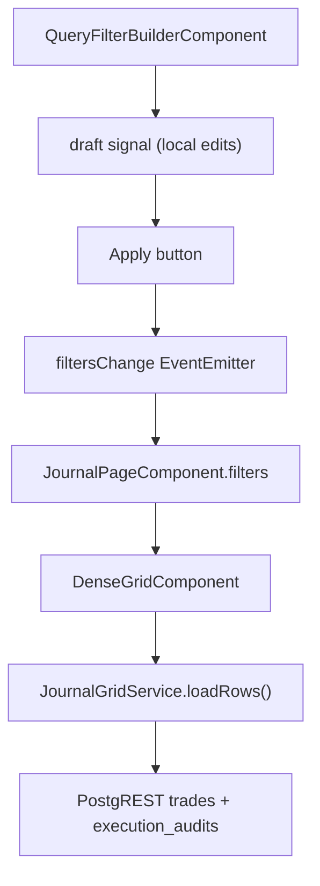

# 05b — Journal Query Filter Builder

## Module Header

| Field | Value |
|-------|-------|
| **Purpose** | Composable filter bar mapping UI controls to Supabase query parameters for the journal dense grid |
| **Angular Target Path** | `src/app/features/journal/components/query-filter-builder/` |
| **Route** | `/journal` (top toolbar of `JournalPageComponent`) |
| **Supabase Tables / Views** | `trades`, `execution_audits` |
| **Key Metrics** | Filtered trade count (drives grid reload) |

---

## Philosophy

Filters separate **downstream trade attributes** (symbol, direction, R range, date) from **upstream pillar attributes** (location, behavior, confirmation). Trade-level filters push to PostgREST `.in()` / `.gte()` / `.lte()` clauses. Pillar-level filters apply client-side after join because PostgREST cannot filter embedded FK columns in the initial query without an RPC.

Active filters surface as removable `p-chip` tags below the control row for at-a-glance audit of the current query state.

---

## PrimeNG Component Table

| Component | Import Path | Role |
|-----------|-------------|------|
| `p-multiselect` | `primeng/multiselect` | Symbol, Location, Behavior, Confirmation |
| `p-select` | `primeng/select` | Direction, Day Type |
| `p-datepicker` | `primeng/datepicker` | Date range (from / to) |
| `p-inputnumber` | `primeng/inputnumber` | Min R / Max R range |
| `p-checkbox` | `primeng/checkbox` | Execution Errors Only, Edge Failures Only |
| `p-chip` | `primeng/chip` | Active filter tags with remove |
| `p-button` | `primeng/button` | Apply + Clear All |
| `p-divider` | `primeng/divider` | Separates trade vs pillar filter groups |

---

## Filter Model

```typescript
// journal-filters.model.ts — src/app/features/journal/models/journal-filters.model.ts
import {
  AssetSymbol,
  TradeDirection,
  DayType,
  AuctionLocation,
  MarketBehavior,
  ConfirmationTrigger,
} from '../../../core/models/trade.types';

export interface JournalFilters {
  symbols: AssetSymbol[];
  directions: TradeDirection[];
  dayTypes: DayType[];
  locations: AuctionLocation[];
  behaviors: MarketBehavior[];
  confirmations: ConfirmationTrigger[];
  dateFrom: string | null;   // ISO 8601 start-of-day UTC
  dateTo: string | null;     // ISO 8601 end-of-day UTC
  minR: number | null;
  maxR: number | null;
  executionErrorsOnly: boolean;
  edgeFailuresOnly: boolean;
}

export const DEFAULT_JOURNAL_FILTERS: JournalFilters = {
  symbols: [],
  directions: [],
  dayTypes: [],
  locations: [],
  behaviors: [],
  confirmations: [],
  dateFrom: null,
  dateTo: null,
  minR: null,
  maxR: null,
  executionErrorsOnly: false,
  edgeFailuresOnly: false,
};
```

---

## Filter → Supabase Parameter Map

| UI Control | Filter Key | Supabase Clause | Applied |
|------------|------------|-----------------|---------|
| Symbol multiselect | `symbols[]` | `.in('symbol', symbols)` | Server |
| Direction select (multi) | `directions[]` | `.in('direction', directions)` | Server |
| Day Type multiselect | `dayTypes[]` | `.in('day_type', dayTypes)` | Server |
| Date From picker | `dateFrom` | `.gte('closed_at', dateFrom)` | Server |
| Date To picker | `dateTo` | `.lte('closed_at', dateTo)` | Server |
| Min R input | `minR` | `.gte('r_multiple', minR)` | Server |
| Max R input | `maxR` | `.lte('r_multiple', maxR)` | Server |
| Location multiselect | `locations[]` | Filter `execution_audits.location` | Client |
| Behavior multiselect | `behaviors[]` | Filter `execution_audits.behavior` | Client |
| Confirmation multiselect | `confirmations[]` | Filter `execution_audits.confirmation` | Client |
| Exec Errors checkbox | `executionErrorsOnly` | Filter `execution_audits.execution_error = true` | Client |
| Edge Failures checkbox | `edgeFailuresOnly` | Filter `execution_audits.edge_failure = true` | Client |

Base query invariant (always applied): `.eq('status', 'CLOSED').not('closed_at', 'is', null)`.

---

## Optional RPC (Future Enhancement)

For server-side pillar filtering at scale, add this RPC to Supabase:

```sql
CREATE OR REPLACE FUNCTION public.query_journal_trades(
  p_symbols         text[]    DEFAULT NULL,
  p_directions      text[]    DEFAULT NULL,
  p_day_types       text[]    DEFAULT NULL,
  p_locations       text[]    DEFAULT NULL,
  p_behaviors       text[]    DEFAULT NULL,
  p_confirmations   text[]    DEFAULT NULL,
  p_date_from       timestamptz DEFAULT NULL,
  p_date_to         timestamptz DEFAULT NULL,
  p_min_r           numeric   DEFAULT NULL,
  p_max_r           numeric   DEFAULT NULL,
  p_exec_errors     boolean   DEFAULT FALSE,
  p_edge_failures   boolean   DEFAULT FALSE
)
RETURNS TABLE (
  id uuid,
  closed_at timestamptz,
  symbol asset_symbol,
  direction trade_direction,
  day_type day_type,
  entry_price numeric,
  stop_price numeric,
  exit_price numeric,
  size integer,
  r_multiple numeric,
  tqs numeric,
  process_compliance_pct numeric,
  setup_name text,
  location auction_location,
  behavior market_behavior,
  confirmation confirmation_trigger,
  invalidation_level text,
  location_valid_post boolean,
  behavior_matched_post boolean,
  confirmation_legitimate_post boolean,
  invalidation_respected_post boolean,
  execution_error boolean,
  edge_failure boolean
)
LANGUAGE sql
STABLE
SECURITY DEFINER
SET search_path = public
AS $$
  SELECT
    t.id, t.closed_at, t.symbol, t.direction, t.day_type,
    t.entry_price, t.stop_price, t.exit_price, t.size,
    t.r_multiple, t.tqs, t.process_compliance_pct,
    s.name AS setup_name,
    ea.location, ea.behavior, ea.confirmation, ea.invalidation_level,
    ea.location_valid_post, ea.behavior_matched_post,
    ea.confirmation_legitimate_post, ea.invalidation_respected_post,
    ea.execution_error, ea.edge_failure
  FROM public.trades t
  JOIN public.execution_audits ea ON ea.trade_id = t.id
  LEFT JOIN public.setups s ON s.id = t.setup_id
  WHERE t.user_id = auth.uid()
    AND t.status = 'CLOSED'
    AND t.closed_at IS NOT NULL
    AND (p_symbols IS NULL OR t.symbol::text = ANY(p_symbols))
    AND (p_directions IS NULL OR t.direction::text = ANY(p_directions))
    AND (p_day_types IS NULL OR t.day_type::text = ANY(p_day_types))
    AND (p_locations IS NULL OR ea.location::text = ANY(p_locations))
    AND (p_behaviors IS NULL OR ea.behavior::text = ANY(p_behaviors))
    AND (p_confirmations IS NULL OR ea.confirmation::text = ANY(p_confirmations))
    AND (p_date_from IS NULL OR t.closed_at >= p_date_from)
    AND (p_date_to IS NULL OR t.closed_at <= p_date_to)
    AND (p_min_r IS NULL OR t.r_multiple >= p_min_r)
    AND (p_max_r IS NULL OR t.r_multiple <= p_max_r)
    AND (NOT p_exec_errors OR ea.execution_error = TRUE)
    AND (NOT p_edge_failures OR ea.edge_failure = TRUE)
  ORDER BY t.closed_at DESC;
$$;
```

Initial implementation uses PostgREST + client-side pillar filter; switch to RPC when trade count exceeds 500.

---

## Enum Option Sources

```typescript
// journal-filter-options.ts
export const SYMBOL_OPTIONS = ['ES', 'NQ', 'RTY', 'YM', 'CL', 'GC', 'SI', 'ZB'] as const;
export const DIRECTION_OPTIONS = ['LONG', 'SHORT'] as const;
export const DAY_TYPE_OPTIONS = ['D_Day', 'P_Day', 'b_Day', 'Trend_Day', 'Double_Dist'] as const;
export const LOCATION_OPTIONS = [
  'VAH', 'VAL', 'POC', 'Weekly_VWAP', 'Monthly_VWAP',
  'Composite_VAH', 'Composite_VAL', 'Composite_POC',
  'Overnight_High', 'Overnight_Low', 'Single_Print', 'Naked_POC',
] as const;
export const BEHAVIOR_OPTIONS = [
  'Rejection', 'Acceptance', 'Rotation', 'Exhaustion', 'Excess',
  'Failed_Auction', 'Value_Migration', 'Responsive_Buying', 'Responsive_Selling',
] as const;
export const CONFIRMATION_OPTIONS = [
  'Delta_Divergence', 'Volume_Absorption', 'Excess_Tail',
  'VWAP_Reclaim', 'Market_Structure_Break',
] as const;
```

Display labels: replace `_` with space via `formatEnum()`.

---

## TypeScript — Component

```typescript
// query-filter-builder.component.ts
import { Component, EventEmitter, Input, Output, signal, computed } from '@angular/core';
import { CommonModule } from '@angular/common';
import { FormsModule } from '@angular/forms';
import { MultiSelectModule } from 'primeng/multiselect';
import { SelectModule } from 'primeng/select';
import { DatePickerModule } from 'primeng/datepicker';
import { InputNumberModule } from 'primeng/inputnumber';
import { CheckboxModule } from 'primeng/checkbox';
import { ChipModule } from 'primeng/chip';
import { ButtonModule } from 'primeng/button';
import { DividerModule } from 'primeng/divider';
import {
  JournalFilters,
  DEFAULT_JOURNAL_FILTERS,
} from '../../models/journal-filters.model';
import {
  SYMBOL_OPTIONS,
  DIRECTION_OPTIONS,
  DAY_TYPE_OPTIONS,
  LOCATION_OPTIONS,
  BEHAVIOR_OPTIONS,
  CONFIRMATION_OPTIONS,
} from '../../models/journal-filter-options';

interface ActiveChip {
  key: keyof JournalFilters;
  label: string;
  value?: string;
}

@Component({
  selector: 'app-query-filter-builder',
  standalone: true,
  imports: [
    CommonModule,
    FormsModule,
    MultiSelectModule,
    SelectModule,
    DatePickerModule,
    InputNumberModule,
    CheckboxModule,
    ChipModule,
    ButtonModule,
    DividerModule,
  ],
  templateUrl: './query-filter-builder.component.html',
  styleUrl: './query-filter-builder.component.scss',
})
export class QueryFilterBuilderComponent {
  @Input() filters: JournalFilters = { ...DEFAULT_JOURNAL_FILTERS };
  @Output() filtersChange = new EventEmitter<JournalFilters>();

  readonly draft = signal<JournalFilters>({ ...DEFAULT_JOURNAL_FILTERS });

  readonly symbolOptions = SYMBOL_OPTIONS.map(v => ({ label: v, value: v }));
  readonly directionOptions = DIRECTION_OPTIONS.map(v => ({ label: v, value: v }));
  readonly dayTypeOptions = DAY_TYPE_OPTIONS.map(v => ({
    label: v.replace(/_/g, ' '),
    value: v,
  }));
  readonly locationOptions = LOCATION_OPTIONS.map(v => ({
    label: v.replace(/_/g, ' '),
    value: v,
  }));
  readonly behaviorOptions = BEHAVIOR_OPTIONS.map(v => ({ label: v, value: v }));
  readonly confirmationOptions = CONFIRMATION_OPTIONS.map(v => ({
    label: v.replace(/_/g, ' '),
    value: v,
  }));

  dateFromLocal: Date | null = null;
  dateToLocal: Date | null = null;

  readonly activeChips = computed(() => this.buildChips(this.filters));

  ngOnInit(): void {
    this.draft.set({ ...this.filters });
    this.dateFromLocal = this.filters.dateFrom ? new Date(this.filters.dateFrom) : null;
    this.dateToLocal = this.filters.dateTo ? new Date(this.filters.dateTo) : null;
  }

  apply(): void {
    const next: JournalFilters = {
      ...this.draft(),
      dateFrom: this.dateFromLocal
        ? new Date(this.dateFromLocal.setHours(0, 0, 0, 0)).toISOString()
        : null,
      dateTo: this.dateToLocal
        ? new Date(this.dateToLocal.setHours(23, 59, 59, 999)).toISOString()
        : null,
    };
    this.filters = next;
    this.filtersChange.emit(next);
  }

  clearAll(): void {
    this.draft.set({ ...DEFAULT_JOURNAL_FILTERS });
    this.dateFromLocal = null;
    this.dateToLocal = null;
    this.filters = { ...DEFAULT_JOURNAL_FILTERS };
    this.filtersChange.emit(this.filters);
  }

  removeChip(chip: ActiveChip): void {
    const next = { ...this.filters };

    if (chip.key === 'dateFrom') next.dateFrom = null;
    else if (chip.key === 'dateTo') next.dateTo = null;
    else if (chip.key === 'minR') next.minR = null;
    else if (chip.key === 'maxR') next.maxR = null;
    else if (chip.key === 'executionErrorsOnly') next.executionErrorsOnly = false;
    else if (chip.key === 'edgeFailuresOnly') next.edgeFailuresOnly = false;
    else if (chip.value && Array.isArray(next[chip.key])) {
      (next[chip.key] as string[]) = (next[chip.key] as string[]).filter(v => v !== chip.value);
    }

    this.filters = next;
    this.draft.set({ ...next });
    this.filtersChange.emit(next);
  }

  private buildChips(f: JournalFilters): ActiveChip[] {
    const chips: ActiveChip[] = [];

    f.symbols.forEach(v => chips.push({ key: 'symbols', label: `Symbol: ${v}`, value: v }));
    f.directions.forEach(v => chips.push({ key: 'directions', label: `Dir: ${v}`, value: v }));
    f.dayTypes.forEach(v =>
      chips.push({ key: 'dayTypes', label: `Day: ${v.replace(/_/g, ' ')}`, value: v }),
    );
    f.locations.forEach(v =>
      chips.push({ key: 'locations', label: `Loc: ${v.replace(/_/g, ' ')}`, value: v }),
    );
    f.behaviors.forEach(v => chips.push({ key: 'behaviors', label: `Beh: ${v}`, value: v }));
    f.confirmations.forEach(v =>
      chips.push({ key: 'confirmations', label: `Conf: ${v.replace(/_/g, ' ')}`, value: v }),
    );
    if (f.dateFrom) chips.push({ key: 'dateFrom', label: `From: ${f.dateFrom.slice(0, 10)}` });
    if (f.dateTo) chips.push({ key: 'dateTo', label: `To: ${f.dateTo.slice(0, 10)}` });
    if (f.minR != null) chips.push({ key: 'minR', label: `Min R: ${f.minR}` });
    if (f.maxR != null) chips.push({ key: 'maxR', label: `Max R: ${f.maxR}` });
    if (f.executionErrorsOnly) chips.push({ key: 'executionErrorsOnly', label: 'Exec Errors' });
    if (f.edgeFailuresOnly) chips.push({ key: 'edgeFailuresOnly', label: 'Edge Failures' });

    return chips;
  }
}
```

---

## HTML Template

```html
<!-- query-filter-builder.component.html -->
<section class="query-filter-builder" aria-label="Journal filters">
  <!-- Row 1: Trade-level filters -->
  <div class="query-filter-builder__row">
    <p-multiselect
      [(ngModel)]="draft().symbols"
      [options]="symbolOptions"
      optionLabel="label"
      optionValue="value"
      placeholder="Symbol"
      [showClear]="true"
      styleClass="query-filter-builder__control"
      display="chip"
    />

    <p-multiselect
      [(ngModel)]="draft().directions"
      [options]="directionOptions"
      optionLabel="label"
      optionValue="value"
      placeholder="Direction"
      [showClear]="true"
      styleClass="query-filter-builder__control"
    />

    <p-multiselect
      [(ngModel)]="draft().dayTypes"
      [options]="dayTypeOptions"
      optionLabel="label"
      optionValue="value"
      placeholder="Day Type"
      [showClear]="true"
      styleClass="query-filter-builder__control"
    />

    <p-datepicker
      [(ngModel)]="dateFromLocal"
      placeholder="From"
      [showIcon]="true"
      dateFormat="yy-mm-dd"
      styleClass="query-filter-builder__control query-filter-builder__date"
    />

    <p-datepicker
      [(ngModel)]="dateToLocal"
      placeholder="To"
      [showIcon]="true"
      dateFormat="yy-mm-dd"
      styleClass="query-filter-builder__control query-filter-builder__date"
    />

    <p-inputnumber
      [(ngModel)]="draft().minR"
      placeholder="Min R"
      [minFractionDigits]="2"
      [maxFractionDigits]="2"
      styleClass="query-filter-builder__control query-filter-builder__r"
    />

    <p-inputnumber
      [(ngModel)]="draft().maxR"
      placeholder="Max R"
      [minFractionDigits]="2"
      [maxFractionDigits]="2"
      styleClass="query-filter-builder__control query-filter-builder__r"
    />
  </div>

  <p-divider styleClass="query-filter-builder__divider" />

  <!-- Row 2: Pillar-level filters -->
  <div class="query-filter-builder__row">
    <p-multiselect
      [(ngModel)]="draft().locations"
      [options]="locationOptions"
      optionLabel="label"
      optionValue="value"
      placeholder="Location"
      [showClear]="true"
      styleClass="query-filter-builder__control query-filter-builder__control--wide"
      display="chip"
    />

    <p-multiselect
      [(ngModel)]="draft().behaviors"
      [options]="behaviorOptions"
      optionLabel="label"
      optionValue="value"
      placeholder="Behavior"
      [showClear]="true"
      styleClass="query-filter-builder__control query-filter-builder__control--wide"
    />

    <p-multiselect
      [(ngModel)]="draft().confirmations"
      [options]="confirmationOptions"
      optionLabel="label"
      optionValue="value"
      placeholder="Confirmation"
      [showClear]="true"
      styleClass="query-filter-builder__control query-filter-builder__control--wide"
    />

    <div class="query-filter-builder__checkboxes">
      <label class="query-filter-builder__check-label">
        <p-checkbox [(ngModel)]="draft().executionErrorsOnly" [binary]="true" />
        Exec Errors
      </label>
      <label class="query-filter-builder__check-label">
        <p-checkbox [(ngModel)]="draft().edgeFailuresOnly" [binary]="true" />
        Edge Failures
      </label>
    </div>

    <div class="query-filter-builder__actions">
      <button pButton label="Apply" icon="pi pi-filter" (click)="apply()" class="p-button-sm" />
      <button
        pButton
        label="Clear"
        icon="pi pi-times"
        (click)="clearAll()"
        class="p-button-sm p-button-text"
      />
    </div>
  </div>

  <!-- Active filter chips -->
  @if (activeChips().length > 0) {
    <div class="query-filter-builder__chips">
      @for (chip of activeChips(); track chip.label) {
        <p-chip
          [label]="chip.label"
          [removable]="true"
          (onRemove)="removeChip(chip)"
          styleClass="query-filter-builder__chip"
        />
      }
    </div>
  }
</section>
```

---

## SCSS

```scss
// query-filter-builder.component.scss
.query-filter-builder {
  background: var(--dqos-bg-panel, #161920);
  border: 1px solid var(--dqos-border, #262B37);
  border-radius: 6px;
  padding: 0.75rem 1rem;
  margin-block-end: 1rem;

  &__row {
    display: flex;
    flex-wrap: wrap;
    align-items: center;
    gap: 0.5rem;
  }

  &__control {
    min-width: 120px;
    flex: 0 1 auto;

    &--wide {
      min-width: 160px;
    }
  }

  &__date {
    min-width: 140px;
  }

  &__r {
    min-width: 90px;

    ::ng-deep input {
      font-family: var(--dqos-font-mono, 'JetBrains Mono', monospace);
      font-size: 0.8125rem;
    }
  }

  &__divider {
    margin: 0.5rem 0;
  }

  &__checkboxes {
    display: flex;
    gap: 1rem;
    align-items: center;
  }

  &__check-label {
    display: flex;
    align-items: center;
    gap: 0.375rem;
    font-size: 0.8125rem;
    color: var(--p-text-muted-color, #9ca3af);
    cursor: pointer;
  }

  &__actions {
    display: flex;
    gap: 0.375rem;
    margin-left: auto;
  }

  &__chips {
    display: flex;
    flex-wrap: wrap;
    gap: 0.375rem;
    margin-top: 0.625rem;
    padding-top: 0.625rem;
    border-top: 1px solid var(--dqos-border, #262B37);
  }

  &__chip {
    font-size: 0.6875rem;
  }
}
```

---

## Data Flow



Chip removal bypasses draft — mutates applied `filters` directly and re-emits.

---

## Acceptance Criteria

1. All enum multiselects populate from PostgreSQL enum values defined in `01_DATABASE_CORE.md`.
2. Apply emits `JournalFilters` to parent; dense grid reloads without full page navigation.
3. Clear All resets to `DEFAULT_JOURNAL_FILTERS` and emits immediately.
4. Active filter chips render one chip per selected enum value plus date/R/boolean filters.
5. Chip remove updates filters and triggers grid reload.
6. Date From sets start-of-day UTC; Date To sets end-of-day UTC.
7. Server-side filters (symbol, direction, day type, dates, R range) appear as PostgREST query params in network tab.
8. Pillar filters (location, behavior, confirmation, EE/EF) apply client-side on joined rows.
9. Filter bar wraps gracefully on viewports ≥768px without horizontal page scroll.
