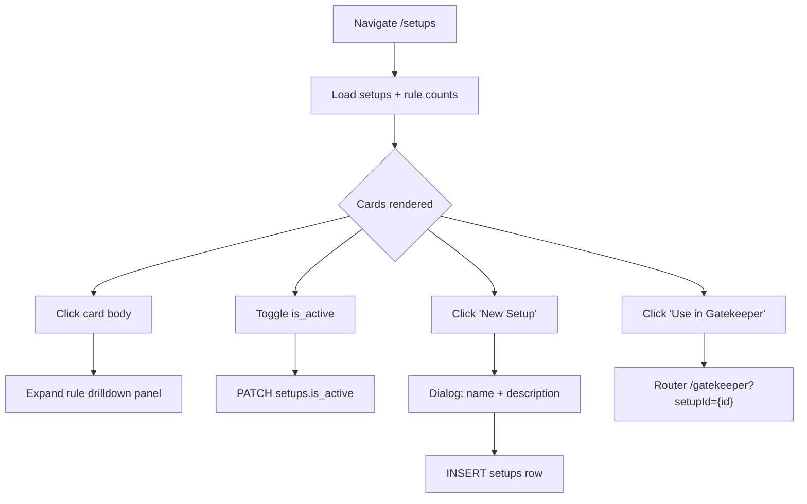

# 06a — Setups Library: Playbook Cards

## Module Header

| Field | Value |
|-------|-------|
| **Purpose** | Browse and manage the user's playbook library — named setups with active/inactive status — as a responsive card grid sourced from `public.setups` |
| **Angular Target Path** | `src/app/features/setups/pages/setups-library/` |
| **Route** | `/setups` |
| **Supabase Tables** | `setups` (read/write), `setup_rules` (count only for badge) |
| **Key Metrics** | Active setup count, total setups, rules-per-setup badge |
| **Parent Module** | [01 — Database Core](../01_DATABASE_CORE.md) |
| **Sibling Spec** | [06b — Rule Drilldown](./rule_drilldown.md) |

---

## Philosophy

Setups are **upstream playbooks**, not trade records. Each card represents a reusable qualification template. The Gatekeeper (Phase 1) can pre-fill its four-pillar wizard from a selected setup's rules — see [rule_drilldown.md](./rule_drilldown.md). Cards surface `is_active` so the trader can retire playbooks without deleting historical `trades.setup_id` references.

---

## User Flow



---

## PrimeNG Component Table

| UI Element | PrimeNG Component | Module Import | Binding / Notes |
|------------|-------------------|---------------|-----------------|
| Page shell | `p-card` | `CardModule` | Root container with title "Playbook Library" |
| Setup grid | `p-card` × N | `CardModule` | One card per setup; CSS grid parent `.setups-library` |
| Active toggle | `p-toggleswitch` | `ToggleSwitchModule` | `[(ngModel)]="setup.is_active"` → PATCH on change |
| Rule count badge | `p-badge` | `BadgeModule` | `value="{{ setup.rule_count }}"` severity `secondary` |
| New setup CTA | `p-button` | `ButtonModule` | `icon="pi pi-plus"`, opens dialog |
| Create dialog | `p-dialog` | `DialogModule` | `header="New Playbook Setup"` |
| Name field | `p-inputtext` | `InputTextModule` | Required; unique per `user_id` |
| Description field | `p-textarea` | `TextareaModule` | Optional multi-line |
| Save / Cancel | `p-button` | `ButtonModule` | Save triggers INSERT; Cancel closes dialog |
| Empty state | `p-message` | `MessageModule` | `severity="info"` when zero setups |
| Loading overlay | `p-progressspinner` | `ProgressSpinnerModule` | Shown while Supabase query in flight |
| Toast feedback | `p-toast` | `ToastModule` | Success/error on create and toggle |
| Gatekeeper link | `p-button` | `ButtonModule` | `label="Use in Gatekeeper"`, `routerLink` with query param |
| Rule drilldown host | `app-setup-rule-drilldown` | Local component | See [rule_drilldown.md](./rule_drilldown.md) |

---

## Supabase Queries

### Load library (with rule counts)

```typescript
// setups-library.service.ts
async loadSetupsWithRuleCounts(): Promise<SetupCard[]> {
  const { data: setups, error } = await this.supabase
    .from('setups')
    .select('id, user_id, name, description, is_active, created_at, updated_at, setup_rules(count)')
    .order('name', { ascending: true });

  if (error) throw error;

  return (setups ?? []).map((row) => ({
    id: row.id,
    user_id: row.user_id,
    name: row.name,
    description: row.description ?? '',
    is_active: row.is_active,
    created_at: row.created_at,
    updated_at: row.updated_at,
    rule_count: row.setup_rules?.[0]?.count ?? 0,
  }));
}
```

### Create setup

```typescript
async createSetup(payload: CreateSetupPayload): Promise<Setup> {
  const { data, error } = await this.supabase
    .from('setups')
    .insert({
      user_id: (await this.supabase.auth.getUser()).data.user!.id,
      name: payload.name.trim(),
      description: payload.description?.trim() || null,
      is_active: true,
    })
    .select('id, user_id, name, description, is_active, created_at, updated_at')
    .single();

  if (error) throw error;
  return { ...data, description: data.description ?? '' };
}
```

### Toggle active status

```typescript
async setSetupActive(setupId: string, isActive: boolean): Promise<void> {
  const { error } = await this.supabase
    .from('setups')
    .update({ is_active: isActive })
    .eq('id', setupId);

  if (error) throw error;
}
```

**RLS:** All queries inherit `setups_self` policy from [01 — Database Core](../01_DATABASE_CORE.md).

---

## TypeScript Interfaces

```typescript
// src/app/features/setups/models/setup.model.ts

export type SetupPillar = 'location' | 'behavior' | 'confirmation' | 'invalidation';

export interface Setup {
  id: string;
  user_id: string;
  name: string;
  description: string;
  is_active: boolean;
  created_at: string;
  updated_at: string;
}

/** Row shape returned by library page query (includes aggregated rule count). */
export interface SetupCard extends Setup {
  rule_count: number;
  expanded?: boolean;
}

export interface CreateSetupPayload {
  name: string;
  description?: string;
}

export interface SetupRule {
  id: string;
  setup_id: string;
  rule_order: number;
  pillar: SetupPillar;
  rule_text: string;
  created_at: string;
}

/** Grouped rules for drilldown panel — keyed by pillar display order. */
export interface SetupRulesByPillar {
  location: SetupRule[];
  behavior: SetupRule[];
  confirmation: SetupRule[];
  invalidation: SetupRule[];
}
```

---

## Component Structure

```
src/app/features/setups/
├── models/
│   └── setup.model.ts
├── services/
│   └── setups-library.service.ts
├── pages/
│   └── setups-library/
│       ├── setups-library.component.ts
│       ├── setups-library.component.html
│       └── setups-library.component.scss
└── components/
    └── setup-rule-drilldown/   ← see rule_drilldown.md
```

### Route registration

```typescript
// src/app/features/setups/setups.routes.ts
import { Routes } from '@angular/router';

export const SETUPS_ROUTES: Routes = [
  {
    path: '',
    loadComponent: () =>
      import('./pages/setups-library/setups-library.component').then(
        (m) => m.SetupsLibraryComponent
      ),
  },
];
```

```typescript
// src/app/app.routes.ts (excerpt)
{ path: 'setups', loadChildren: () => import('./features/setups/setups.routes').then(m => m.SETUPS_ROUTES) },
```

---

## Component Implementation

### setups-library.component.ts

```typescript
import { Component, OnInit, inject, signal } from '@angular/core';
import { RouterLink } from '@angular/router';
import { FormsModule } from '@angular/forms';
import { CardModule } from 'primeng/card';
import { ButtonModule } from 'primeng/button';
import { ToggleSwitchModule } from 'primeng/toggleswitch';
import { BadgeModule } from 'primeng/badge';
import { DialogModule } from 'primeng/dialog';
import { InputTextModule } from 'primeng/inputtext';
import { TextareaModule } from 'primeng/textarea';
import { MessageModule } from 'primeng/message';
import { ProgressSpinnerModule } from 'primeng/progressspinner';
import { ToastModule } from 'primeng/toast';
import { MessageService } from 'primeng/api';
import { SetupsLibraryService } from '../../services/setups-library.service';
import { SetupRuleDrilldownComponent } from '../../components/setup-rule-drilldown/setup-rule-drilldown.component';
import type { SetupCard, CreateSetupPayload } from '../../models/setup.model';

@Component({
  selector: 'app-setups-library',
  standalone: true,
  imports: [
    RouterLink,
    FormsModule,
    CardModule,
    ButtonModule,
    ToggleSwitchModule,
    BadgeModule,
    DialogModule,
    InputTextModule,
    TextareaModule,
    MessageModule,
    ProgressSpinnerModule,
    ToastModule,
    SetupRuleDrilldownComponent,
  ],
  providers: [MessageService],
  templateUrl: './setups-library.component.html',
  styleUrl: './setups-library.component.scss',
})
export class SetupsLibraryComponent implements OnInit {
  private readonly libraryService = inject(SetupsLibraryService);
  private readonly messageService = inject(MessageService);

  readonly setups = signal<SetupCard[]>([]);
  readonly loading = signal(true);
  readonly createDialogVisible = signal(false);
  readonly createPayload = signal<CreateSetupPayload>({ name: '', description: '' });
  readonly saving = signal(false);

  ngOnInit(): void {
    this.refresh();
  }

  async refresh(): Promise<void> {
    this.loading.set(true);
    try {
      const rows = await this.libraryService.loadSetupsWithRuleCounts();
      this.setups.set(rows);
    } catch (err) {
      this.messageService.add({
        severity: 'error',
        summary: 'Load failed',
        detail: err instanceof Error ? err.message : 'Could not load setups',
      });
    } finally {
      this.loading.set(false);
    }
  }

  openCreateDialog(): void {
    this.createPayload.set({ name: '', description: '' });
    this.createDialogVisible.set(true);
  }

  async saveNewSetup(): Promise<void> {
    const payload = this.createPayload();
    if (!payload.name.trim()) {
      this.messageService.add({ severity: 'warn', summary: 'Name required' });
      return;
    }
    this.saving.set(true);
    try {
      const created = await this.libraryService.createSetup(payload);
      this.setups.update((list) => [
        ...list,
        { ...created, rule_count: 0 },
      ].sort((a, b) => a.name.localeCompare(b.name)));
      this.createDialogVisible.set(false);
      this.messageService.add({ severity: 'success', summary: 'Setup created', detail: created.name });
    } catch (err) {
      this.messageService.add({
        severity: 'error',
        summary: 'Create failed',
        detail: err instanceof Error ? err.message : 'Duplicate name or server error',
      });
    } finally {
      this.saving.set(false);
    }
  }

  async onActiveToggle(setup: SetupCard, isActive: boolean): Promise<void> {
    const previous = setup.is_active;
    setup.is_active = isActive;
    try {
      await this.libraryService.setSetupActive(setup.id, isActive);
    } catch (err) {
      setup.is_active = previous;
      this.messageService.add({
        severity: 'error',
        summary: 'Update failed',
        detail: err instanceof Error ? err.message : 'Could not update active status',
      });
    }
  }

  toggleExpanded(setup: SetupCard): void {
    setup.expanded = !setup.expanded;
    this.setups.update((list) => [...list]);
  }

  activeCount(): number {
    return this.setups().filter((s) => s.is_active).length;
  }
}
```

### setups-library.component.html

```html
<p-toast position="top-right" />

<section class="setups-library">
  <header class="setups-library__header">
    <div>
      <h1 class="setups-library__title">Playbook Library</h1>
      <p class="setups-library__subtitle">
        {{ activeCount() }} active · {{ setups().length }} total
      </p>
    </div>
    <p-button
      label="New Setup"
      icon="pi pi-plus"
      (onClick)="openCreateDialog()"
    />
  </header>

  @if (loading()) {
    <div class="setups-library__loading">
      <p-progressSpinner strokeWidth="4" />
    </div>
  } @else if (setups().length === 0) {
    <p-message
      severity="info"
      text="No playbook setups yet. Create your first setup to define reusable Gatekeeper rules."
    />
  } @else {
    <div class="setups-library__grid">
      @for (setup of setups(); track setup.id) {
        <p-card class="setups-library__card" [class.setups-library__card--inactive]="!setup.is_active">
          <ng-template pTemplate="header">
            <div class="setups-library__card-header">
              <span class="setups-library__card-name">{{ setup.name }}</span>
              <p-badge [value]="setup.rule_count + ' rules'" severity="secondary" />
            </div>
          </ng-template>

          <p class="setups-library__card-description">
            {{ setup.description || 'No description provided.' }}
          </p>

          <div class="setups-library__card-meta">
            <label class="setups-library__active-label">
              <span>Active</span>
              <p-toggleswitch
                [ngModel]="setup.is_active"
                (ngModelChange)="onActiveToggle(setup, $event)"
              />
            </label>
            <span
              class="setups-library__status-chip"
              [class.setups-library__status-chip--active]="setup.is_active"
            >
              {{ setup.is_active ? 'ACTIVE' : 'INACTIVE' }}
            </span>
          </div>

          <ng-template pTemplate="footer">
            <div class="setups-library__card-actions">
              <p-button
                [label]="setup.expanded ? 'Hide Rules' : 'View Rules'"
                icon="pi pi-list"
                severity="secondary"
                [text]="true"
                (onClick)="toggleExpanded(setup)"
              />
              <p-button
                label="Use in Gatekeeper"
                icon="pi pi-shield"
                [routerLink]="['/gatekeeper']"
                [queryParams]="{ setupId: setup.id }"
                [disabled]="!setup.is_active || setup.rule_count === 0"
              />
            </div>
          </ng-template>

          @if (setup.expanded) {
            <app-setup-rule-drilldown [setupId]="setup.id" />
          }
        </p-card>
      }
    </div>
  }
</section>

<p-dialog
  header="New Playbook Setup"
  [modal]="true"
  [visible]="createDialogVisible()"
  (visibleChange)="createDialogVisible.set($event)"
  [style]="{ width: '28rem' }"
>
  <div class="setups-library__dialog-fields">
    <label for="setup-name">Name</label>
    <input
      pInputText
      id="setup-name"
      class="setups-library__input"
      [ngModel]="createPayload().name"
      (ngModelChange)="createPayload.update((p) => ({ ...p, name: $event }))"
      placeholder="e.g. VAH Rejection Retest"
    />

    <label for="setup-description">Description</label>
    <textarea
      pTextarea
      id="setup-description"
      class="setups-library__textarea"
      rows="4"
      [ngModel]="createPayload().description"
      (ngModelChange)="createPayload.update((p) => ({ ...p, description: $event }))"
      placeholder="When and why this playbook applies…"
    ></textarea>
  </div>

  <ng-template pTemplate="footer">
    <p-button label="Cancel" severity="secondary" [text]="true" (onClick)="createDialogVisible.set(false)" />
    <p-button label="Create" icon="pi pi-check" [loading]="saving()" (onClick)="saveNewSetup()" />
  </ng-template>
</p-dialog>
```

### setups-library.component.scss

```scss
.setups-library {
  padding: 1.5rem 2rem;
  background: var(--dqos-bg-base);
  min-height: 100%;

  &__header {
    display: flex;
    align-items: flex-start;
    justify-content: space-between;
    gap: 1rem;
    margin-bottom: 1.5rem;
  }

  &__title {
    margin: 0;
    font-family: var(--dqos-font-ui);
    font-size: 1.5rem;
    font-weight: 600;
    color: #f1f5f9;
  }

  &__subtitle {
    margin: 0.25rem 0 0;
    font-family: var(--dqos-font-mono);
    font-size: 0.8125rem;
    color: #94a3b8;
  }

  &__loading {
    display: flex;
    justify-content: center;
    padding: 4rem 0;
  }

  &__grid {
    display: grid;
    grid-template-columns: repeat(auto-fill, minmax(20rem, 1fr));
    gap: 1.25rem;
  }

  &__card {
    background: var(--dqos-bg-panel);
    border: 1px solid var(--dqos-border);
    transition: border-color 0.15s ease;

    &:hover {
      border-color: #3b4252;
    }

    &--inactive {
      opacity: 0.72;

      .setups-library__card-name {
        text-decoration: line-through;
        text-decoration-color: #64748b;
      }
    }

    ::ng-deep .p-card-body {
      display: flex;
      flex-direction: column;
      gap: 0.75rem;
    }
  }

  &__card-header {
    display: flex;
    align-items: center;
    justify-content: space-between;
    gap: 0.75rem;
    padding: 1rem 1rem 0;
  }

  &__card-name {
    font-family: var(--dqos-font-ui);
    font-size: 1.0625rem;
    font-weight: 600;
    color: #e2e8f0;
  }

  &__card-description {
    margin: 0;
    font-size: 0.875rem;
    line-height: 1.5;
    color: #94a3b8;
    min-height: 2.625rem;
  }

  &__card-meta {
    display: flex;
    align-items: center;
    justify-content: space-between;
    gap: 0.5rem;
  }

  &__active-label {
    display: flex;
    align-items: center;
    gap: 0.5rem;
    font-size: 0.8125rem;
    color: #cbd5e1;
    cursor: pointer;
  }

  &__status-chip {
    font-family: var(--dqos-font-mono);
    font-size: 0.6875rem;
    letter-spacing: 0.06em;
    padding: 0.2rem 0.5rem;
    border-radius: 0.25rem;
    background: #1e293b;
    color: #64748b;

    &--active {
      background: rgba(16, 185, 129, 0.15);
      color: var(--dqos-accent-qualified);
    }
  }

  &__card-actions {
    display: flex;
    flex-wrap: wrap;
    gap: 0.5rem;
    justify-content: flex-end;
    width: 100%;
  }

  &__dialog-fields {
    display: flex;
    flex-direction: column;
    gap: 0.375rem;

    label {
      font-size: 0.8125rem;
      color: #94a3b8;
      margin-top: 0.5rem;

      &:first-child {
        margin-top: 0;
      }
    }
  }

  &__input,
  &__textarea {
    width: 100%;
  }
}
```

---

## Validation Rules

| Field | Rule | Error Handling |
|-------|------|----------------|
| `name` | Required, `trim()` length ≥ 1 | Toast warn before submit |
| `name` | Unique per `user_id` (DB `UNIQUE`) | Toast error on `23505` duplicate |
| `description` | Optional, max 2000 chars (UI cap) | `maxlength` on textarea |
| `is_active` | Boolean, default `true` on create | Optimistic toggle with rollback |
| Gatekeeper CTA | Disabled when `!is_active` or `rule_count === 0` | Tooltip: "Add rules or activate setup" |

---

## Accessibility

- Card grid uses semantic `<section>` with `<h1>` page title.
- Toggle switch has visible "Active" label; status chip provides redundant state for color-blind users.
- Dialog traps focus; Escape closes via PrimeNG default.
- "Use in Gatekeeper" is a real `routerLink` (keyboard navigable).

---

## Testing Checklist

- [ ] Empty library shows info message and "New Setup" works
- [ ] Grid renders N cards from `setups` ordered by name
- [ ] Toggle `is_active` persists and rolls back on error
- [ ] Duplicate name insert surfaces error toast
- [ ] Inactive card shows strikethrough name and muted opacity
- [ ] "Use in Gatekeeper" navigates to `/gatekeeper?setupId={uuid}` only when active + has rules
- [ ] Expanding card mounts `app-setup-rule-drilldown` with correct `setupId`
