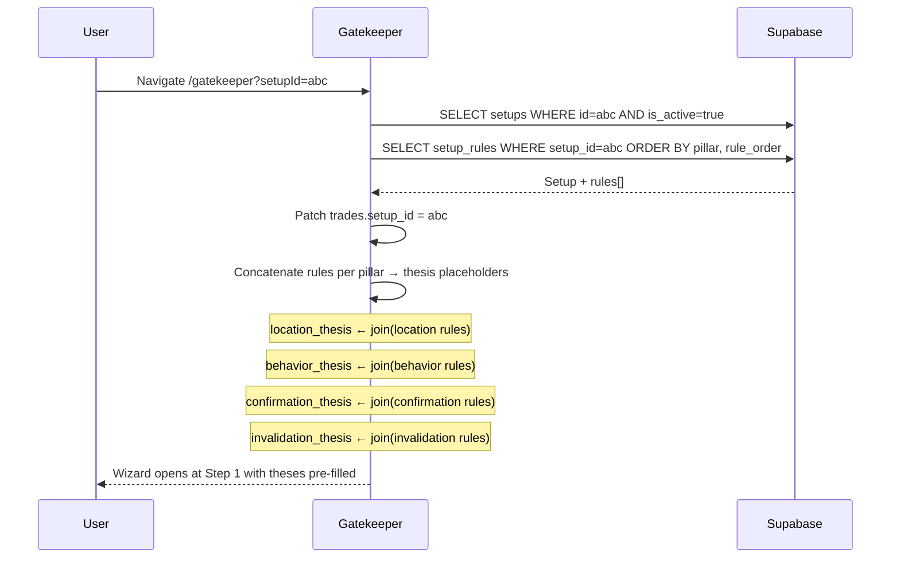

# 06b — Setups Library: Rule Drilldown

## Module Header

| Field | Value |
|-------|-------|
| **Purpose** | Display and edit pillar-grouped qualification rules (`setup_rules`) inside an expandable panel on each setup card, and expose the contract used by Gatekeeper pre-fill |
| **Angular Target Path** | `src/app/features/setups/components/setup-rule-drilldown/` |
| **Route** | Embedded on `/setups` (child of [playbook_cards.md](./playbook_cards.md)) |
| **Supabase Tables** | `setup_rules`, `setups` (parent FK) |
| **Key Metrics** | Rules per pillar, total rule count, Gatekeeper pre-fill coverage |
| **Parent Module** | [01 — Database Core](../01_DATABASE_CORE.md) |
| **Consumer** | `features/gatekeeper/` — setup pre-fill on `?setupId=` query param |

---

## Philosophy

Each setup rule is an **upstream cause statement** aligned to one of the four Gatekeeper pillars: `location`, `behavior`, `confirmation`, `invalidation`. Rules are free-text playbooks (not enum values) — they guide thesis entry in Gatekeeper steps. Enum selections (`auction_location`, `market_behavior`, etc.) remain user choices at qualification time; rules provide contextual reminders and default thesis text.

---

## Pillar Display Order

| Order | `pillar` value | Gatekeeper Step | Icon | Accent Token |
|-------|----------------|-----------------|------|--------------|
| 1 | `location` | Step 1 — Location | `pi-map-marker` | `#38bdf8` |
| 2 | `behavior` | Step 2 — Behavior | `pi-chart-line` | `#a78bfa` |
| 3 | `confirmation` | Step 3 — Confirmation | `pi-check-circle` | `#34d399` |
| 4 | `invalidation` | Step 4 — Invalidation | `pi-times-circle` | `#f87171` |

---

## PrimeNG Component Table

| UI Element | PrimeNG Component | Module Import | Binding / Notes |
|------------|-------------------|---------------|-----------------|
| Outer container | `p-panel` | `PanelModule` | `[toggleable]="true"`, `collapsed` default false when embedded |
| Pillar sections | `p-panel` × 4 | `PanelModule` | Nested; header shows pillar label + rule count |
| Rule list item | `p-card` | `CardModule` | Compact; shows `rule_text` and order index |
| Add rule | `p-button` | `ButtonModule` | Per-pillar `icon="pi pi-plus"` |
| Rule text input | `p-textarea` | `TextareaModule` | Inline edit mode |
| Save rule | `p-button` | `ButtonModule` | `severity="success"`, `size="small"` |
| Delete rule | `p-button` | `ButtonModule` | `icon="pi pi-trash"`, `severity="danger"`, `[text]="true"` |
| Reorder | `p-orderlist` | `OrderListModule` | Optional advanced; or manual `rule_order` PATCH |
| Empty pillar | `p-message` | `MessageModule` | `severity="warn"` — "No rules — Gatekeeper pre-fill incomplete" |
| Loading | `p-skeleton` | `SkeletonModule` | 4 rows while fetching |
| Gatekeeper hint | `p-message` | `MessageModule` | `severity="info"` linking pre-fill behavior |

---

## Supabase Queries

### Load rules for setup

```typescript
async loadRulesBySetupId(setupId: string): Promise<SetupRule[]> {
  const { data, error } = await this.supabase
    .from('setup_rules')
    .select('id, setup_id, rule_order, pillar, rule_text, created_at')
    .eq('setup_id', setupId)
    .order('pillar')
    .order('rule_order', { ascending: true });

  if (error) throw error;
  return data ?? [];
}
```

### Insert rule

```typescript
async addRule(setupId: string, pillar: SetupPillar, ruleText: string): Promise<SetupRule> {
  const { data: maxOrder } = await this.supabase
    .from('setup_rules')
    .select('rule_order')
    .eq('setup_id', setupId)
    .eq('pillar', pillar)
    .order('rule_order', { ascending: false })
    .limit(1)
    .maybeSingle();

  const nextOrder = (maxOrder?.rule_order ?? -1) + 1;

  const { data, error } = await this.supabase
    .from('setup_rules')
    .insert({
      setup_id: setupId,
      pillar,
      rule_text: ruleText.trim(),
      rule_order: nextOrder,
    })
    .select()
    .single();

  if (error) throw error;
  return data;
}
```

### Update / delete

```typescript
async updateRule(ruleId: string, ruleText: string): Promise<void> {
  const { error } = await this.supabase
    .from('setup_rules')
    .update({ rule_text: ruleText.trim() })
    .eq('id', ruleId);
  if (error) throw error;
}

async deleteRule(ruleId: string): Promise<void> {
  const { error } = await this.supabase.from('setup_rules').delete().eq('id', ruleId);
  if (error) throw error;
}
```

**RLS:** `setup_rules_self` — user must own parent setup ([01 — Database Core](../01_DATABASE_CORE.md)).

---

## Gatekeeper Pre-Fill Contract

When Gatekeeper loads with `?setupId={uuid}`, it fetches rules and maps them to wizard state **without** auto-selecting enum values.



### Gatekeeper service excerpt (consumer — `features/gatekeeper/`)

```typescript
export interface GatekeeperPrefillFromSetup {
  setup_id: string;
  setup_name: string;
  location_thesis: string;
  behavior_thesis: string;
  confirmation_thesis: string;
  invalidation_thesis: string;
  rule_count_by_pillar: Record<SetupPillar, number>;
}

async buildPrefillFromSetup(setupId: string): Promise<GatekeeperPrefillFromSetup | null> {
  const { data: setup, error: setupError } = await this.supabase
    .from('setups')
    .select('id, name, is_active')
    .eq('id', setupId)
    .eq('is_active', true)
    .maybeSingle();

  if (setupError) throw setupError;
  if (!setup) return null;

  const { data: rules, error: rulesError } = await this.supabase
    .from('setup_rules')
    .select('pillar, rule_text, rule_order')
    .eq('setup_id', setupId)
    .order('rule_order', { ascending: true });

  if (rulesError) throw rulesError;

  const grouped = groupRulesByPillar(rules ?? []);
  const join = (pillar: SetupPillar) =>
    grouped[pillar].map((r, i) => `${i + 1}. ${r.rule_text}`).join('\n');

  return {
    setup_id: setup.id,
    setup_name: setup.name,
    location_thesis: join('location'),
    behavior_thesis: join('behavior'),
    confirmation_thesis: join('confirmation'),
    invalidation_thesis: join('invalidation'),
    rule_count_by_pillar: {
      location: grouped.location.length,
      behavior: grouped.behavior.length,
      confirmation: grouped.confirmation.length,
      invalidation: grouped.invalidation.length,
    },
  };
}

function groupRulesByPillar(rules: Pick<SetupRule, 'pillar' | 'rule_text' | 'rule_order'>[]): SetupRulesByPillar {
  const pillars: SetupPillar[] = ['location', 'behavior', 'confirmation', 'invalidation'];
  const result: SetupRulesByPillar = {
    location: [],
    behavior: [],
    confirmation: [],
    invalidation: [],
  };
  for (const pillar of pillars) {
    result[pillar] = rules
      .filter((r) => r.pillar === pillar)
      .sort((a, b) => a.rule_order - b.rule_order)
      .map((r) => ({ ...r, id: '', setup_id: '', created_at: '' }));
  }
  return result;
}
```

**Gatekeeper UI behavior after pre-fill:**

| Wizard Field | Pre-fill Source | User Action Still Required |
|--------------|-----------------|---------------------------|
| `trades.setup_id` | `setup.id` | None — auto-set |
| `location` (`p-selectbutton`) | — | User selects `auction_location` enum |
| `location_thesis` (`p-textarea`) | Joined `location` rules | User may edit |
| `behavior` | — | User selects `market_behavior` |
| `behavior_thesis` | Joined `behavior` rules | User may edit |
| `confirmation` | — | User selects `confirmation_trigger` |
| `confirmation_thesis` | Joined `confirmation` rules | User may edit |
| `invalidation_level` / `invalidation_price` | — | User enters level + price |
| `invalidation_thesis` | Joined `invalidation` rules | User may edit |
| `is_retest` (`p-checkbox`) | — | User must check (DB requires `true`) |

Readiness % still advances only when all four enum fields + theses + invalidation price are valid — pre-fill does not bypass qualification.

---

## TypeScript Interfaces

```typescript
// Re-exported from setup.model.ts — see playbook_cards.md
import type { SetupPillar, SetupRule, SetupRulesByPillar } from '../../models/setup.model';

export interface PillarMeta {
  key: SetupPillar;
  label: string;
  icon: string;
  color: string;
  gatekeeperStep: number;
}

export const PILLAR_META: PillarMeta[] = [
  { key: 'location', label: 'Location', icon: 'pi-map-marker', color: '#38bdf8', gatekeeperStep: 1 },
  { key: 'behavior', label: 'Behavior', icon: 'pi-chart-line', color: '#a78bfa', gatekeeperStep: 2 },
  { key: 'confirmation', label: 'Confirmation', icon: 'pi-check-circle', color: '#34d399', gatekeeperStep: 3 },
  { key: 'invalidation', label: 'Invalidation', icon: 'pi-times-circle', color: '#f87171', gatekeeperStep: 4 },
];

export interface RuleDraft {
  pillar: SetupPillar;
  rule_text: string;
}
```

---

## Component Implementation

### setup-rule-drilldown.component.ts

```typescript
import { Component, Input, OnInit, inject, signal, computed } from '@angular/core';
import { FormsModule } from '@angular/forms';
import { PanelModule } from 'primeng/panel';
import { CardModule } from 'primeng/card';
import { ButtonModule } from 'primeng/button';
import { TextareaModule } from 'primeng/textarea';
import { MessageModule } from 'primeng/message';
import { SkeletonModule } from 'primeng/skeleton';
import { ToastModule } from 'primeng/toast';
import { MessageService } from 'primeng/api';
import { SetupsLibraryService } from '../../services/setups-library.service';
import { PILLAR_META, type RuleDraft } from './setup-rule-drilldown.model';
import type { SetupPillar, SetupRule, SetupRulesByPillar } from '../../models/setup.model';

@Component({
  selector: 'app-setup-rule-drilldown',
  standalone: true,
  imports: [
    FormsModule,
    PanelModule,
    CardModule,
    ButtonModule,
    TextareaModule,
    MessageModule,
    SkeletonModule,
    ToastModule,
  ],
  templateUrl: './setup-rule-drilldown.component.html',
  styleUrl: './setup-rule-drilldown.component.scss',
})
export class SetupRuleDrilldownComponent implements OnInit {
  @Input({ required: true }) setupId!: string;

  private readonly libraryService = inject(SetupsLibraryService);
  private readonly messageService = inject(MessageService);

  readonly pillarMeta = PILLAR_META;
  readonly loading = signal(true);
  readonly rules = signal<SetupRule[]>([]);
  readonly editingRuleId = signal<string | null>(null);
  readonly editText = signal('');
  readonly draft = signal<RuleDraft | null>(null);

  readonly grouped = computed<SetupRulesByPillar>(() => this.groupRules(this.rules()));

  readonly totalRules = computed(() => this.rules().length);

  ngOnInit(): void {
    this.load();
  }

  async load(): Promise<void> {
    this.loading.set(true);
    try {
      const rows = await this.libraryService.loadRulesBySetupId(this.setupId);
      this.rules.set(rows);
    } catch (err) {
      this.messageService.add({
        severity: 'error',
        summary: 'Rules load failed',
        detail: err instanceof Error ? err.message : 'Unknown error',
      });
    } finally {
      this.loading.set(false);
    }
  }

  startAdd(pillar: SetupPillar): void {
    this.editingRuleId.set(null);
    this.draft.set({ pillar, rule_text: '' });
  }

  cancelDraft(): void {
    this.draft.set(null);
  }

  async saveDraft(): Promise<void> {
    const d = this.draft();
    if (!d || !d.rule_text.trim()) return;
    try {
      const created = await this.libraryService.addRule(this.setupId, d.pillar, d.rule_text);
      this.rules.update((list) => [...list, created]);
      this.draft.set(null);
      this.messageService.add({ severity: 'success', summary: 'Rule added' });
    } catch (err) {
      this.messageService.add({ severity: 'error', summary: 'Add failed', detail: String(err) });
    }
  }

  startEdit(rule: SetupRule): void {
    this.draft.set(null);
    this.editingRuleId.set(rule.id);
    this.editText.set(rule.rule_text);
  }

  async saveEdit(ruleId: string): Promise<void> {
    try {
      await this.libraryService.updateRule(ruleId, this.editText());
      this.rules.update((list) =>
        list.map((r) => (r.id === ruleId ? { ...r, rule_text: this.editText().trim() } : r))
      );
      this.editingRuleId.set(null);
    } catch (err) {
      this.messageService.add({ severity: 'error', summary: 'Update failed', detail: String(err) });
    }
  }

  async remove(ruleId: string): Promise<void> {
    try {
      await this.libraryService.deleteRule(ruleId);
      this.rules.update((list) => list.filter((r) => r.id !== ruleId));
    } catch (err) {
      this.messageService.add({ severity: 'error', summary: 'Delete failed', detail: String(err) });
    }
  }

  rulesForPillar(pillar: SetupPillar): SetupRule[] {
    return this.grouped()[pillar];
  }

  private groupRules(rules: SetupRule[]): SetupRulesByPillar {
    const pillars: SetupPillar[] = ['location', 'behavior', 'confirmation', 'invalidation'];
    const result: SetupRulesByPillar = {
      location: [],
      behavior: [],
      confirmation: [],
      invalidation: [],
    };
    for (const p of pillars) {
      result[p] = rules
        .filter((r) => r.pillar === p)
        .sort((a, b) => a.rule_order - b.rule_order);
    }
    return result;
  }
}
```

### setup-rule-drilldown.component.html

```html
<div class="rule-drilldown">
  <p-message
    severity="info"
    class="rule-drilldown__prefill-hint"
    text="Rules pre-fill Gatekeeper thesis fields when you click 'Use in Gatekeeper'. Enum selections (location, behavior, confirmation) remain manual."
  />

  @if (loading()) {
    @for (i of [1, 2, 3, 4]; track i) {
      <p-skeleton height="3rem" class="rule-drilldown__skeleton" />
    }
  } @else {
    @for (meta of pillarMeta; track meta.key) {
      <p-panel
        [toggleable]="true"
        [collapsed]="false"
        class="rule-drilldown__pillar-panel"
        [style.--pillar-color]="meta.color"
      >
        <ng-template pTemplate="header">
          <span class="rule-drilldown__pillar-header">
            <i [class]="'pi ' + meta.icon"></i>
            {{ meta.label }}
            <span class="rule-drilldown__pillar-step">Step {{ meta.gatekeeperStep }}</span>
            <span class="rule-drilldown__pillar-count">
              ({{ rulesForPillar(meta.key).length }})
            </span>
          </span>
        </ng-template>

        @if (rulesForPillar(meta.key).length === 0) {
          <p-message
            severity="warn"
            [text]="'No ' + meta.label.toLowerCase() + ' rules — Gatekeeper pre-fill will leave this thesis empty.'"
          />
        } @else {
          <ul class="rule-drilldown__rule-list">
            @for (rule of rulesForPillar(meta.key); track rule.id; let idx = $index) {
              <li>
                @if (editingRuleId() === rule.id) {
                  <div class="rule-drilldown__edit-row">
                    <textarea
                      pTextarea
                      rows="3"
                      class="rule-drilldown__textarea"
                      [ngModel]="editText()"
                      (ngModelChange)="editText.set($event)"
                    ></textarea>
                    <div class="rule-drilldown__edit-actions">
                      <p-button label="Save" size="small" (onClick)="saveEdit(rule.id)" />
                      <p-button label="Cancel" size="small" severity="secondary" [text]="true" (onClick)="editingRuleId.set(null)" />
                    </div>
                  </div>
                } @else {
                  <p-card class="rule-drilldown__rule-card">
                    <span class="rule-drilldown__rule-index">{{ idx + 1 }}.</span>
                    <span class="rule-drilldown__rule-text">{{ rule.rule_text }}</span>
                    <div class="rule-drilldown__rule-actions">
                      <p-button icon="pi pi-pencil" [text]="true" size="small" (onClick)="startEdit(rule)" />
                      <p-button icon="pi pi-trash" [text]="true" size="small" severity="danger" (onClick)="remove(rule.id)" />
                    </div>
                  </p-card>
                }
              </li>
            }
          </ul>
        }

        @if (draft()?.pillar === meta.key) {
          <div class="rule-drilldown__add-row">
            <textarea
              pTextarea
              rows="3"
              class="rule-drilldown__textarea"
              placeholder="Describe the {{ meta.label.toLowerCase() }} requirement…"
              [ngModel]="draft()!.rule_text"
              (ngModelChange)="draft.update((d) => d ? { ...d, rule_text: $event } : d)"
            ></textarea>
            <div class="rule-drilldown__edit-actions">
              <p-button label="Add Rule" icon="pi pi-plus" size="small" (onClick)="saveDraft()" />
              <p-button label="Cancel" size="small" severity="secondary" [text]="true" (onClick)="cancelDraft()" />
            </div>
          </div>
        } @else {
          <p-button
            label="Add {{ meta.label }} Rule"
            icon="pi pi-plus"
            size="small"
            [text]="true"
            (onClick)="startAdd(meta.key)"
          />
        }
      </p-panel>
    }
  }
</div>
```

### setup-rule-drilldown.component.scss

```scss
.rule-drilldown {
  margin-top: 1rem;
  padding-top: 1rem;
  border-top: 1px solid var(--dqos-border);
  display: flex;
  flex-direction: column;
  gap: 0.75rem;

  &__prefill-hint {
    margin-bottom: 0.25rem;
  }

  &__skeleton {
    margin-bottom: 0.5rem;
  }

  &__pillar-panel {
    ::ng-deep .p-panel-header {
      border-left: 3px solid var(--pillar-color, var(--dqos-border));
    }
  }

  &__pillar-header {
    display: flex;
    align-items: center;
    gap: 0.5rem;
    font-weight: 600;
    color: #e2e8f0;

    .pi {
      color: var(--pillar-color);
    }
  }

  &__pillar-step {
    font-family: var(--dqos-font-mono);
    font-size: 0.6875rem;
    color: #64748b;
    margin-left: 0.25rem;
  }

  &__pillar-count {
    font-family: var(--dqos-font-mono);
    font-size: 0.75rem;
    color: #94a3b8;
  }

  &__rule-list {
    list-style: none;
    margin: 0 0 0.75rem;
    padding: 0;
    display: flex;
    flex-direction: column;
    gap: 0.5rem;
  }

  &__rule-card {
    ::ng-deep .p-card-body {
      display: flex;
      align-items: flex-start;
      gap: 0.5rem;
      padding: 0.625rem 0.75rem;
    }
  }

  &__rule-index {
    font-family: var(--dqos-font-mono);
    font-size: 0.75rem;
    color: #64748b;
    flex-shrink: 0;
  }

  &__rule-text {
    flex: 1;
    font-size: 0.875rem;
    line-height: 1.45;
    color: #cbd5e1;
  }

  &__rule-actions {
    display: flex;
    gap: 0.125rem;
    flex-shrink: 0;
  }

  &__textarea {
    width: 100%;
    margin-bottom: 0.5rem;
  }

  &__edit-row,
  &__add-row {
    margin-top: 0.5rem;
  }

  &__edit-actions {
    display: flex;
    gap: 0.5rem;
  }
}
```

---

## Testing Checklist

- [ ] Four pillar panels render in fixed order with correct icons
- [ ] Empty pillar shows warn message
- [ ] Add / edit / delete persists via `setup_rules` RLS
- [ ] `rule_order` increments per pillar independently
- [ ] Gatekeeper `buildPrefillFromSetup` joins rules into numbered thesis strings
- [ ] Inactive setup returns `null` from pre-fill builder
- [ ] Pre-fill sets `trades.setup_id` but does not set enum fields
