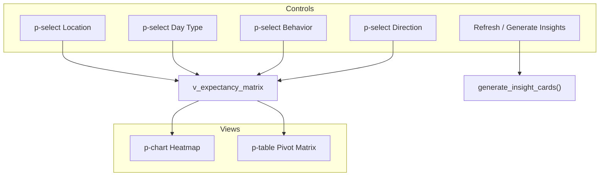

# 07 — Edge Discovery Lab: Analytics Workspace

## Module Header

| Field | Value |
|-------|-------|
| **Purpose** | Interactive expectancy exploration — heatmap and pivot table over closed-trade cross-tabs sourced from `v_expectancy_matrix`, with dimension filters driving both views |
| **Angular Target Path** | `src/app/features/edge-lab/pages/analytics-workspace/` |
| **Route** | `/lab/analytics` |
| **Supabase Tables / Views** | `v_expectancy_matrix` (read), `insight_snapshots` (via `generate_insight_cards` RPC) |
| **Key Metrics** | Expectancy R, win rate %, sample size per cell |
| **Parent Module** | [01 — Database Core](../01_DATABASE_CORE.md) |

---

## Philosophy

The analytics workspace surfaces **downstream outcomes** (R-multiple, win rate) grouped by **upstream causes** (location, behavior) and trade context (day type, direction). It reads the same aggregated view that powers `generate_insight_cards` — cells with `sample_size >= 20` and `|expectancy_r| >= 0.5` become HIGH_CONFIDENCE or SYSTEM_DRIFT insight cards. The workspace shows the full matrix (including low-n cells) for discovery; insight generation applies stricter thresholds.

---

## Data Model — `v_expectancy_matrix`

| Column | Type | Filter Dimension |
|--------|------|------------------|
| `user_id` | UUID | Implicit (`auth.uid()`) |
| `location` | `auction_location` | `p-select` — Location |
| `day_type` | `day_type` | `p-select` — Day Type |
| `behavior` | `market_behavior` | `p-select` — Behavior |
| `direction` | `trade_direction` | `p-select` — Direction |
| `sample_size` | integer | Display only |
| `expectancy_r` | numeric | Heatmap color scale |
| `win_rate_pct` | numeric | Pivot cell secondary stat |

Source SQL ([01 — Database Core](../01_DATABASE_CORE.md)):

```sql
SELECT t.user_id, ea.location, t.day_type, ea.behavior, t.direction,
       COUNT(*) FILTER (WHERE t.status = 'CLOSED') AS sample_size,
       ROUND(AVG(t.r_multiple) FILTER (WHERE t.status = 'CLOSED'), 4) AS expectancy_r,
       ROUND(100.0 * COUNT(*) FILTER (...) / NULLIF(...), 2) AS win_rate_pct
FROM trades t JOIN execution_audits ea ON ea.trade_id = t.id
GROUP BY t.user_id, ea.location, t.day_type, ea.behavior, t.direction
HAVING COUNT(*) FILTER (WHERE t.status = 'CLOSED') >= 1;
```

---

## Layout Architecture



**Default pivot axes:** Rows = `location`, Columns = `day_type` (when Behavior and Direction filters are set to "All"). Heatmap uses the same filtered slice with rows = `location`, columns = `behavior`.

---

## PrimeNG Component Table

| UI Element | PrimeNG Component | Module Import | Binding / Notes |
|------------|-------------------|---------------|-----------------|
| Page shell | `p-card` | `CardModule` | Title "Analytics Workspace" |
| Location filter | `p-select` | `SelectModule` | `options` = `AuctionLocation[]` + "All" |
| Day type filter | `p-select` | `SelectModule` | `options` = `DayType[]` + "All" |
| Behavior filter | `p-select` | `SelectModule` | `options` = `MarketBehavior[]` + "All" |
| Direction filter | `p-select` | `SelectModule` | `LONG`, `SHORT`, "All" |
| Apply filters | `p-button` | `ButtonModule` | Re-queries view (or client-filters cache) |
| Heatmap | `p-chart` | `ChartModule` | Chart.js matrix/heatmap plugin |
| Pivot table | `p-table` | `TableModule` | Dynamic columns from pivot builder |
| Sample size badge | `p-badge` | `BadgeModule` | In cell when n &lt; 20, severity `warn` |
| High confidence cell | `p-tag` | `TagModule` | `severity="success"` when expectancy ≥ 0.5, n ≥ 20 |
| Drift cell | `p-tag` | `TagModule` | `severity="danger"` when expectancy ≤ -0.5, n ≥ 20 |
| Generate insights | `p-button` | `ButtonModule` | Calls `generate_insight_cards` RPC |
| Loading | `p-progressspinner` | `ProgressSpinnerModule` | Initial load |
| Empty | `p-message` | `MessageModule` | No closed trades in filter slice |
| Insight toast | `p-toast` | `ToastModule` | Reports count of cards generated |

---

## TypeScript Interfaces

```typescript
// src/app/features/edge-lab/models/expectancy-matrix.model.ts

import type {
  AuctionLocation,
  DayType,
  MarketBehavior,
  TradeDirection,
} from '../../../core/supabase/database.types';

export interface ExpectancyMatrixRow {
  user_id: string;
  location: AuctionLocation;
  day_type: DayType;
  behavior: MarketBehavior;
  direction: TradeDirection;
  sample_size: number;
  expectancy_r: number;
  win_rate_pct: number | null;
}

export type DimensionFilterValue<T extends string> = T | 'ALL';

export interface AnalyticsFilters {
  location: DimensionFilterValue<AuctionLocation>;
  day_type: DimensionFilterValue<DayType>;
  behavior: DimensionFilterValue<MarketBehavior>;
  direction: DimensionFilterValue<TradeDirection>;
}

export interface PivotCell {
  sample_size: number;
  expectancy_r: number | null;
  win_rate_pct: number | null;
  insight_tier: 'HIGH_CONFIDENCE' | 'SYSTEM_DRIFT' | 'NEUTRAL' | 'LOW_SAMPLE';
}

export interface PivotRow {
  rowKey: string;
  cells: Record<string, PivotCell>;
}

export interface HeatmapPoint {
  x: string;
  y: string;
  v: number;
  n: number;
}
```

---

## Service Implementation

### analytics-workspace.service.ts

```typescript
import { Injectable, inject } from '@angular/core';
import { SupabaseClient } from '@supabase/supabase-js';
import type {
  AnalyticsFilters,
  ExpectancyMatrixRow,
  HeatmapPoint,
  PivotCell,
  PivotRow,
} from '../models/expectancy-matrix.model';
import type { AuctionLocation, DayType } from '../../../core/supabase/database.types';

@Injectable({ providedIn: 'root' })
export class AnalyticsWorkspaceService {
  private readonly supabase = inject(SupabaseClient);

  async fetchMatrix(): Promise<ExpectancyMatrixRow[]> {
    const { data, error } = await this.supabase
      .from('v_expectancy_matrix')
      .select('user_id, location, day_type, behavior, direction, sample_size, expectancy_r, win_rate_pct');

    if (error) throw error;
    return (data ?? []) as ExpectancyMatrixRow[];
  }

  filterRows(rows: ExpectancyMatrixRow[], filters: AnalyticsFilters): ExpectancyMatrixRow[] {
    return rows.filter((r) => {
      if (filters.location !== 'ALL' && r.location !== filters.location) return false;
      if (filters.day_type !== 'ALL' && r.day_type !== filters.day_type) return false;
      if (filters.behavior !== 'ALL' && r.behavior !== filters.behavior) return false;
      if (filters.direction !== 'ALL' && r.direction !== filters.direction) return false;
      return true;
    });
  }

  buildPivot(
    rows: ExpectancyMatrixRow[],
    rowDim: 'location' | 'behavior',
    colDim: 'day_type' | 'direction'
  ): { columns: string[]; pivotRows: PivotRow[] } {
    const colSet = new Set<string>();
    const rowMap = new Map<string, Record<string, PivotCell>>();

    for (const r of rows) {
      const rowKey = r[rowDim];
      const colKey = r[colDim];
      colSet.add(colKey);
      if (!rowMap.has(rowKey)) rowMap.set(rowKey, {});
      rowMap.get(rowKey)![colKey] = this.toPivotCell(r);
    }

    const columns = Array.from(colSet).sort();
    const pivotRows: PivotRow[] = Array.from(rowMap.entries())
      .sort(([a], [b]) => a.localeCompare(b))
      .map(([rowKey, cells]) => ({ rowKey, cells }));

    return { columns, pivotRows };
  }

  buildHeatmapPoints(
    rows: ExpectancyMatrixRow[],
    xDim: 'behavior' | 'day_type',
    yDim: 'location'
  ): HeatmapPoint[] {
    return rows.map((r) => ({
      x: r[xDim],
      y: r[yDim],
      v: r.expectancy_r,
      n: r.sample_size,
    }));
  }

  async generateInsightCards(): Promise<number> {
    const { data, error } = await this.supabase.rpc('generate_insight_cards');
    if (error) throw error;
    return (data ?? []).length;
  }

  private toPivotCell(r: ExpectancyMatrixRow): PivotCell {
    let insight_tier: PivotCell['insight_tier'] = 'NEUTRAL';
    if (r.sample_size < 20) insight_tier = 'LOW_SAMPLE';
    else if (r.expectancy_r >= 0.5) insight_tier = 'HIGH_CONFIDENCE';
    else if (r.expectancy_r <= -0.5) insight_tier = 'SYSTEM_DRIFT';
    return {
      sample_size: r.sample_size,
      expectancy_r: r.expectancy_r,
      win_rate_pct: r.win_rate_pct,
      insight_tier,
    };
  }
}
```

---

## Heatmap Chart Configuration

Register Chart.js matrix controller (install `chartjs-chart-matrix`):

```bash
npm install chartjs-chart-matrix --legacy-peer-deps
```

```typescript
// analytics-workspace.component.ts (chart setup excerpt)
import { Chart, registerables } from 'chart.js';
import { MatrixController, MatrixElement } from 'chartjs-chart-matrix';

Chart.register(...registerables, MatrixController, MatrixElement);

buildHeatmapConfig(points: HeatmapPoint[]) {
  return {
    type: 'matrix' as const,
    data: {
      datasets: [{
        label: 'Expectancy (R)',
        data: points.map((p) => ({ x: p.x, y: p.y, v: p.v })),
        backgroundColor(ctx: { raw?: { v: number } }) {
          const v = ctx.raw?.v ?? 0;
          if (v >= 0.5) return 'rgba(16, 185, 129, 0.85)';
          if (v <= -0.5) return 'rgba(248, 113, 113, 0.85)';
          if (v >= 0) return 'rgba(52, 211, 153, 0.35)';
          return 'rgba(251, 191, 36, 0.35)';
        },
        borderWidth: 1,
        borderColor: '#262B37',
        width: ({ chart }: { chart: { chartArea?: { width: number } } }) =>
          (chart.chartArea?.width ?? 400) / Math.max(points.length, 1) - 2,
        height: ({ chart }: { chart: { chartArea?: { height: number } } }) =>
          (chart.chartArea?.height ?? 300) / 12 - 2,
      }],
    },
    options: {
      responsive: true,
      maintainAspectRatio: false,
      plugins: {
        legend: { display: false },
        tooltip: {
          callbacks: {
            title: (items: { raw: { x: string; y: string } }[]) => {
              const raw = items[0]?.raw;
              return raw ? `${raw.y} × ${raw.x}` : '';
            },
            label: (ctx: { raw: { v: number }; dataset: { data: { n?: number }[] } }) => {
              const pt = points[ctx.dataIndex];
              return [
                `Expectancy: ${ctx.raw.v.toFixed(2)}R`,
                `Win rate: ${pt?.n ? (points.find((p) => p.v === ctx.raw.v)?.n ?? '') : ''}%`,
                `n = ${pt?.n ?? 0}`,
              ];
            },
          },
        },
      },
      scales: {
        x: { type: 'category' as const, labels: [...new Set(points.map((p) => p.x))].sort() },
        y: { type: 'category' as const, labels: [...new Set(points.map((p) => p.y))].sort() },
      },
    },
  };
}
```

---

## Component Implementation

### analytics-workspace.component.ts

```typescript
import { Component, OnInit, inject, signal, computed } from '@angular/core';
import { FormsModule } from '@angular/forms';
import { CardModule } from 'primeng/card';
import { SelectModule } from 'primeng/select';
import { ButtonModule } from 'primeng/button';
import { ChartModule } from 'primeng/chart';
import { TableModule } from 'primeng/table';
import { BadgeModule } from 'primeng/badge';
import { TagModule } from 'primeng/tag';
import { ProgressSpinnerModule } from 'primeng/progressspinner';
import { MessageModule } from 'primeng/message';
import { ToastModule } from 'primeng/toast';
import { MessageService } from 'primeng/api';
import { AnalyticsWorkspaceService } from '../../services/analytics-workspace.service';
import type { AnalyticsFilters, ExpectancyMatrixRow } from '../../models/expectancy-matrix.model';
import {
  AUCTION_LOCATIONS,
  DAY_TYPES,
  MARKET_BEHAVIORS,
  TRADE_DIRECTIONS,
} from '../../../core/supabase/enum-options';

@Component({
  selector: 'app-analytics-workspace',
  standalone: true,
  imports: [
    FormsModule,
    CardModule,
    SelectModule,
    ButtonModule,
    ChartModule,
    TableModule,
    BadgeModule,
    TagModule,
    ProgressSpinnerModule,
    MessageModule,
    ToastModule,
  ],
  providers: [MessageService],
  templateUrl: './analytics-workspace.component.html',
  styleUrl: './analytics-workspace.component.scss',
})
export class AnalyticsWorkspaceComponent implements OnInit {
  private readonly analyticsService = inject(AnalyticsWorkspaceService);
  private readonly messageService = inject(MessageService);

  readonly loading = signal(true);
  readonly rawMatrix = signal<ExpectancyMatrixRow[]>([]);
  readonly filters = signal<AnalyticsFilters>({
    location: 'ALL',
    day_type: 'ALL',
    behavior: 'ALL',
    direction: 'ALL',
  });
  readonly generating = signal(false);

  readonly locationOptions = [{ label: 'All Locations', value: 'ALL' as const }, ...AUCTION_LOCATIONS];
  readonly dayTypeOptions = [{ label: 'All Day Types', value: 'ALL' as const }, ...DAY_TYPES];
  readonly behaviorOptions = [{ label: 'All Behaviors', value: 'ALL' as const }, ...MARKET_BEHAVIORS];
  readonly directionOptions = [{ label: 'All Directions', value: 'ALL' as const }, ...TRADE_DIRECTIONS];

  readonly filteredRows = computed(() =>
    this.analyticsService.filterRows(this.rawMatrix(), this.filters())
  );

  readonly heatmapData = computed(() => {
    const points = this.analyticsService.buildHeatmapPoints(
      this.filteredRows(),
      'behavior',
      'location'
    );
    return this.buildHeatmapConfig(points);
  });

  readonly pivot = computed(() =>
    this.analyticsService.buildPivot(this.filteredRows(), 'location', 'day_type')
  );

  ngOnInit(): void {
    this.load();
  }

  async load(): Promise<void> {
    this.loading.set(true);
    try {
      const rows = await this.analyticsService.fetchMatrix();
      this.rawMatrix.set(rows);
    } catch (err) {
      this.messageService.add({
        severity: 'error',
        summary: 'Matrix load failed',
        detail: err instanceof Error ? err.message : 'Unknown error',
      });
    } finally {
      this.loading.set(false);
    }
  }

  async generateInsights(): Promise<void> {
    this.generating.set(true);
    try {
      const count = await this.analyticsService.generateInsightCards();
      this.messageService.add({
        severity: 'success',
        summary: 'Insights generated',
        detail: `${count} active insight card(s) — n≥20, |E|≥0.5R`,
      });
    } catch (err) {
      this.messageService.add({ severity: 'error', summary: 'RPC failed', detail: String(err) });
    } finally {
      this.generating.set(false);
    }
  }

  updateFilter<K extends keyof AnalyticsFilters>(key: K, value: AnalyticsFilters[K]): void {
    this.filters.update((f) => ({ ...f, [key]: value }));
  }

  cellFor(row: { cells: Record<string, import('../../models/expectancy-matrix.model').PivotCell> }, col: string) {
    return row.cells[col] ?? null;
  }

  tierSeverity(tier: string): 'success' | 'danger' | 'warn' | 'secondary' {
    switch (tier) {
      case 'HIGH_CONFIDENCE': return 'success';
      case 'SYSTEM_DRIFT': return 'danger';
      case 'LOW_SAMPLE': return 'warn';
      default: return 'secondary';
    }
  }

  private buildHeatmapConfig(points: import('../../models/expectancy-matrix.model').HeatmapPoint[]) {
    // Full implementation in Heatmap Chart Configuration section above
    return {
      type: 'matrix',
      data: {
        datasets: [{
          label: 'Expectancy (R)',
          data: points.map((p) => ({ x: p.x, y: p.y, v: p.v })),
        }],
      },
      options: { responsive: true, maintainAspectRatio: false },
    };
  }
}
```

### analytics-workspace.component.html

```html
<p-toast position="top-right" />

<section class="analytics-workspace">
  <p-card>
    <ng-template pTemplate="title">Analytics Workspace</ng-template>
    <ng-template pTemplate="subtitle">
      Expectancy matrix from closed trades — feeds Edge Lab insight cards
    </ng-template>

    <div class="analytics-workspace__filters">
      <div class="analytics-workspace__filter">
        <label for="filter-location">Location</label>
        <p-select
          inputId="filter-location"
          [options]="locationOptions"
          optionLabel="label"
          optionValue="value"
          [ngModel]="filters().location"
          (ngModelChange)="updateFilter('location', $event)"
        />
      </div>
      <div class="analytics-workspace__filter">
        <label for="filter-day-type">Day Type</label>
        <p-select
          inputId="filter-day-type"
          [options]="dayTypeOptions"
          optionLabel="label"
          optionValue="value"
          [ngModel]="filters().day_type"
          (ngModelChange)="updateFilter('day_type', $event)"
        />
      </div>
      <div class="analytics-workspace__filter">
        <label for="filter-behavior">Behavior</label>
        <p-select
          inputId="filter-behavior"
          [options]="behaviorOptions"
          optionLabel="label"
          optionValue="value"
          [ngModel]="filters().behavior"
          (ngModelChange)="updateFilter('behavior', $event)"
        />
      </div>
      <div class="analytics-workspace__filter">
        <label for="filter-direction">Direction</label>
        <p-select
          inputId="filter-direction"
          [options]="directionOptions"
          optionLabel="label"
          optionValue="value"
          [ngModel]="filters().direction"
          (ngModelChange)="updateFilter('direction', $event)"
        />
      </div>
      <p-button label="Reload" icon="pi pi-refresh" severity="secondary" (onClick)="load()" />
      <p-button
        label="Generate Insights"
        icon="pi pi-bolt"
        [loading]="generating()"
        (onClick)="generateInsights()"
      />
    </div>

    @if (loading()) {
      <div class="analytics-workspace__loading">
        <p-progressSpinner strokeWidth="4" />
      </div>
    } @else if (filteredRows().length === 0) {
      <p-message
        severity="info"
        text="No closed trades match the current filters. Adjust dimensions or log more trades."
      />
    } @else {
      <div class="analytics-workspace__grid">
        <div class="analytics-workspace__heatmap-panel">
          <h2 class="analytics-workspace__panel-title">Expectancy Heatmap</h2>
          <p class="analytics-workspace__panel-subtitle">Location × Behavior (filtered slice)</p>
          <div class="analytics-workspace__chart-container">
            <p-chart type="matrix" [data]="heatmapData().data" [options]="heatmapData().options" />
          </div>
        </div>

        <div class="analytics-workspace__pivot-panel">
          <h2 class="analytics-workspace__panel-title">Pivot Matrix</h2>
          <p class="analytics-workspace__panel-subtitle">Location × Day Type</p>
          <p-table
            [value]="pivot().pivotRows"
            [scrollable]="true"
            scrollHeight="24rem"
            styleClass="analytics-workspace__pivot-table"
          >
            <ng-template pTemplate="header">
              <tr>
                <th class="analytics-workspace__row-header">Location</th>
                @for (col of pivot().columns; track col) {
                  <th>{{ col }}</th>
                }
              </tr>
            </ng-template>
            <ng-template pTemplate="body" let-row>
              <tr>
                <td class="analytics-workspace__row-header">{{ row.rowKey }}</td>
                @for (col of pivot().columns; track col) {
                  <td class="analytics-workspace__cell">
                    @if (cellFor(row, col); as cell) {
                      <span
                        class="analytics-workspace__expectancy"
                        [class.analytics-workspace__expectancy--positive]="cell.expectancy_r! >= 0.5"
                        [class.analytics-workspace__expectancy--negative]="cell.expectancy_r! <= -0.5"
                      >
                        {{ cell.expectancy_r | number: '1.2-2' }}R
                      </span>
                      <span class="analytics-workspace__win-rate">
                        {{ cell.win_rate_pct ?? '—' }}%
                      </span>
                      <span class="analytics-workspace__sample">n={{ cell.sample_size }}</span>
                      @if (cell.insight_tier !== 'NEUTRAL') {
                        <p-tag
                          [value]="cell.insight_tier === 'LOW_SAMPLE' ? 'n&lt;20' : cell.insight_tier"
                          [severity]="tierSeverity(cell.insight_tier)"
                        />
                      }
                    } @else {
                      <span class="analytics-workspace__empty-cell">—</span>
                    }
                  </td>
                }
              </tr>
            </ng-template>
          </p-table>
        </div>
      </div>
    }
  </p-card>
</section>
```

### analytics-workspace.component.scss

```scss
.analytics-workspace {
  padding: 1.5rem 2rem;
  background: var(--dqos-bg-base);
  min-height: 100%;

  &__filters {
    display: flex;
    flex-wrap: wrap;
    gap: 1rem;
    align-items: flex-end;
    margin-bottom: 1.5rem;
  }

  &__filter {
    display: flex;
    flex-direction: column;
    gap: 0.25rem;
    min-width: 10rem;

    label {
      font-size: 0.75rem;
      color: #94a3b8;
      text-transform: uppercase;
      letter-spacing: 0.04em;
    }
  }

  &__loading {
    display: flex;
    justify-content: center;
    padding: 4rem 0;
  }

  &__grid {
    display: grid;
    grid-template-columns: 1fr 1fr;
    gap: 1.5rem;

    @media (max-width: 1100px) {
      grid-template-columns: 1fr;
    }
  }

  &__panel-title {
    margin: 0 0 0.25rem;
    font-size: 1rem;
    font-weight: 600;
    color: #e2e8f0;
  }

  &__panel-subtitle {
    margin: 0 0 1rem;
    font-size: 0.8125rem;
    color: #64748b;
  }

  &__heatmap-panel,
  &__pivot-panel {
    background: var(--dqos-bg-panel);
    border: 1px solid var(--dqos-border);
    border-radius: 0.5rem;
    padding: 1rem;
  }

  &__chart-container {
    height: 22rem;
  }

  &__row-header {
    font-family: var(--dqos-font-mono);
    font-size: 0.75rem;
    font-weight: 600;
    color: #94a3b8;
    white-space: nowrap;
  }

  &__cell {
    text-align: center;
    vertical-align: middle;
    min-width: 6.5rem;
  }

  &__expectancy {
    display: block;
    font-family: var(--dqos-font-mono);
    font-size: 0.9375rem;
    font-weight: 600;
    color: #cbd5e1;

    &--positive {
      color: var(--dqos-accent-qualified);
    }

    &--negative {
      color: #f87171;
    }
  }

  &__win-rate,
  &__sample {
    display: block;
    font-family: var(--dqos-font-mono);
    font-size: 0.6875rem;
    color: #64748b;
  }

  &__empty-cell {
    color: #475569;
  }
}
```

---

## Route Registration

```typescript
// src/app/features/edge-lab/edge-lab.routes.ts
import { Routes } from '@angular/router';

export const EDGE_LAB_ROUTES: Routes = [
  {
    path: 'analytics',
    loadComponent: () =>
      import('./pages/analytics-workspace/analytics-workspace.component').then(
        (m) => m.AnalyticsWorkspaceComponent
      ),
  },
];
```

```typescript
// src/app/app.routes.ts (excerpt)
{
  path: 'lab',
  loadChildren: () => import('./features/edge-lab/edge-lab.routes').then(m => m.EDGE_LAB_ROUTES),
},
```

---

## Insight Card Threshold Alignment

| Workspace Display | `generate_insight_cards` RPC |
|-------------------|------------------------------|
| Shows all cells with `sample_size >= 1` | Requires `sample_size >= 20` |
| Colors heatmap at ±0.5R | Inserts HIGH_CONFIDENCE at `expectancy_r >= 0.5` |
| Tags SYSTEM_DRIFT at ≤ -0.5R | Inserts SYSTEM_DRIFT at `expectancy_r <= -0.5` |
| LOW_SAMPLE tag when n &lt; 20 | Skips insert for neutral band (-0.5, 0.5) |

---

## Enum Options Helper

```typescript
// src/app/core/supabase/enum-options.ts
export const AUCTION_LOCATIONS = [
  { label: 'VAH', value: 'VAH' },
  { label: 'VAL', value: 'VAL' },
  { label: 'POC', value: 'POC' },
  { label: 'Weekly VWAP', value: 'Weekly_VWAP' },
  { label: 'Monthly VWAP', value: 'Monthly_VWAP' },
  { label: 'Composite VAH', value: 'Composite_VAH' },
  { label: 'Composite VAL', value: 'Composite_VAL' },
  { label: 'Composite POC', value: 'Composite_POC' },
  { label: 'Overnight High', value: 'Overnight_High' },
  { label: 'Overnight Low', value: 'Overnight_Low' },
  { label: 'Single Print', value: 'Single_Print' },
  { label: 'Naked POC', value: 'Naked_POC' },
] as const;

export const DAY_TYPES = [
  { label: 'D-Day', value: 'D_Day' },
  { label: 'P-Day', value: 'P_Day' },
  { label: 'b-Day', value: 'b_Day' },
  { label: 'Trend Day', value: 'Trend_Day' },
  { label: 'Double Distribution', value: 'Double_Dist' },
] as const;

export const MARKET_BEHAVIORS = [
  { label: 'Rejection', value: 'Rejection' },
  { label: 'Acceptance', value: 'Acceptance' },
  { label: 'Rotation', value: 'Rotation' },
  { label: 'Exhaustion', value: 'Exhaustion' },
  { label: 'Excess', value: 'Excess' },
  { label: 'Failed Auction', value: 'Failed_Auction' },
  { label: 'Value Migration', value: 'Value_Migration' },
  { label: 'Responsive Buying', value: 'Responsive_Buying' },
  { label: 'Responsive Selling', value: 'Responsive_Selling' },
] as const;

export const TRADE_DIRECTIONS = [
  { label: 'Long', value: 'LONG' },
  { label: 'Short', value: 'SHORT' },
] as const;
```

---

## Testing Checklist

- [ ] `v_expectancy_matrix` loads for authenticated user only (RLS via underlying tables)
- [ ] Each `p-select` filters client-side matrix without extra round-trips
- [ ] Heatmap cell colors match expectancy sign and ±0.5R thresholds
- [ ] Pivot shows location rows × day_type columns with expectancy, win rate, n
- [ ] Cells with n &lt; 20 show warn tag; n ≥ 20 + |E| ≥ 0.5 show insight tier tags
- [ ] "Generate Insights" RPC deactivates old snapshots and returns new active set
- [ ] Empty filter combination shows info message
- [ ] Responsive layout stacks heatmap above pivot below 1100px
