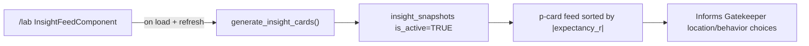

# 07 — Insight Feed Specification

## Module Header

| Field | Value |
|-------|-------|
| **Purpose** | Edge Discovery Lab home: surfaces statistically significant expectancy edges and system drift warnings derived from closed-trade history |
| **Angular Target Path** | `src/app/features/edge-lab/` |
| **Primary Component** | `InsightFeedComponent` |
| **Route** | `/lab` |
| **Supabase RPC** | `generate_insight_cards(p_user_id UUID DEFAULT auth.uid())` |
| **Supabase Tables** | `insight_snapshots` (read after RPC) |
| **Supabase Views** | `v_expectancy_matrix` (source data for RPC) |
| **Key Metrics** | Expectancy (R), Sample Size (n), Win Rate %, Insight Tier |

---

## Philosophy

The Lab does not invent opinions — it reads aggregate expectancy from closed trades joined to execution audits. Insights are **cached snapshots** written by the RPC so the feed loads instantly and refreshes on a controlled cadence.

Two actionable tiers are surfaced:

| Tier | DB Enum | Trigger (from `v_expectancy_matrix`) | Visual |
|------|---------|----------------------------------------|--------|
| **High Confidence** | `HIGH_CONFIDENCE` | `expectancy_r >= 0.5` AND `sample_size >= 20` | Green `p-tag` |
| **System Drift** | `SYSTEM_DRIFT` | `expectancy_r <= -0.5` AND `sample_size >= 20` | Amber `p-tag` |

Combinations with `sample_size < 20` or expectancy between `-0.5` and `0.5` produce **no card** — insufficient edge signal.

Reference: [`docs/01_DATABASE_CORE.md`](../01_DATABASE_CORE.md) — `generate_insight_cards()` RPC and `insight_snapshots` table.

---

## Application Flow



---

## Route Configuration

```typescript
// src/app/features/edge-lab/edge-lab.routes.ts
import { Routes } from '@angular/router';

export const EDGE_LAB_ROUTES: Routes = [
  {
    path: 'lab',
    loadComponent: () =>
      import('./insight-feed/insight-feed.component').then((m) => m.InsightFeedComponent),
  },
];
```

Register in root routes:

```typescript
// src/app/app.routes.ts
{
  path: '',
  loadChildren: () =>
    import('./features/edge-lab/edge-lab.routes').then((m) => m.EDGE_LAB_ROUTES),
},
```

---

## PrimeNG Component Table

| UI Region | PrimeNG Component | Purpose | Key Props |
|-----------|-------------------|---------|-----------|
| Page header | `p-toolbar` | Title + last refreshed timestamp + manual refresh | Custom start/end templates |
| Refresh action | `p-button` | Trigger RPC regeneration | `icon="pi pi-refresh"`, `[loading]="refreshing"` |
| Auto-refresh indicator | `p-tag` | Shows cadence label | `value="Auto-refresh: 15 min"` |
| Insight card | `p-card` | One card per snapshot row | `[styleClass]="tierCardClass(snapshot.tier)"` |
| Tier badge | `p-tag` | High Confidence / System Drift | Green: `severity="success"`, Amber: `severity="warn"` |
| Sample size | `p-badge` | Trade count overlay | `[value]="snapshot.sample_size + ''"`, `severity="info"` |
| Expectancy stat | `p-tag` | Formatted R-multiple | Mono font via SCSS |
| Win rate stat | `p-tag` | Win rate percentage | `severity="secondary"` |
| Expandable detail | `p-panel` | Full body text + dimension breakdown | `[toggleable]="true"`, `[collapsed]="true"` |
| Empty state | `p-message` | No insights yet | `severity="info"` |
| Loading skeleton | `p-skeleton` | Card placeholders during RPC | `height="8rem"`, repeat ×3 |
| Error state | `p-message` | RPC failure | `severity="error"` |
| Dimension chips | `p-tag` | location, day_type, behavior, direction | `severity="contrast"` |

---

## RPC Contract — `generate_insight_cards()`

### Behavior

1. Sets all existing `insight_snapshots` for the user to `is_active = FALSE`.
2. Iterates `v_expectancy_matrix` where `sample_size >= 20`.
3. Inserts new rows for qualifying HIGH_CONFIDENCE and SYSTEM_DRIFT combinations.
4. Returns active snapshots ordered by `ABS(expectancy_r) DESC`.

### Invocation

```typescript
const { data, error } = await supabase.rpc('generate_insight_cards', {
  p_user_id: userId, // optional — defaults to auth.uid()
});
```

### Returned Row Shape

Maps 1:1 to `InsightSnapshot` interface below.

---

## Tier Classification Rules

| Condition | Tier | Headline Pattern | Tag Color |
|-----------|------|------------------|-----------|
| `expectancy_r >= 0.5` AND `n >= 20` | `HIGH_CONFIDENCE` | `{direction} @ {location} on {day_type} → +{expectancy_r}R expectancy` | Green (`--dqos-accent-qualified`) |
| `expectancy_r <= -0.5` AND `n >= 20` | `SYSTEM_DRIFT` | `{direction} @ {location} on {day_type} → {expectancy_r}R expectancy (drift)` | Amber (`--dqos-accent-warning`) |
| `-0.5 < expectancy_r < 0.5` | *(no card)* | — | — |
| `n < 20` | *(no card)* | — | — |

---

## Refresh Cadence

| Trigger | Action | Debounce |
|---------|--------|----------|
| Component init (`ngOnInit`) | Call RPC, bind results | None |
| Manual refresh button | Call RPC, bind results | Disable button while in-flight |
| Timer interval | Call RPC every **15 minutes** while route active | Skip if prior call still running |
| Tab visibility resume | If hidden > 15 min, refresh on `document.visibilitychange` → `visible` | 500 ms debounce |
| Post-mortem save (optional hook) | Parent app may navigate to `/lab` with `?refresh=1` query param | Component reads query, refreshes once, clears param |

```typescript
private static readonly AUTO_REFRESH_MS = 15 * 60 * 1000; // 15 minutes

ngOnInit(): void {
  this.loadInsights();
  this.autoRefreshSub = interval(InsightFeedComponent.AUTO_REFRESH_MS)
    .pipe(filter(() => !this.refreshing()))
    .subscribe(() => this.loadInsights({ silent: true }));
}
```

Display `lastRefreshedAt` in toolbar using user timezone from `profiles.timezone`.

---

## TypeScript Interfaces

```typescript
// src/app/features/edge-lab/models/insight-snapshot.model.ts
import {
  AuctionLocation,
  DayType,
  MarketBehavior,
  TradeDirection,
} from '../../../core/supabase/database.types';

export type InsightTier = 'HIGH_CONFIDENCE' | 'SYSTEM_DRIFT' | 'NEUTRAL';

export interface InsightSnapshot {
  id: string;
  user_id: string;
  tier: InsightTier;
  headline: string;
  body: string;
  location: AuctionLocation | null;
  day_type: DayType | null;
  behavior: MarketBehavior | null;
  direction: TradeDirection | null;
  sample_size: number;
  expectancy_r: number;
  win_rate_pct: number | null;
  generated_at: string;
  is_active: boolean;
}

export interface InsightFeedState {
  snapshots: InsightSnapshot[];
  highConfidence: InsightSnapshot[];
  systemDrift: InsightSnapshot[];
  loading: boolean;
  refreshing: boolean;
  error: string | null;
  lastRefreshedAt: string | null;
}

export interface InsightTierMeta {
  tier: InsightTier;
  label: string;
  tagSeverity: 'success' | 'warn' | 'secondary';
  icon: string;
  emptyMessage: string;
}

export const INSIGHT_TIER_META: Record<'HIGH_CONFIDENCE' | 'SYSTEM_DRIFT', InsightTierMeta> = {
  HIGH_CONFIDENCE: {
    tier: 'HIGH_CONFIDENCE',
    label: 'High Confidence',
    tagSeverity: 'success',
    icon: 'pi pi-check-circle',
    emptyMessage: 'No high-confidence edges yet. Need n≥20 and expectancy ≥ +0.5R.',
  },
  SYSTEM_DRIFT: {
    tier: 'SYSTEM_DRIFT',
    label: 'System Drift',
    tagSeverity: 'warn',
    icon: 'pi pi-exclamation-triangle',
    emptyMessage: 'No system drift detected. Negative edges ≤ −0.5R will appear here.',
  },
};

export function partitionSnapshots(snapshots: InsightSnapshot[]): {
  highConfidence: InsightSnapshot[];
  systemDrift: InsightSnapshot[];
} {
  return {
    highConfidence: snapshots.filter((s) => s.tier === 'HIGH_CONFIDENCE'),
    systemDrift: snapshots.filter((s) => s.tier === 'SYSTEM_DRIFT'),
  };
}

export function formatExpectancyR(value: number): string {
  const sign = value > 0 ? '+' : '';
  return `${sign}${value.toFixed(2)}R`;
}
```

---

## Service Layer

```typescript
// src/app/features/edge-lab/services/insight-feed.service.ts
import { Injectable, inject } from '@angular/core';
import { SupabaseService } from '../../../core/supabase/supabase.service';
import { InsightSnapshot } from '../models/insight-snapshot.model';

@Injectable({ providedIn: 'root' })
export class InsightFeedService {
  private readonly supabase = inject(SupabaseService).client;

  async regenerate(userId?: string): Promise<InsightSnapshot[]> {
    const { data, error } = await this.supabase.rpc('generate_insight_cards', {
      p_user_id: userId,
    });

    if (error) throw error;
    return (data ?? []) as InsightSnapshot[];
  }

  async fetchActive(userId: string): Promise<InsightSnapshot[]> {
    const { data, error } = await this.supabase
      .from('insight_snapshots')
      .select('*')
      .eq('user_id', userId)
      .eq('is_active', true)
      .order('expectancy_r', { ascending: false });

    if (error) throw error;
    return (data ?? []) as InsightSnapshot[];
  }
}
```

**Load strategy:** On first visit or manual refresh, call `regenerate()` (RPC returns fresh rows). On silent auto-refresh, also call `regenerate()` to keep cache aligned with latest closed trades.

---

## Component Blueprint — TypeScript

```typescript
// src/app/features/edge-lab/insight-feed/insight-feed.component.ts
import { Component, computed, inject, signal, OnInit, OnDestroy } from '@angular/core';
import { DatePipe } from '@angular/common';
import { ActivatedRoute, Router } from '@angular/router';
import { interval, Subscription, filter } from 'rxjs';
import { BadgeModule } from 'primeng/badge';
import { ButtonModule } from 'primeng/button';
import { CardModule } from 'primeng/card';
import { MessageModule } from 'primeng/message';
import { PanelModule } from 'primeng/panel';
import { SkeletonModule } from 'primeng/skeleton';
import { TagModule } from 'primeng/tag';
import { ToolbarModule } from 'primeng/toolbar';
import { AuthService } from '../../../core/auth/auth.service';
import {
  formatExpectancyR,
  INSIGHT_TIER_META,
  InsightSnapshot,
  partitionSnapshots,
} from '../models/insight-snapshot.model';
import { InsightFeedService } from '../services/insight-feed.service';

@Component({
  selector: 'app-insight-feed',
  standalone: true,
  imports: [
    DatePipe,
    BadgeModule,
    ButtonModule,
    CardModule,
    MessageModule,
    PanelModule,
    SkeletonModule,
    TagModule,
    ToolbarModule,
  ],
  templateUrl: './insight-feed.component.html',
  styleUrl: './insight-feed.component.scss',
})
export class InsightFeedComponent implements OnInit, OnDestroy {
  private static readonly AUTO_REFRESH_MS = 15 * 60 * 1000;

  private readonly insightFeedService = inject(InsightFeedService);
  private readonly authService = inject(AuthService);
  private readonly route = inject(ActivatedRoute);
  private readonly router = inject(Router);

  readonly tierMeta = INSIGHT_TIER_META;
  readonly formatExpectancyR = formatExpectancyR;

  snapshots = signal<InsightSnapshot[]>([]);
  loading = signal(true);
  refreshing = signal(false);
  error = signal<string | null>(null);
  lastRefreshedAt = signal<string | null>(null);

  partitioned = computed(() => partitionSnapshots(this.snapshots()));
  highConfidence = computed(() => this.partitioned().highConfidence);
  systemDrift = computed(() => this.partitioned().systemDrift);

  private autoRefreshSub?: Subscription;
  private hiddenAt: number | null = null;

  async ngOnInit(): Promise<void> {
    const forceRefresh = this.route.snapshot.queryParamMap.get('refresh') === '1';
    if (forceRefresh) {
      await this.router.navigate([], {
        relativeTo: this.route,
        queryParams: { refresh: null },
        queryParamsHandling: 'merge',
        replaceUrl: true,
      });
    }

    await this.loadInsights();

    this.autoRefreshSub = interval(InsightFeedComponent.AUTO_REFRESH_MS)
      .pipe(filter(() => !this.refreshing()))
      .subscribe(() => this.loadInsights({ silent: true }));

    document.addEventListener('visibilitychange', this.onVisibilityChange);
  }

  ngOnDestroy(): void {
    this.autoRefreshSub?.unsubscribe();
    document.removeEventListener('visibilitychange', this.onVisibilityChange);
  }

  private onVisibilityChange = (): void => {
    if (document.visibilityState === 'hidden') {
      this.hiddenAt = Date.now();
      return;
    }
    if (
      this.hiddenAt &&
      Date.now() - this.hiddenAt >= InsightFeedComponent.AUTO_REFRESH_MS
    ) {
      this.loadInsights({ silent: true });
    }
    this.hiddenAt = null;
  };

  async loadInsights(options: { silent?: boolean } = {}): Promise<void> {
    const silent = options.silent ?? false;
    if (silent) {
      this.refreshing.set(true);
    } else {
      this.loading.set(true);
    }
    this.error.set(null);

    try {
      const userId = await this.authService.getUserId();
      const data = await this.insightFeedService.regenerate(userId);
      this.snapshots.set(data);
      this.lastRefreshedAt.set(new Date().toISOString());
    } catch (err) {
      this.error.set(err instanceof Error ? err.message : 'Failed to load insights');
    } finally {
      this.loading.set(false);
      this.refreshing.set(false);
    }
  }

  tierCardClass(tier: InsightSnapshot['tier']): string {
    return tier === 'HIGH_CONFIDENCE'
      ? 'insight-feed__card insight-feed__card--high'
      : 'insight-feed__card insight-feed__card--drift';
  }
}
```

---

## Component Blueprint — HTML

```html
<!-- src/app/features/edge-lab/insight-feed/insight-feed.component.html -->
<section class="insight-feed">
  <p-toolbar styleClass="insight-feed__toolbar">
    <ng-template #start>
      <div class="insight-feed__toolbar-start">
        <h1 class="insight-feed__title">Edge Discovery Lab</h1>
        <p class="insight-feed__subtitle">Expectancy insights from closed trade history</p>
      </div>
    </ng-template>
    <ng-template #end>
      <div class="insight-feed__toolbar-end">
        @if (lastRefreshedAt()) {
          <span class="insight-feed__refreshed">
            Updated {{ lastRefreshedAt() | date: 'short' }}
          </span>
        }
        <p-tag value="Auto-refresh: 15 min" severity="secondary" />
        <p-button
          icon="pi pi-refresh"
          label="Refresh"
          [loading]="refreshing()"
          (onClick)="loadInsights()"
        />
      </div>
    </ng-template>
  </p-toolbar>

  @if (error()) {
    <p-message severity="error" [text]="error()!" styleClass="insight-feed__error" />
  }

  @if (loading()) {
    <div class="insight-feed__skeleton-grid">
      @for (i of [1, 2, 3]; track i) {
        <p-skeleton height="10rem" />
      }
    </div>
  } @else {
    <!-- High Confidence Section -->
    <section class="insight-feed__section">
      <header class="insight-feed__section-header">
        <p-tag
          [value]="tierMeta.HIGH_CONFIDENCE.label"
          severity="success"
          [icon]="tierMeta.HIGH_CONFIDENCE.icon"
        />
        <span class="insight-feed__section-count">{{ highConfidence().length }} insights</span>
      </header>

      @if (highConfidence().length === 0) {
        <p-message severity="info" [text]="tierMeta.HIGH_CONFIDENCE.emptyMessage" />
      } @else {
        <div class="insight-feed__grid">
          @for (snapshot of highConfidence(); track snapshot.id) {
            <p-card [styleClass]="tierCardClass(snapshot.tier)">
              <ng-template #header>
                <div class="insight-feed__card-header">
                  <p-tag value="High Confidence" severity="success" />
                  <p-badge
                    [value]="snapshot.sample_size + ''"
                    severity="info"
                    styleClass="insight-feed__sample-badge"
                  />
                </div>
              </ng-template>
              <h2 class="insight-feed__headline">{{ snapshot.headline }}</h2>
              <div class="insight-feed__metrics">
                <p-tag
                  [value]="formatExpectancyR(snapshot.expectancy_r)"
                  severity="success"
                  styleClass="insight-feed__expectancy"
                />
                @if (snapshot.win_rate_pct != null) {
                  <p-tag [value]="snapshot.win_rate_pct + '% WR'" severity="secondary" />
                }
              </div>
              <div class="insight-feed__dimensions">
                @if (snapshot.location) { <p-tag [value]="snapshot.location" severity="contrast" /> }
                @if (snapshot.day_type) { <p-tag [value]="snapshot.day_type" severity="contrast" /> }
                @if (snapshot.behavior) { <p-tag [value]="snapshot.behavior" severity="contrast" /> }
                @if (snapshot.direction) { <p-tag [value]="snapshot.direction" severity="contrast" /> }
              </div>
              <p-panel header="Details" [toggleable]="true" [collapsed]="true" styleClass="insight-feed__panel">
                <p class="insight-feed__body">{{ snapshot.body }}</p>
                <p class="insight-feed__generated">
                  Generated {{ snapshot.generated_at | date: 'medium' }}
                </p>
              </p-panel>
            </p-card>
          }
        </div>
      }
    </section>

    <!-- System Drift Section -->
    <section class="insight-feed__section">
      <header class="insight-feed__section-header">
        <p-tag
          [value]="tierMeta.SYSTEM_DRIFT.label"
          severity="warn"
          [icon]="tierMeta.SYSTEM_DRIFT.icon"
        />
        <span class="insight-feed__section-count">{{ systemDrift().length }} insights</span>
      </header>

      @if (systemDrift().length === 0) {
        <p-message severity="info" [text]="tierMeta.SYSTEM_DRIFT.emptyMessage" />
      } @else {
        <div class="insight-feed__grid">
          @for (snapshot of systemDrift(); track snapshot.id) {
            <p-card [styleClass]="tierCardClass(snapshot.tier)">
              <ng-template #header>
                <div class="insight-feed__card-header">
                  <p-tag value="System Drift" severity="warn" />
                  <p-badge
                    [value]="snapshot.sample_size + ''"
                    severity="info"
                    styleClass="insight-feed__sample-badge"
                  />
                </div>
              </ng-template>
              <h2 class="insight-feed__headline">{{ snapshot.headline }}</h2>
              <div class="insight-feed__metrics">
                <p-tag
                  [value]="formatExpectancyR(snapshot.expectancy_r)"
                  severity="warn"
                  styleClass="insight-feed__expectancy"
                />
                @if (snapshot.win_rate_pct != null) {
                  <p-tag [value]="snapshot.win_rate_pct + '% WR'" severity="secondary" />
                }
              </div>
              <div class="insight-feed__dimensions">
                @if (snapshot.location) { <p-tag [value]="snapshot.location" severity="contrast" /> }
                @if (snapshot.day_type) { <p-tag [value]="snapshot.day_type" severity="contrast" /> }
                @if (snapshot.behavior) { <p-tag [value]="snapshot.behavior" severity="contrast" /> }
                @if (snapshot.direction) { <p-tag [value]="snapshot.direction" severity="contrast" /> }
              </div>
              <p-panel header="Details" [toggleable]="true" [collapsed]="true" styleClass="insight-feed__panel">
                <p class="insight-feed__body">{{ snapshot.body }}</p>
                <p class="insight-feed__generated">
                  Generated {{ snapshot.generated_at | date: 'medium' }}
                </p>
              </p-panel>
            </p-card>
          }
        </div>
      }
    </section>
  }
</section>
```

---

## Component Blueprint — SCSS (BEM)

```scss
// src/app/features/edge-lab/insight-feed/insight-feed.component.scss
.insight-feed {
  max-width: 80rem;
  margin: 0 auto;
  padding: 1.5rem;

  &__toolbar {
    margin-bottom: 1.5rem;
    background: var(--dqos-bg-panel, #161920);
    border: 1px solid var(--dqos-border, #262b37);
  }

  &__toolbar-start {
    display: flex;
    flex-direction: column;
    gap: 0.125rem;
  }

  &__toolbar-end {
    display: flex;
    align-items: center;
    gap: 0.75rem;
    flex-wrap: wrap;
  }

  &__title {
    font-family: var(--dqos-font-ui, Inter, sans-serif);
    font-size: 1.5rem;
    font-weight: 600;
    margin: 0;
  }

  &__subtitle {
    margin: 0;
    font-size: 0.875rem;
    color: var(--dqos-text-muted, #9ca3af);
  }

  &__refreshed {
    font-size: 0.75rem;
    color: var(--dqos-text-muted, #9ca3af);
  }

  &__section {
    margin-bottom: 2rem;
  }

  &__section-header {
    display: flex;
    align-items: center;
    gap: 0.75rem;
    margin-bottom: 1rem;
  }

  &__section-count {
    font-size: 0.75rem;
    color: var(--dqos-text-muted, #9ca3af);
  }

  &__grid {
    display: grid;
    grid-template-columns: repeat(auto-fill, minmax(22rem, 1fr));
    gap: 1rem;
  }

  &__skeleton-grid {
    display: grid;
    grid-template-columns: repeat(auto-fill, minmax(22rem, 1fr));
    gap: 1rem;
  }

  &__card {
    background: var(--dqos-bg-panel, #161920);
    border: 1px solid var(--dqos-border, #262b37);
    height: 100%;

    &--high {
      border-left: 3px solid var(--dqos-accent-qualified, #10b981);
    }

    &--drift {
      border-left: 3px solid var(--dqos-accent-warning, #f59e0b);
    }
  }

  &__card-header {
    display: flex;
    justify-content: space-between;
    align-items: center;
    padding: 0.75rem 1rem 0;
  }

  &__sample-badge {
    font-family: var(--dqos-font-mono, 'JetBrains Mono', monospace);
  }

  &__headline {
    font-size: 1rem;
    font-weight: 600;
    margin: 0 0 0.75rem;
    line-height: 1.4;
  }

  &__metrics {
    display: flex;
    gap: 0.5rem;
    flex-wrap: wrap;
    margin-bottom: 0.75rem;
  }

  &__expectancy {
    :host ::ng-deep .p-tag-value {
      font-family: var(--dqos-font-mono, 'JetBrains Mono', monospace);
    }
  }

  &__dimensions {
    display: flex;
    flex-wrap: wrap;
    gap: 0.375rem;
    margin-bottom: 0.75rem;
  }

  &__panel {
    margin-top: 0.5rem;
  }

  &__body {
    margin: 0 0 0.5rem;
    font-size: 0.875rem;
    line-height: 1.5;
    color: var(--dqos-text-muted, #9ca3af);
  }

  &__generated {
    margin: 0;
    font-size: 0.75rem;
    color: var(--dqos-text-muted, #6b7280);
  }

  &__error {
    margin-bottom: 1rem;
  }
}
```

---

## UI Layout Wireframe (ASCII)

```
┌──────────────────────────────────────────────────────────────────────────────┐
│ Edge Discovery Lab                    Updated 6/7/26 2:30 PM  [15 min] [↻]  │
│ Expectancy insights from closed trade history                                │
├──────────────────────────────────────────────────────────────────────────────┤
│ [✓ High Confidence]  3 insights                                              │
│                                                                              │
│ ┌─────────────────────────────┐  ┌─────────────────────────────┐          │
│ │ [High Confidence]      [24] │  │ [High Confidence]      [31] │          │
│ │ LONG @ VAH on D_Day → +0.82R│  │ SHORT @ VAL on P_Day → +0.61R│         │
│ │ [+0.82R] [58.3% WR]         │  │ [+0.61R] [51.6% WR]         │          │
│ │ [VAH][D_Day][Rejection][LONG]│  │ [VAL][P_Day][Acceptance][SH]│          │
│ │ ▶ Details                   │  │ ▶ Details                   │          │
│ └─────────────────────────────┘  └─────────────────────────────┘          │
│                                                                              │
│ [⚠ System Drift]  1 insight                                                  │
│                                                                              │
│ ┌─────────────────────────────┐                                              │
│ │ [System Drift]         [22] │                                              │
│ │ LONG @ POC on b_Day → -0.71R│                                              │
│ │ [-0.71R] [40.9% WR]         │                                              │
│ │ [POC][b_Day][Rotation][LONG] │                                              │
│ │ ▶ Details                   │                                              │
│ │   Negative edge detected... │                                              │
│ └─────────────────────────────┘                                              │
└──────────────────────────────────────────────────────────────────────────────┘
```

---

## Card Content Examples (from RPC)

### High Confidence

| Field | Example Value |
|-------|---------------|
| `headline` | `LONG @ VAH on D_Day → +0.8200R expectancy` |
| `body` | `Cross-tab: Rejection behavior, n=24, win rate 58.33%` |
| `expectancy_r` | `0.8200` |
| `sample_size` | `24` |
| `win_rate_pct` | `58.33` |

### System Drift

| Field | Example Value |
|-------|---------------|
| `headline` | `LONG @ POC on b_Day → -0.7100R expectancy (drift)` |
| `body` | `Negative edge detected: Rotation behavior, n=22. Review playbook compliance.` |
| `expectancy_r` | `-0.7100` |
| `sample_size` | `22` |
| `win_rate_pct` | `40.91` |

---

## Acceptance Criteria

1. Route `/lab` renders `InsightFeedComponent` with toolbar, tier sections, and card grid.
2. Initial load and manual refresh invoke `generate_insight_cards()` RPC.
3. High Confidence cards use green `p-tag` (`severity="success"`) for tier badge.
4. System Drift cards use amber `p-tag` (`severity="warn"`) for tier badge.
5. Each card displays `p-badge` with `sample_size` in the header.
6. Expandable `p-panel` reveals full `body` and `generated_at` timestamp.
7. Auto-refresh runs every 15 minutes while component is mounted; skips overlapping calls.
8. Cards sorted by `ABS(expectancy_r) DESC` as returned by RPC.
9. Empty sections show informational `p-message` with tier-specific guidance.
10. SCSS uses BEM block `.insight-feed` with `--high` / `--drift` card modifiers.

---

## Cross-References

| Document | Relationship |
|----------|--------------|
| [`docs/01_DATABASE_CORE.md`](../01_DATABASE_CORE.md) | `insight_snapshots`, `v_expectancy_matrix`, RPC source |
| [`docs/04_TRADE_DETAILS_PAGE/post_mortem_audit.md`](../04_TRADE_DETAILS_PAGE/post_mortem_audit.md) | Post-mortem data enriches closed trade quality |
| `docs/02_GATEKEEPER/` | Insights inform location/behavior selection at entry |
